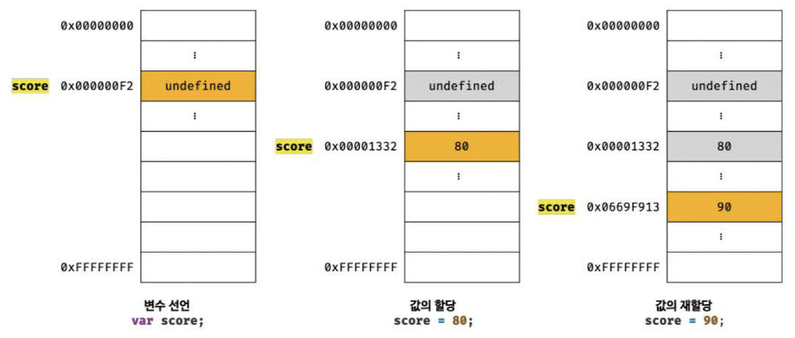
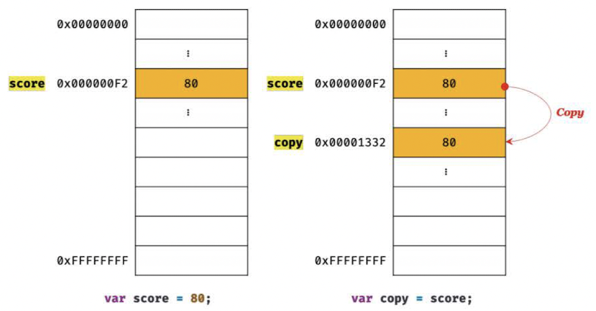
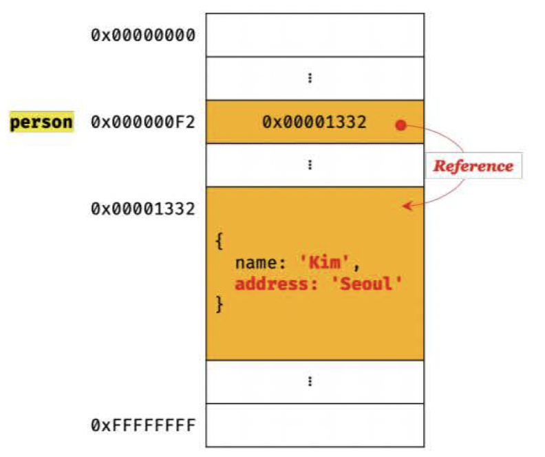
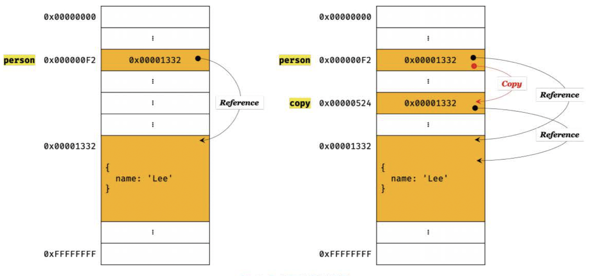

중간에 많이 다뤘던 내용이라 많이 익숙하실 겁니다. :)

## 📌11장 학습목표

- 원시 값이 왜 변경 불가능한 값인지 설명할 수 있다.
- 값에 의한 전달이 무슨 뜻인지 설명할 수 있다.
- 참조 값이 무엇인지 설명할 수 있다.
- 참조에 의한 전달이 무슨 뜻인지 설명할 수 있다.
- 얕은 복사와 깊은 복사의 간단한 차이점에 대해 설명할 수 있다.

## 원시 값 VS 객체

**원시 값**

- 변경 불가능한 값입니다. (immutable value)
- 원시 값을 변수에 할당하면 변수에는 실제 값이 저장됩니다.
- 원시 값을 갖는 변수를 다른 변수에 할당하면 원본의 원시 값이 복사되어 전달됩니다. (pass by value)

**객체**

- 변경 가능한 값입니다. (mutable value)
- 객체를 변수에 할당하면 변수에는 참조 값이 저장됩니다.
- 객체를 가리키는 변수를 다른 변수에 할당하면 원본의 참조 값이 복사되어 전달됩니다. (pass by reference)

<br>

🏋️‍♀️ 이제 이 용어들을 익숙하게 만들어 봅시다!

<br>

## 원시 값

✅ **변경 불가능한 값 (immutable value)**

> 읽기 전용 값이라는 뜻입니다.

<br>



<br>

주의할 점이 있습니다.

여기서 변경이 불가하다는 것은 `변수`가 아니라 `값`에 대한 이야기입니다.

그럼 이렇게 원시 값을 변경 불가능한 값으로 만든 이유는 무엇일까요?

이것은 데이터의 신뢰성을 보장하기 위해서 입니다.

우리가 그래서 변수가 참조하던 메모리 공간의 주소가 변경된 이유는 애초에 변수에 할당된 원시 값이 변경 불가한 값이기 때문이었습니다.

값의 이러한 특성을 **불변성(immutability)** 이라고 합니다.

불변성을 갖는 원시 값을 할당한 변수는 재할당 이외에 변수 값을 변경할 수 있는 방법이 없답니다.

<br>

✅ **값에 의한 전달(pass by value)**

> 원시 값이 복사되어 전달 됩니다. 이는 다른 메모리 공간에 저장된 별개의 값이 됩니다.

값에 의한 전달은 원시 값을 갖는 변수를 다른 변수에 할당 하는 상황과 관련이 되어있습니다.

<br>



<br>
<br>

score 변수와 copy 변수의 값 80은 **다른 메모리 공간에 저장된 별개의 값**입니다.

score 변수의 값을 변경해도 copy 변수의 값에는 어떠한 영향도 주지 않습니다.

<br>

## 객체

✅ **변경 가능한 값 (mutable value)**

> 재할당 없이 객체를 직접 변경할 수 있다는 뜻입니다.

우선 객체가 왜 원시 값과 근본적으로 다르게 설정되었는지를 짚고 넘어가셔야 합니다.

결론부터 말씀드리면 메모리를 효율적으로 사용하기 위해서 객체는 원시 값과 차이를 가지게 됩니다.

왜냐하면 객체는 크기가 매우 클 수 있고, 원시 값처럼 크기가 일정하지도 않으며, 프로퍼티 값이 객체일 수 있어서, 복사해서 생성하는 비용이 많이 들기 때문입니다.

따라서 객체를 복사해 생성하는 비용을 절약하고 성능을 향상 시키기 위해 객체는 변경 가능한 값으로 설계되어 있습니다.
<br>



<br>
<br>

앞에서 원시 값을 할당한 변수는 원시 값 자체를 값으로 가졌었죠!

하지만 객체를 할당한 변수에는 실제 객체가 저장된 **메모리 공간의 주소가 저장**되어 있습니다.

이 값을 **참조 값 (reference value)** 이라고 합니다.

책에 얕은 복사와 깊은 복사에 대한 내용이 있어서 잠시 개념만 짚고 넘어가겠습니다.

✋ 얕은 복사 vs 깊은 복사

얕은 복사: 객체에 중첩된 객체의 경우 **참조 값**을 복사합니다.

깊은 복사: **객체에 중첩되어 있는 객체까지** 모두 복사해서 원시 값처럼 완전한 복사본을 만드는 것을 뜻합니다.

<br>

✅ **참조에 의한 전달 (pass by reference)**

> 원본의 참조 값이 복사되어 전달 된다는 뜻입니다.

다시 말해서 객체를 가리키는 변수를 다른 변수에 할당하면 원본의 참조 값이 복사되어 전달 된다는 것입니다.

```js
const person = {
  name: "Kim",
};
// 참조 값을 복사 합니다. (얕은 복사)
const copy = person;
```

<br>
<br>



<br>
<br>

이처럼 원본과 사본 모두 동일한 객체를 가리키기에 <u>어느 한쪽에서 객체를 변경하면 서로 영향을 주고 받습니다.</u>
