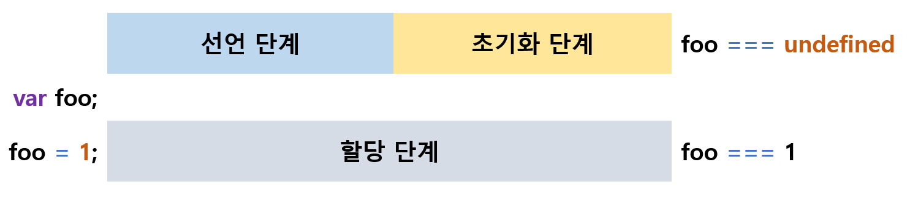
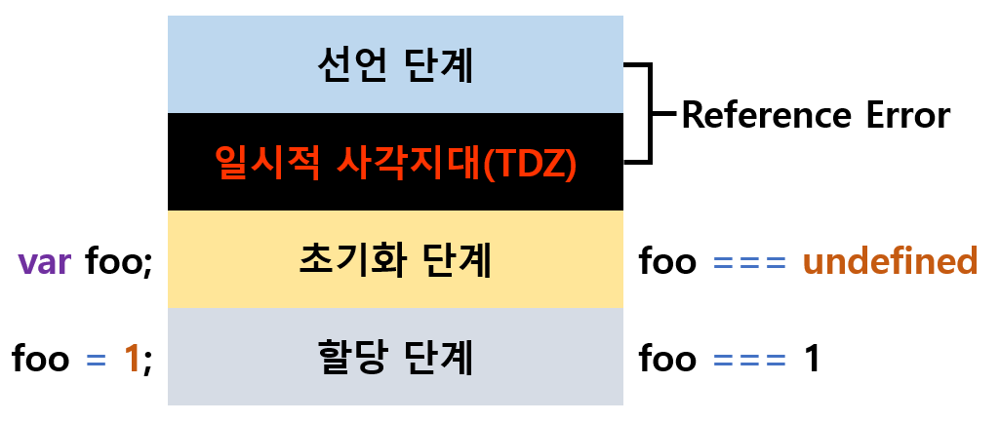

이번 챕터는 한 번에 짧게 정리하는게 좋습니다.

## var 키워드의 문제점

1. 변수의 중복 선언을 ✅허용합니다.

<br>

2. 함수 레벨 스코프를 따릅니다.

<br>

3. 선언 단계와 초기화 단계가 한번에 진행됩니다.

    <br>

   다시 한번 선언 단계와 초기화 단계가 무엇인지 복습하고 가시죠.

    <br>

   ✅**선언 단계:** 자바스크립트 엔진에 변수의 존재를 알립니다. 스코프(실행컨텍스트의 렉시컬환경)에 변수 식별자를 등록하는 방식으로 이루어 집니다.

   <br>

   ✅**초기화 단계:** undefined로 변수를 초기화합니다.

   <br>

   

<br>

4. `전역 변수`와 `전역 함수` 그리고 `암묵적 전역(선언하지 않은 변수에 값을 할당하는 것)`은 전역 객체 window의 프로퍼티가 됩니다.

```js
// 전역변수
var a = 1;
// 암묵적 전역
b = 2;
// 전역 함수 (함수 선언문)
function foo() {}

// var 키워드로 선언한 전연 변수는 전역 객체 window의 프로퍼티입니다.
console.log(window.a); // 1
// 암묵적 전역은 전역 객체 window의 프로퍼티입니다.
console.log(window.b); // 2
// 함수 선언문으로 정의한 전역 함수는 전역 객체 window의 프로퍼티입니다.
console.log(window.foo); // ƒ foo() {}
```

<br>

## let 키워드

1. 변수의 중복 선언이 🚫금지 됩니다.

<br>

2. 블록 레벨 스코프를 따릅니다.

<br>

3. **선언 단계와 초기화 단계가 분리되어 진행**됩니다.

   <br>

   **런타임 이전에** `선언 단계`가 실행되지만, `초기화 단계`는 **변수 선언문에 도달했을 때** 실행됩니다.

    <br>

   그래서 let 키워드로 선언한 변수는 스코프의 시작 지점 부터 초기화 단계 시작 지점까지 변수를 참조 할 수 없습니다.

   <br>

   만약에 초기화 단계가 실행되기 이전에 변수에 접근하려고 하면 참조 에러(ReferenceError)가 발생하게 되죠.

   <br>

   이처럼 선언 단계와 초기화 단계 사이의 변수를 참조할 수 없는 구간을 **일시적 사각지대(Temporal Dead Zone; TDZ)** 라고 말합니다.

   <br>

   

   <br>
   <br>

   ```js
   // 초기화 이전의 일시적 사각지대에서는 변수를 참조할 수 없습니다.
   console.log(x); //  🚫 ReferenceError: x is not defined

   let x; // 변수 선언문에서 초기화 단계가 진행됩니다.

   console.log(x); // undefined

   x = 1;

   console.log(x); // 1
   ```

<br>

4. let 키워드로 선언한 전역 변수는 전역 객체의 프로퍼티가 아닙니다.

   <br>

   대신 `보이지 않는 개념적인 블록(전역 렉시컬 환경의 선언적 환경 레코드)`내에 존재하게 됩니다.

   ```js
   let a = 1;

   console.log(window.a); //undefined
   console.log(a); // 1
   ```

## 👀 결론

> 우리는 기본적으로 변수 선언을 할 때 `const` 키워드를 사용하고 재할당이 필요할 때만 `let` 키워드를 사용 합시다. 😃
