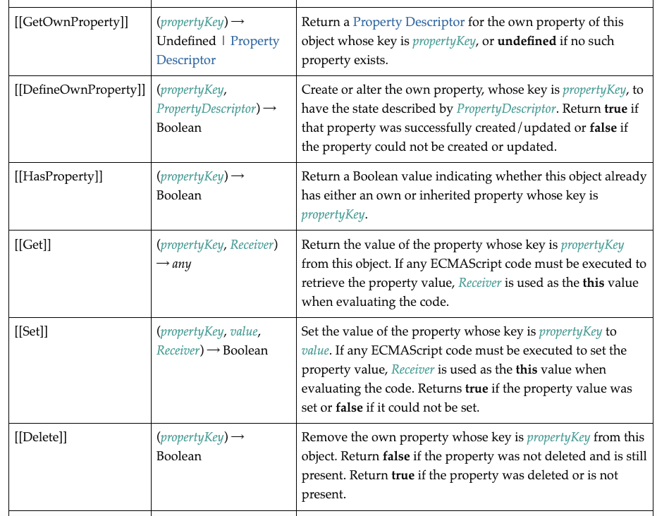

이번 챕터는 앞에서 배운 `객체`와 관련된 챕터입니다.

우선 그 전에, `내부 슬롯(internal slot)`과 `내부 메서드(internal method)`의 개념에 대해서 알고 가야합니다.

왜 프로퍼티 어트리뷰트를 이해하기 위해서는 내부 슬롯과 내부 메서드를 알아야할까요❓ 🤔

왜냐하면 프로퍼티 어트리뷰트 자체가 내부 슬롯이기에 개발자의 직접 접근이 불가능한 특성을 지니고있기 때문입니다.

따라서 내부 슬롯의 개념에 대해서 잘 알면 프로퍼티 어트리뷰트를 이해하기 더욱 쉽겠죠?

## 01. 내부 슬롯(internal slot)과 내부 메서드(internal method)

> 자바스크립트의 구현 알고리즘을 설명하기 위한 프로퍼티(상태)와 메서드(동작)입니다.

`이중 대괄호 [[ ]]`로 감싼 이름들은 모두 내부 슬롯과 내부 메서드입니다.

하단은 ECMAscript 사양에서 내부 메서드와 관련된 이미지입니다.

<br>



<br>
<br>

만약에 일반 개발자가 이런 내부 로직들이 직접 접근이 가능하면, 자바스크립트 엔진 내부가 조작될 위험이 있지 않을까요? 🥷

그래서 자바스크립트는 내부 슬롯과 내부 메서드의 직접 접근 혹은 호출 방법을 제공하지 않습니다.

❗️그러나, 일부의 내부 슬롯과 내부 메서드에 한하여 간접적으로 접근 할 수 있는 수단을 제공합니다.

예를 들어서 모든 객체는 `[[Prototype]]` 이라는 내부 슬롯을 갖습니다.

이 내부 슬롯에 직접 접근은 불가능하지만, `__proto__`를 통해서 간접적인 접근이 가능하답니다.

```js
const obj ={}

// 내부 슬롯은 직접 접근이 불가합니다.
obj.[[Prototype]] //🚫 Unexpected token '['

// 간접 접근 수단을 일부 제공합니다.
obj.__proto__ //{constructor: ƒ, __defineGetter__: ƒ, __defineSetter__: ƒ, hasOwnProperty: ƒ, __lookupGetter__: ƒ, …}

```

```js
// 재밌어서 숫자 타입도 한 번 접근해보았습니다.
const num = 5;

num.__proto__; // Number {0, constructor: ƒ, toExponential: ƒ, toFixed: ƒ, toPrecision: ƒ, …}
```

<br>

❓❗️**프로토타입(prototype)**

> `프로토타입`은 어떤 객체의 상위(부모)객체의 역할을 하는 객체입니다.

프로토타입은 하위(자식) 객체에게 **자신의 프로퍼티와 메서드를 상속**합니다.

상속 받은 하위 객체는 자신의 프로퍼티 또는 메서드인 것처럼 자유롭게 사용이 가능하답니다.

<br>

## 02. 프로퍼티 어트리뷰트와 프로퍼티 디스크립터 객체

> 프로퍼티 어트리뷰트는 프로퍼티를 생성할 때 자동으로 정의하는 프로퍼티의 상태를 말합니다.

여기서 말하는 상태는 다음과 같습니다.

- Value (프로퍼티의 값)
- Writable (값의 갱신 가능 여부)
- Enumerable (열거 가능 여부)
- Configurable (재정의 가능 여부)

프로퍼티 어트리뷰트는 자바스크립트 엔진이 관리하는 <u>내부 슬롯</u>에 해당합니다.

따라서 직접 접근은 불가능하지만, `Object.getOwnPropertyDescriptor` 메서드를 사용해서 간접적으로 확인 가능합니다.

```js
// 객체 리터럴로 객체를 생성하였습니다.
// 할당시에 프로퍼티가 생성이 될 때 자바스크립트 엔진은 프로퍼티 어트리뷰트를 기본값으로 자동 정의합니다.
const person = {
  name: "Kim",
};

// 두번 째 인자에서 프로퍼티 키를 ❗️문자열로 전달해야 합니다
// Object.getOwnPropertyDescriptor 메서드는 프로퍼티 어트리뷰트 정보를 제공하는 프로퍼티 디스크립터 객체(PropertyDescriptor)를 반환합니다.
console.log(Object.getOwnPropertyDescriptor(person, "name")); // {value: 'Kim', writable: true, enumerable: true, configurable: true}
```

`Object.getOwnPropertyDescriptor` 메서드는 **하나의** 프로퍼티에 대해서 프로퍼티 디스크립터 객체를 반환합니다.

ES8에 도입된 `Object.getOwnPropertyDescriptors` 메서드는 **모든 프로퍼티 어트리뷰트 정보를 제공**하는 프로퍼티 디스크립터 객체를 반환합니다.

```js
const person = {
  name: "Kim",
};

// 프로퍼티를 동적으로 생성합니다.
person.height = 180;

// 모든 프로퍼티 어트리뷰트의 정보를 제공하는 프로퍼티 디스크립터 객체들을 반환합니다.
console.log(Object.getOwnPropertyDescriptors(person));
/*
{

height: {value: 180, writable: true, enumerable: true, configurable: true}
name: {value: 'Kim', writable: true, enumerable: true, configurable: true}

}
*/
```

<br>

## 03. 데이터 프로퍼티와 접근자 프로퍼티

> 프로퍼티는 데이터 프로퍼티와 접근자 프로퍼티로 구분할 수 있습니다.

<br>

- **데이터 프로퍼티(data property):** 키와 값으로 구성된 일반적인 프로퍼티입니다.

<br>

- **접근자 프로퍼티(accessor property):** 다른 데이터 프로퍼티의 값을 읽거나 저장할 때 호출되는 접근자 함수(accessor function)로 구성된 프로퍼티입니다. 자체적으로 값을 갖지는 않습니다.

<br>

데이터 프로퍼티는 하단의 프로퍼티 어트리뷰트를 갖습니다.
| 프로퍼티 어트리뷰트 | 설명 |
| ------------------- | ------------------------------------------------------------------------------------------------------------------------------------------------------------------------------------------------------------------------------------------------- |
| `[[Value]]` | 📌 프로퍼티 키를 통해 프로퍼티 값을 접근하면 반환되는 값입니다.<br>📌 프로퍼티 키를 통해 프로퍼티 값을 변경하면 `[[Value]]`에 값을 재할당합니다. 이 때 프로퍼티가 없으면 프로퍼티를 동적 생성하고 생성된 프로퍼티 `[[Value]]`에 값을 저장합니다. |
| `[[Writable]]` | 📌 프로퍼티 값의 변경 가능 여부를 나타내며 boolean 값을 갖습니다.<br>📌 `[[Writable]]`이 false인 경우 해당 프로퍼티의 `[[Value]]` 값을 변경할 수 없는 읽기 전용 프로퍼티가 됩니다. |
| `[[Enumerable]]` | 📌 프로퍼티의 열거 가능 여부를 나타내며 boolean 값을 갖습니다.<br>📌 `[[Enumerable]]`의 값이 false인 경우 해당 프로퍼티는 for ... in 이나 Object.keys 메서드 등으로 열거할 수 없습니다. |
| `[[Configurable]]` | 📌 프로퍼티의 재정의 가능 여부를 나타내며 boolean값을 갖습니다.<br>📌 `[[Configurable]]`의 값이 false인 경우 삭제나 변경이 금지됩니다. 단, `[[Writable]]`이 true인 경우는 `[[Value]]`의 변경과 `[[Writable]]`을 false로 변경하는 것이 허용됩니다. |

<br>

접근자 프로퍼티는 하단의 프로퍼티 어트리뷰트를 갖습니다.
| 프로퍼티 어트리뷰트 | 설명 |
| ------------------- | ----------------------------------------------------------------------------------------------------------------------------------------------------------------------------------------------------------------------------------------- |
| `[[Get]]` | 📌 접근자 프로퍼티를 통해 데이터 프로퍼티 값을 읽을 때 호출되는 접근자 함수입니다.<br>📌 접근자 프로퍼티 키로 프로퍼티 값에 접근하면 프로퍼티 어트리뷰트 `[[Get]]`의 값, getter 함수가 호출되고 그 결과가 프로퍼티 값으로 반환됩니다. |
| `[[Set]]` | 📌 접근자 프로퍼티를 통해 데이터 프로퍼티의 값을 저장할 때 호출되는 접근자 함수입니다.<br>📌 접근자 프로퍼티 키로 프로퍼티 값을 저장하면 프로퍼티 어트리뷰트 `[[Set]]`값, 즉 setter 함수가 호출되고 그 결과가 프로퍼티 값으로 저장됩니다. |
| `[[Enumerable]]` | 📌 데이터 프로퍼티의 enumerable과 같습니다. |
| `[[Configurable]]` | 📌 데이터 프로퍼티의 configurable과 같습니다. |

접근자 함수는 `getter setter 함수`라고도 부릅니다.

접근자 프로퍼티는 getter와 setter 함수를 모두 정의할 수도 있고, 하나만 정의할 수도 있습니다.

```js
const person = {
  // 데이터 프로퍼티입니다.
  firstName: "JungHee",
  lastName: "Kim",

  // getter 함수
  get fullName() {
    return `${this.firstName} ${this.lastName}`; //this는 자기참조 변수입니다.
  },
  // setter 함수
  set fullName(name) {
    [this.firstName, this.lastName] = name.split(" "); // 배열 디스트럭처링 할당을 사용합니다.
  },
};

// 데이터 프로퍼티를 통한 프로퍼티 값 참조입니다.
console.log(person.firstName + " " + person.lastName); // JungHee Kim

// 접근자 프로퍼티를 통한 프로퍼티 값의 저장입니다.
// 접근자 프로퍼티 fullName에 값을 저장하면 setter 함수가 호출됩니다.
person.fullName = "Ungmo Lee";
console.log(person); // {firstName: 'Ungmo', lastName: 'Lee'}

// 접근자 프로퍼티 fullName에 접근하면 getter 함수가 호출됩니다.
console.log(person.fullName); // Ungmo Lee
```

<br>

## 04. 프로퍼티 정의

> 새로운 프로퍼티를 추가하면서 프로퍼티 어트리뷰트를 정의하거나 기존의 프로퍼티 어트리뷰트를 재정의하는 것을 말합니다.

`Object.defineProperty` 메서드를 사용해서 프로퍼티 어트리뷰트를 정의할 수 있습니다.

인수로는 객체의 참조와 데이터프로퍼티의 키인 문자열, 프로퍼티 디스크립터 객체를 전달합니다.

```js
const person = {};

// 데이터 프로퍼티 정의
// 이상한거 추가해도 무시됩니다.
Object.defineProperty(person, "firstName", {
  value: "JungHee",
  writable: true,
  enumerable: true,
  configurable: true,
});

Object.defineProperty(person, "lastName", {
  value: "Kim",
});

console.log(person); // {firstName: 'JungHee', lastName: 'Kim'}

// 접근자 프로퍼티 정의
Object.defineProperty(person, "fullName", {
  //getter 함수
  get() {
    return `${this.firstName} ${this.lastName}`;
  },

  // setter 함수
  set(name) {
    [this.firstName, this.lastName] = name.split(" ");
  },
  enumerable: true,
  configurable: true,
});

person.fullName = "Ungmo Lee";
console.log(person); // {firstName: 'Ungmo', lastName: 'Kim'}
```

`Object.defineProperties` 메서드를 사용하면 여러개의 프로퍼티를 한 번에 정의할 수 있습니다.

```js
const person = {};

Object.defineProperties(person, {
  //데이터 프로퍼티 정의
  firstName: {
    value: "JungHee",
    writable: true,
    enumerable: true,
    configurable: true,
  },
  lastName: {
    value: "Kim",
    writable: true,
    enumerable: true,
    configurable: true,
  },
  // 접근자 프로퍼티 정의
  fullName: {
    get() {
      return `${this.firstName} ${this.lastName}`;
    },

    // setter 함수
    set(name) {
      [this.firstName, this.lastName] = name.split(" ");
    },
    enumerable: true,
    configurable: true,
  },
});

console.log(person); // {firstName: 'JungHee', lastName: 'Kim'}

person.fullName = "Ungmo Lee";
console.log(person); // {firstName: 'Ungmo', lastName: 'Lee'}
```

<br>

## 05. 객체의 변경 방지

객체는 변경 가능한 값(mutable value)이므로 재할당 없이 직접적인 변경이 가능하다는 사실 기억하시나요?

그래서 자바스크립트는 객체의 변경을 방지하는 다양한 메서드를 제공합니다.

| 구분           | 메서드                   | 프로퍼티 추가 | 프로퍼티 삭제 | 프로퍼티 값 읽기 | 프로퍼티 값 쓰기 | 프로퍼티 어트리뷰트 재정의 |
| -------------- | ------------------------ | :-----------: | :-----------: | :--------------: | :--------------: | :------------------------: |
| 객체 확장 금지 | Object.preventExtensions |       X       |       O       |        O         |        O         |             O              |
| 객체 밀봉      | Object.seal              |       X       |       X       |        O         |        O         |             X              |
| 객체 동결      | Object.freeze            |       X       |       X       |        O         |        X         |             X              |

각각 코드 예시와 함께 알아봅시다.

#### 05-1. Object.preventExtensions (객체 확장 금지)

> 프로퍼티 추가가 🚫금지됩니다.

프로퍼티를 추가하는 방법은 크게 2가지 입니다.

- 프로퍼티 동적 추가
- Object.defineProperty

객체 확장 금지를 사용하면 이 2가지 추가 방법이 모두 금지됩니다.

참고로 확장이 가능한 객체인지 확인하는 메서드는 `Object.isExtensible`입니다.

```js
const person = {
  name: "Kim",
};

// person 객체는 확징이 금지된 객체가 아닙니다.
console.log(Object.isExtensible(person)); // true

// person 객체의 확장을 금지하며 프로퍼티 추가를 금지합니다.
Object.preventExtensions(person);

// person 객체는 확징이 금지된 객체입니다.
console.log(Object.isExtensible(person)); // false

//프로퍼티 추가가 금지됩니다.
person.height = 180; //무시합니다. strict mode에서는 에러입니다.
console.log(person); // {name: 'Kim'}

// 프로퍼티 정의에 의한 프로퍼티 추가도 금지됩니다.
Object.defineProperty(person, "height", { value: 18 }); // 🚫TypeError: Cannot define property height, object is not extensible
```

#### 05-2. Object.seal (객체 밀봉 )

> ✅읽기와 쓰기(갱신)만 가능합니다. 프로퍼티 추가 및 삭제 그리고 어트리뷰트 재정의가 🚫 금지됩니다.

참고로 밀봉된 객체인지 확인하는 메서드는 `Object.isSealed`입니다.

```js
const person = {
  name: "Kim",
};

// person 객체는 밀봉된 객체가 아닙니다.
console.log(Object.isSealed(person)); // false

// person 객체를 밀봉하여 프로퍼티 추가,삭제, 재정의를 금지합니다.
Object.seal(person);

// person 객체는 밀봉된 객체입니다.
console.log(Object.isSealed(person)); // true

// 밀봉된 객체는 configurable이 false입니다.
console.log(Object.getOwnPropertyDescriptors(person));

/*

name: {value: 'Kim', writable: true, enumerable: true, configurable: false}

*/

//프로퍼티 추가가 금지됩니다.
person.height = 180; //무시합니다. strict mode에서는 에러입니다.
console.log(person); // {name: 'Kim'}

//프로퍼티 삭제가 금지됩니다.
delete person.name; // 무시합니다. strict mode에서는 에러입니다.
console.log(person); // {name: 'Kim'}

//프로퍼티 값 갱신은 가능합니다.
person.name = "Park";
console.log(person); // {name: 'Park'}

// 프로퍼티 어트리뷰트 재정의가 금지됩니다.
Object.defineProperty(person, "name", { configurable: true }); // 🚫TypeError: Cannot redefine property: name
```

#### 05-3. Object.freeze (객체 동결 )

> 프로퍼티 값 ✅읽기만 가능합니다. 프로퍼티 추가, 삭제 , 프로퍼티 어트리뷰트 재정의, 프로퍼티 값 갱신이 🚫금지됩니다.

참고로 동결된 객체인지 확인하는 메서드는 `Object.isFrozen`입니다.

```js
const person = {
  name: "Kim",
};

// person 객체는 동결된 객체가 아닙니다.
console.log(Object.isFrozen(person)); // false

// person 객체를 동결하여 프로퍼티 추가,삭제,재정의,쓰기를 🚫금지합니다.
Object.freeze(person);

// person 객체는 동결된 객체입니다.
console.log(Object.isSealed(person)); // true

// 밀봉된 객체는 configurable이 false입니다.
console.log(Object.getOwnPropertyDescriptors(person));

/*

name: {value: 'Kim', writable: false, enumerable: true, configurable: false


*/

//프로퍼티 추가가 금지됩니다.
person.height = 180; //무시합니다. strict mode에서는 에러입니다.
console.log(person); // {name: 'Kim'}

//프로퍼티 삭제가 금지됩니다.
delete person.name; // 무시합니다. strict mode에서는 에러입니다.
console.log(person); // {name: 'Kim'}

//프로퍼티 값 갱신이 불가능합니다.
person.name = "Park";
console.log(person); // {name: 'Kim'}

// 프로퍼티 어트리뷰트 재정의가 금지됩니다.
Object.defineProperty(person, "name", { configurable: true }); // 🚫TypeError: Cannot redefine property: name
```

#### 불변 객체

❗️그러나 지금까지 살펴본 객체 변경 방지 메서드들은 얕은 변경 방지(shallow only)로 **중첩 객체까지는 영향을 주지 못합니다.**

따라서 `Object.freeze` 메서드로 객체를 동결하여도 중첩 객체까지는 동결할 수 없습니다.

```js
const person = {
  name: "Kim",
  address: {
    city: "Seoul",
  },
};

// 얕은 객체 동결을 진행합니다.
Object.freeze(person);

// 직속 프로퍼티만 동결합니다.
console.log(Object.isFrozen(person)); // true

// 중첩 객체까지는 동결할 수 없습니다.
console.log(Object.isFrozen(person.address)); // false

// 중첩 객체 프로퍼티 갱신
person.address.city = "Ulsan";

// 중첩 객체 프로퍼티 값이 바뀌었습니다.
console.log(person); // {name: 'Kim', address: {city: "Ulsan"}}}
```

객체의 중첩 객체까지 동결하려면 객체를 값으로 갖는 모든 프로퍼티에 대하여 **재귀적으로 `Object.freeze` 메서드를 호출**해야 합니다.

```js
function deepFreeze(target) {
  // 객체가 아니거나 동결된 객체는 무시하고 나머지 경우에 해당하는 모든 객체를 동결시킵니다.
  if (target && typeof target === "object" && !Object.isFrozen(target)) {
    Object.freeze(target);

    // Object.keys 메서드는 객체 자신의 열거 가능한 프로퍼티 키를 배열로 반환합니다.
    // forEach 메서드는 배열을 순환하며 배열의 각 요소에 대하여 콜백 함수를 실행합니다.
    Object.keys(target).forEach((key) => deepFreeze(target[key])); // 표현식 이용하여 프로퍼티 값에 접근
  }
  return target;
}

const person = {
  name: "Kim",
  address: {
    city: "Seoul",
  },
};

// 깊은 객체 동결입니다.
deepFreeze(person);

console.log(Object.isFrozen(person)); // true

// 중첩 객체 동결까지 확인합니다.
console.log(Object.isFrozen(person.address)); // true

person.address.city = "Ulsan";

console.log(person); // {name: 'Kim', address: {city: "Seoul"}}}
```
