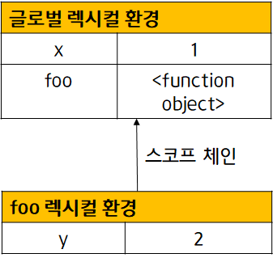
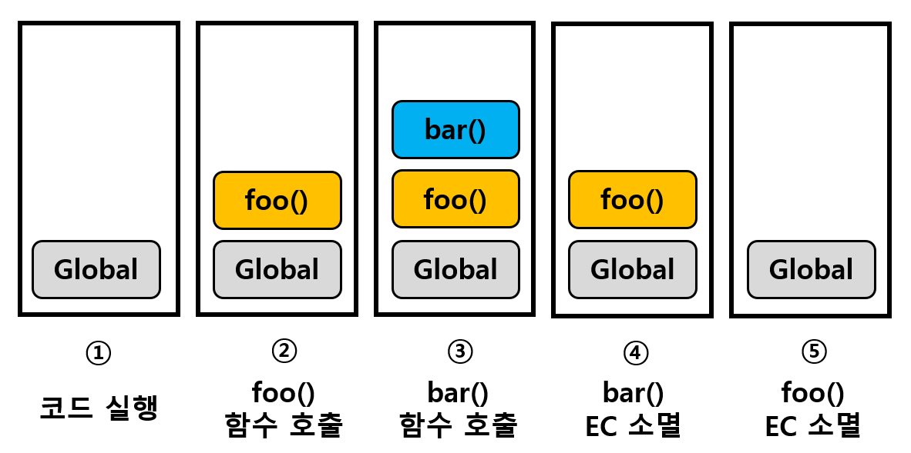

### 🙋🏻‍♀️ what is 실행 컨텍스트 ?

> `식별자(변수,함수,클래스 등의 이름)를 등록하고 관리하는 스코프`와 `코드 실행 순서 관리`를 구현한 내부 메커니즘입니다.

실행 컨텍스트의 정의를 찾아보려고 하는데 너무 어렵게 정의가 되어 있더군요.

책에는 어려운 용어로 다음과 같이 서술되어 있습니다.

_소스코드를 실행하는 데 필요한 환경을 제공하고 코드의 실행 결과를 실제로 관리하는 영역입니다._

특히 저 `환경` 이라는 단어가 저는 낯설더라구요.

하나씩 차근차근 살펴보죠.

#### ✅ 식별자(변수,함수,클래스 등의 이름)와 스코프

예를 들어 변수 선언 같은 경우 🌎전역에서 선언되었는지 🥅지역에서 선언되었는지 구분을 해야겠죠?

이 또한 실행 컨텍스트에서 관리를 합니다.

가령, 전역 코드에서 선언된 변수 선언문과 함수 선언문은 런타임 이전에 먼저 실행 되어서 전역 변수와 전역 함수가 생성됩니다.

그리고 이것들이 실행 컨텍스트가 관리하는 **전역 스코프**에 등록이 되게 되죠.

마찬가지로, 매개변수 혹은 지역 변수 같은 경우는 실행 컨텍스트가 관리하는 **지역 스코프**에 등록이 됩니다.

#### ✅ 코드 실행 순서를 관리

예를 들어 함수를 생각해 봅시다.

함수가 호출되면 순차적으로 진행되던 것을 일시 중단하고 코드의 실행 순서를 변경라여 함수 내부로 진입하는 것 기억나실까요?

또한 함수 호출이 종료 되면, 함수 호출 이전으로 돌아가기 위해서 현재 실행 중인 코드와 이전에 실행 하던 코드를 구분해서 관리를 해야합니다.

이렇게 **코드의 실행 순서를 변경하고 다시 되돌아가는 것** 또한 <u>실행 컨텍스트</u>에서 관리합니다.

 
 

**이처럼 결국 모든 코드는 실행 컨텍스트를 통해 실행되고 관리된다고 생각하시면 됩니다.**

-   식별자와 스코프: 실행 컨텍스트의 **렉시컬 환경**으로 관리합니다.
-   코드의 실행 순서: **실행 컨텍스트 스택**으로 관리합니다.
