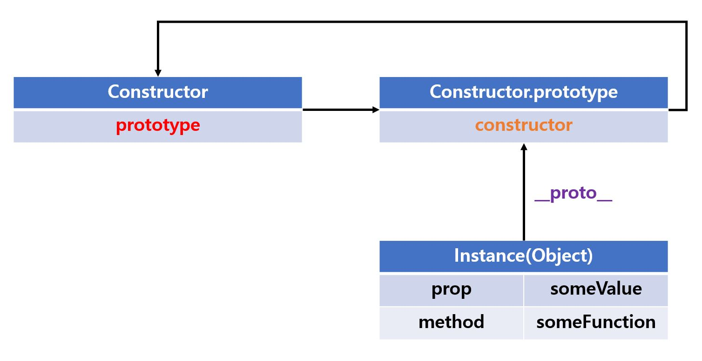

자바스크립트는 **프로토타입** 기반의 객체지향 프로그래밍 언어입니다.

🏋️‍♀️ 드디어 `prototype`을 낱낱히 파헤쳐보는 시간을 가지겠습니다.

## 객체지향 프로그래밍

> 객체의 집합으로 프로그램을 표현하는 프로그래밍 패러다임입니다.

프로그래밍 패러다임은 프로그래머에게 프로그래밍의 👀관점을 갖게 해 주고, 결정하는 역할을 합니다.

-   **👵명령형 프로그래밍(imperative programming):** 프로그램을 명령어 또는 함수의 목록으로 바라봅니다.

-   **👧객체지향 프로그래밍 (object oriented programming):** 프로그램을 독립적인 객체의 집합으로 바라봅니다.

객체지향 프로그래밍은 우리가 세계를 인식하는 방식과 유사합니다.

예를 들어 봅시다.

🐈 어떤 고양이가 있다고 가정 해보죠.

이 고양이의 이름은 `Navi`이고 `3살`이며 `암컷`이라는 특징을 가지고 있다고 합시다.

어때요? 훨씬 전보다 어떤 고양이인지 구체적으로 이해가 잘 가시나요?

바로 이런 속성(이름,나이,성별 등)에 대한 정보들이 다른 고양이로부터 `Navi`를 구별할 수 있게 만들어주죠!

이 예시를 객체로 나타내면 다음과 같습니다.

```js
const cat = {
    name: 'Navi',
    age: 3,
    gender: 'female',
};
```

이처럼 우리 주변에 있는 실체(사물 or 개념)는 특징이나 성질을 나타내는 **속성(attribute / property)** 를 가지고 있습니다.

이 속성을 통해서 우리는 서로 다른 실체를 인식하거나 구별할 수 있게 되는 것이죠.

물론, 고양이에게는 다양한 속성이 존재할겁니다. 하지만 우리는 고양이의 `이름`과 `나이` `성별`에만 집중하겠다는 것이죠.

이렇게 다양한 속성 중에서 프로그램에 필요한 속성만 간추려 표현하는 것을 `추상화(Abstract)`라고 합니다.

이처럼 객체지향 프로그래밍은 **독립적인 객체의 집합으로 프로그램을 표현**하려고 합니다.

이번에는 원이라는 개념을 객체로 만들어보죠. ⭕️

원에는 `반지름` 이라는 속성을 가지고있고 이 속성을 이용해서 `지름,둘레,넓이`를 구할 수 있습니다.

이때 반지름은 원의 **상태를 나타내는 데이터**이며, 지름 둘레 넓이를 구하는 행위는 **동작**이라고 생각할 수 있습니다.

```js
const circle = {
    radius: 8, // 원의 상태 데이터

    // 원의 지름
    getDiameter: function () {
        return this.radius * 2;
    },
    //원의 둘레
    getRound: function () {
        return Math.floor(this.radius * 2 * Math.PI);
    },
    // 원의 넓이
    getArea: function () {
        return Math.floor(this.radius ** 2 * Math.PI);
    },
};

console.log(circle); // {radius: 8, getDiameter: ƒ, getRound: ƒ, getArea: ƒ}

console.log(circle.getDiameter()); // 16
console.log(circle.getRound()); // 50
console.log(circle.getArea()); // 201
```

이처럼 객체 지향 프로그래밍은 객체의 **상태(state)** 를 나타내는 데이터와 상태 데이터를 조작할 수 있는 **동작(behavior)** 을 <u>하나의 논리적인 단위로 묶어서 </u>생각합니다.

그러면 이런 객체들이 서로 🔗관계성(relationship)을 맺을 수 있다면 굉장히 유용하지 않을까요?

마치 우리가 혼자 💡아이디어를 생각하는 것 보다, 팀원과 같이 의견을 공유할 때 더 좋은 아이디어가 나올 때가 있는 것 처럼요!

실제로 객체는 다른 객체와 데이터를 주고 받거나, 또는 다른 객체의 상태 데이터나 동작을 **상속** 받아 사용할 수도 있습니다.

과연 이 상속이란 의미는 프로그래밍에서 어떤 의미일까요?

<br>

## 상속과 프로토타입

> 자바스크립트는 프로토타입을 기반으로 상속을 구현합니다.

**상속**이란 어떤 객체의 프로퍼티 또는 메서드를 다른 객체가 상속👇받아 그대로 사용할 수 있는 것을 의미합니다.

우선 17장에서 살펴본 생성자 함수를 한 번 복습해보죠.

```js
function Wizard(attack) {
    // 생성자 함수 내부의 this는 생성자 함수가 생성할 인스턴스를 가리킵니다.
    this.attack = attack;
    this.specialAttack = function () {
        return this.attack * 2;
    };
}

// 인스턴스를 생성합니다.
const wizard1 = new Wizard(2); // 공격력이 2인 Wizard 객체를 생성합니다.
const wizard2 = new Wizard(5); // 공격력이 5인 Wizard 객체를 생성합니다.

// ❗️모든 인스턴스가 specialAttack이라는 메서드를 중복 생성하고 중복 소유합니다.
console.log(wizard1.specialAttack === wizard2.specialAttack); // false

console.log(wizard1.specialAttack()); // 4
console.log(wizard2.specialAttack()); // 10
```

만약 상속이 없다면 없다면 모든 인스턴스가 **메서드를 중복 소유하게 되어 불필요한 메모리 낭비가 생길 것입니다.**

(왜냐하면 메서드도 결국 함수이고 함수는 값이기에 메모리를 차지하겠죠!)

예를 들어 10개의 인스턴스를 생성하면 내용이 같은 메서드도 10개 생성될테니까요! 😥

같은 내용이라면 메서드를 단 하나만 생성하여 서로 공유하는게 낫지 않을까요?

이처럼 상속을 구현하면 이런 불필요한 중복을 제거하는데 아주 효과적이겠죠!

상속을 구현하는 방법에는 여러가지가 있을 수 있지만, 자바스크립트는 **프로토타입(prototype)** 이라는 녀석을 기반으로 상속을 구현합니다.

```js
function Wizard(attack) {
    this.attack = attack;
}

// 모든 인스턴스가 이 메서드를 공유해서 사용할 수 있도록 프로토타입에 추가합니다.
Wizard.prototype.specialAttack = function () {
    return this.attack * 2;
};

// 인스턴스를 생성합니다.
const wizard1 = new Wizard(2); //
const wizard2 = new Wizard(5); //

// ✅모든 인스턴스는 부모 객체의 역할을 하는
// 프로토타입 Wizard.prototype으로부터 specialAttack이라는 메서드를 상속받습니다.
console.log(wizard1.specialAttack === wizard2.specialAttack); // true

console.log(wizard1.specialAttack()); // 4
console.log(wizard2.specialAttack()); // 10
```

이렇게 공부를 해보니 상속의 개념에 대해서 적절한 비유에 대해서 생각해보았습니다.

제 생각에 상속은 친구에게 🖊펜을 빌려서 쓰는 상황과 굉장히 유사하다고 느껴지네요.

예를 들어, 나는 친구에게서 펜을 빌려서 쓸 수 있지만, 그것이 온전히 내 소유라고 보기에는 어렵죠.

근데 반드시 꼭 소유할 필요가 없다면, 빌려 쓰는 방법도 효율적인 방법입니다.

왜냐하면 무언가를 소유하려면 그것을 담는 공간이 필요하게 되기 때문입니다.

이것이 우리가 책을 빌리거나, 렌트카를 하는 등 이유이자, 공유 경제의 장점이라고 볼 수 있습니다.

필요할 때만 효율적으로 갖다 쓰자 이 뜻입니다.

이름 한 번 쓰려고 10명의 사람들에게 펜을 모두 지급하는 것은 어떻게 보면 자원 입장에서 낭비입니다. 💸

차라리 펜 하나를 한 명씩 돌아가면서 쓰는 편이 훨씬 더 비용적으로는 절감이 될 것입니다. 😀

<br>

## 프로토타입 객체

> 프로토타입이란 어떤 객체의 상위(부모) 객체의 역할을 하는 객체입니다.

모든 객체는 `[[Prototype]]`이라는 내부 슬롯을 가집니다.

이 슬롯 안에는 이 슬롯을 가진 객체에 대한 참조(가리키는) 값이 담겨있습니다.

`[[Prototype]]`에 저장되는 프로토타입은 객체 생성 방식에 의해 결정됩니다.

다른 말로는 객체가 생성 될 때 프로토타입도 결정이 된다고 볼 수 있겠네요.

뒤에 나올 내용이지만, 객체 리터럴에 의해 생성된 객체의 프로토타입은 `Object.prototype`이고,

생성자 함수에 의해 생성된 객체의 프로토타입은 `생성자 함수의 prototype 프로퍼티에 바인딩되어 있는 객체`입니다.

용어가 굉장히 어렵죠? 😵‍💫 하지만 결국 원리는 똑같습니다.

객체 리터럴에 의해서 생성된 객체는 우리가 `Object`라는 생성자 함수에 의해서 생성된 인스턴스입니다.

그렇기에 객체 리터럴에 의해 생성된 객체의 프로토타입은 `Object.prototype` 이겠죠.
그리고 앞의 예시처럼 Object와 같은 `빌트인 생성자 함수`도 있지만, 우리가 `직접 정의하는 생성자 함수`의 경우도 있습니다.

이렇게 우리가 직접 정의한 생성자 함수는 prototype 프로퍼티에 담길 정보를 지정을 해주어야겠죠.

그리고 이런 방식에 의해서 만들어진 인스턴스의 프로토타입은 우리가 직접 정의한 생성자 함수의 `prototype 프로퍼티에 바인딩된 객체`일 것입니다.

이처럼 모든 객체는 하나의 프로토타입을 가지며, 모든 프로토타입은 **생성자 함수와 연결**되어 있습니다.

아래 그림처럼 말이죠.



<br>
<br>

위 그림을 글로 정리해보겠습니다.

✅ 인스턴스는 `__proto__` 접근자 프로퍼티를 통해 자신의 프로토타입에 간접적으로 접근할 수 있습니다.

```js
const obj = {};

console.dir(obj.__proto__); // Object
```

✅프로토타입은 자신의 `constructor` 프로퍼티를 통해 생성자 함수에 접근할 수 있습니다.

```js
console.dir(Object.prototype.constructor); // ƒ Object()
```

✅생성자 함수(constructor)는 자신의 `prototype` 프로퍼티를 통해 프로토타입에 접근할 수 있습니다.

```js
console.dir(Object.prototype); // Object
```

<br>

#### `__proto__` 접근자 프로퍼티

-   ✅`__proto__`는 **접근자 프로퍼티**입니다.

    <br>

    기억하시겠지만, 접근자 프로퍼티는 자체적으로 값을 갖지는 않습니다.

    <br>

    이것은 다른 데이터 프로퍼티의 값을 읽거나 저장할 때 사용하는 접근자 함수, 즉 `[[Get]]` `[[Set]]` 프로퍼티 어트리뷰트로 구성된 프로퍼티입니다.

    <br>

    접근자 프로퍼티인 `__proto__`는 `getter/setter` 함수라고 부르는 접근자 함수를 통해 `[[Prototype]]` 내부 슬롯의 값, 즉 프로토타입을 **취득**하거나 **할당**합니다.

    <br>

    ```js
    const obj = {};
    const parent = { a: 1 };

    // getter 함수인 get __proto__가 호출되어 obj 객체의 프로타타입을 취득합니다. (접근)
    obj.__proto__;

    // // setter 함수인 set __proto__가 호출되어 obj 객체의 프로타타입을 교체합니다. (할당)
    obj.__proto__ = parent;

    console.log(obj.a); // 1
    ```

    ```js
    const ultra = { x: 1 };
    const mini = {};

    mini.__proto__;

    mini.__proto__ = ultra;

    console.log(mini.x); // 1
    ```

<br>

-   ✅`__proto__`는 객체가 직접 소유하는 프로퍼티가 아니라 **Object.prototype**의 프로퍼티를 ❗️상속 받아서 사용하는 것입니다.

    <br>

    ```js
    const person = { name: 'Jung Hee' };

    // person 객체는 __proto__ 프로퍼티를 고유의 키로 소유하지 않습니다.
    console.log(person.hasOwnProperty('__proto__')); // false

    // __proto__ 프로퍼티는 Object.prototype의 접근자 프로퍼티입니다.
    console.log(Object.getOwnPropertyDescriptor(Object.prototype, '__proto__'));
    /* 
    get: [Function: get __proto__],
    set: [Function: set __proto__],
    enumerable: false,
     configurable: true
    */

    // 모든 객체는 Object.prototype의 접근자 프로퍼티 __proto__를 상속받아서 사용할 수 있습니다.
    console.log({}.__proto__ === Object.prototype); // true
    ```

<br>

-   ✅`__proto__`를 사용하는 이유는 **상호 참조에 의해 프로토타입 체인이 생성되는 것을 🚫방지하기 위함**입니다.

    <br>

    왜냐하면 순환 참조하는 프로토타입 체인이 만들어지면 프로토타입의 종점이 존재하지 않기 때문에 🔄무한 루프에 빠지게 됩니다.

    <br>

    ```js
    const parent = {};
    const mini = {};

    mini.__proto__ = parent;

    parent.__proto__ = mini; // 🚫 TypeError: Cyclic __proto__ value
    ```

    

<br>

-   ✅`__proto__` 접근자 프로퍼티를 코드 내에서 직접 사용하는 것은 권장하지 않습니다. 😵

    왜냐하면 모든 객체가 `__proto__` 접근자 프로퍼티를 사용할 수 있는 것은 아니기 때문입니다.

    <br>

    예를들어 직접 상속을 통해서 `Object.prototype`을 상속받지 않는 객체를 생성하는 경우도 있습니다.

    <br>

    `__proto__` 접근자 프로퍼티 대신 프로토타입 참조를 취득하고 싶은 경우에는 `Object.getPrototypeOf` 를 사용하고

    <br>

    프로토타입을 교체하고 싶은 경우에는 `Object.setPropertyOf` 메서드를 사용할 것을 권장한다고 하네요.

    <br>

    ```js
    const mini = {};
    const ultra = { x: 1 };

    // mini 객체의 프로타입을 취득합니다.
    console.log(Object.getPrototypeOf(mini));

    // mini 객체의 프로토타입을 교체합니다.
    console.log(Object.setPrototypeOf(mini, ultra));

    console.log(mini.x); // 1
    ```

<br>

#### 함수 객체의 prototype 프로퍼티

> 생성자 함수가 생성할 인스턴스의 프로토타입을 가리킵니다.

```js
// constructor는 prototpye 프로퍼티를 소유하고 있습니다.
console.log(function () {}.hasOwnProperty('prototype')); // true

// 일반 객체는 prototpye 프로퍼티를 소유하고 있지 않습니다.
console.log({}.hasOwnProperty('prototype')); // false
```

`non-constructor`인 화살표 함수와 ES6 메서드 축약 표현으로 정의한 메서드는 **prototype 프로퍼티를 소유하지 않으며, 프로토타입도 생성하지 않습니다.**

아마도 이런 이유는 `function` 키워드의 유무로 자바스크립트 엔진이 `constructor`와 `non-constructor`를 구분하기 때문이 아닐까 조심스럽게 추측해봅니다. 🤨

```js
// 화살표 함수는 non-constructor 입니다.
const Person = (name) => {
    this.name = name;
};

console.log(Person.hasOwnProperty('prototype')); // false

// non-constructor는 프로토타입을 생성하지 않습니다.
console.log(Person.prototype); // undefined

// ES6 메서드 축약 표현으로 정의한 메서드도 non-constructor 입니다.
const obj = {
    foo() {},
};

console.log(obj.hasOwnProperty('prototype')); // false

// non-constructor는 프로토타입을 생성하지 않습니다.
console.log(obj.prototype); // undefined
```

물론, 생성자 함수로 호출하기 위해 정의하지 않은 일반함수(함수 선언문, 함수 표현식)도 `prototype 프로퍼티`를 소유합니다.

그러나 객체를 생성하지 않는 일반 함수의 prototype 프로퍼티는 아무 의미가 없습니다.

`__proto__ 접근자 프로퍼티`와 `prototype 프로퍼티`는 결국 동일한 프로토타입을 가리키게 됩니다.

하지만 프로퍼티를 사용하는 <u>주체</u>가 다른 것이지요!

✅ `__proto__ 접근자 프로퍼티` : 모든 객체가 자신의 프로토타입에 접근 또는 교체하기 위해서 사용합니다.

✅ `prototype 프로퍼티`: 생성자 함수가 자신이 생성할 객체의 프로토타입에 할당하기 위해서 사용합니다.

```js
function Cat(name) {
    this.name = name;
}

const cat1 = new Cat('Navi');

// cat1.__proto__ 와 Cat.prototype은 결국 동일한 프로토타입을 가리킵니다.
console.log(cat1.__proto__ === Cat.prototype); // true
```

#### 프로토타입의 constructor 프로퍼티와 생성자 함수

> constructor 프로퍼티는 prototype 프로퍼티로 자신으로 참조하고 있는 생성자 함수를 가리킵니다.

모든 프로토타입은 `constructor 프로퍼티`를 가지게 됩니다.

이렇게 생성자 함수와의 연결은 생성자 함수가 생성될 때, 즉 함수 객체가 생성될 때 이뤄집니다.

```js
function Person(name) {
    this.name = name;
}

const me = new Person('Lee');

console.log(Person.prototype.constructor === Person); // true

// me 객체는 Person.prototype의 constructor 프로퍼티를 상속받아 사용이 가능합니다.
console.log(me.constructor === Person); // true
```

<br>

## 프로토타입의 생성 시점

> 프로토타입은 생성자 함수가 생성되는 시점에 더불어 생성됩니다.

생성자 함수는 크게 두 가지로 구분할 수 있습니다.

-   사용자가 직접 정의한 `사용자 정의 생성자 함수`
-   자바스크립트가 기본 제공하는 `빌트인 생성자 함수`

#### ⏰ 사용자 정의 생성자 함수와 프로토타입 생성 시점

> 함수 정의가 평가되어 함수 객체를 생성하는 시점에 프로토타입이 생성됩니다.

prototype은 당연히 생성자 함수로서 호출할 수 있는 함수(함수 선언문 or 함수 표현식)인 `constructor`만 생성이되겠죠.

```js
// 화살표 함수로 정의한 함수는 non-constructor입니다.
const Cat = (name) => {
    this.name = name;
};

// 따라서 프로토타입이 생성되지 않습니다.
console.log(Cat.prototype); // undefined
```

예시를 살펴보죠.

```js
// 함수 정의가 평가되어 함수 객체를 생성하는 시점에 프로토타입도 생성됩니다.
console.log(Cat.prototype); // {constructor: ƒ}

// 생성자 함수
function Cat(name) {
    this.name = name;
}
```

함수 선언문 같은 경우 런타임 이전에 자바스크립트 엔진에 의해 먼저 실행되는 것 기억하시나요?

그리고 이 때 평가되어 함수 객체를 생성되었죠.

그래서 함수 선언문 같은 경우도 런타임 이전에 프로토타입이 더불어서 생성됩니다.

함수 표현식은 또 다르겠죠? 아마도 함수 표현식은 런타임에 프로토타입이 더불어서 생성될 것입니다.

이처럼 사용자 정의 생성자 함수는 자신이 평가되어 함수 객체로 생성되는 시점에 프로토타입도 더불어 생성됩니다.

그리고 생성된 프로토타입의 프로토타입은 언제나 `Object.prototype` 입니다.

#### ⏰ 빌트인 생성자 함수와 프로토타입 생성 시점

> 모든 빌트인 생성자 함수는 전역 객체가 생성되는 시점에 생성되고 프로토타입도 마찬가지입니다.

빌트인 생성자 함수의 예시는 다음과 같습니다.

-   `Object`
-   `String`
-   `Number`
-   `Function`
-   `Array`
-   `RegExp`
-   `Date`
-   `Promise`

<br>

잠깐 전역 객체에 대해서 알아보고 가죠.

**❓전역 객체 (global object)**

> 코드가 실행되기 이전 단계에서 자바스크립트 엔진에 의해 생성되는 특수한 객체입니다.

전역 객체는 아래의 내용을 프로퍼티로 갖습니다.

-   표준 빌트인 객체 (Object, String, Number, Function, Array)
-   호스트 객체 (클라이언트 Web API)
-   var 키워드로 선언한 전역 변수
-   var 키워드로 선언한 전역 함수

<br>

## 객체 생성 방식과 프로토타입의 결정

> 프로토타입은 OrdinaryObjectCreate에 전달되는 인수에 의해 결정됩니다.

모든 객체 생성 방식은 추상 연산 `OrdinaryObjectCreate`에 의해 생성됩니다.

추상 연산 `OrdinaryObjectCreate`는 <u>필수적으로</u> **자신이 생성할 객체의 프로토타입을 인수로 전달 받습니다.**

또한 자신이 생성할 객체에 추가할 프로퍼티 목록을 <u>옵션으로</u> 전달 받습니다.

조금 더 상세하게 설명드리겠습니다.

-   1.  OrdinaryObjectCreate는 빈 객체를 생성합니다.
-   2.  객체에 추가할 프로퍼티 목록이 인수로 전달된 경우에는 프로퍼티를 객체에 추가합니다.
-   3.  인수로 전달받은 프로토타입을 자신이 생성한 객체의 `[[Prototype]]` 내부 슬롯에 할당한 다음 생성된 객체를 반환 합니다.

자 이제 케이스를 나눠서 살펴보시죠.

✅ **객체 리터털**에 의해 생성된 객체의 프로토타입

> 추상 연산 OrdinaryObjectCreate에 전달되는 프로토타입은 **Object.prototype** 입니다.

따라서 객체 리터럴에 의해 생성되는 객체의 프로토타입은 `Object.prototype` 입니다.

```js
const obj = { x: 1 };

// 객체 리터럴에 의해 생성된 obj 객체는 Object.prototype을 상속받습니다.
console.log(obj.constructor === Object); // true
```

<br>

✅ **Object 생성자 함수**에 의해 생성된 객체의 프로토타입

> 마찬가지로 추상 연산 OrdinaryObjectCreate에 전달되는 프로토타입은 **Object.prototype** 입니다.

따라서 Object 생성자 함수에 의해 생성되는 객체의 프로토타입은 `Object.prototype` 입니다.

```js
const obj = new Object();

// Object 생성자 함수에 의해 생성된 obj 객체는 Object.prototype을 상속받습니다.
console.log(obj.constructor === Object); // true
```

참고로 객체 리터럴과 Object 생성자 함수에 의한 객체 생성 방식은 프로퍼티를 추가하는 차이에 있습니다.

-   객체 리터럴: 객체 리터럴 내부에 프로퍼티를 추가합니다.

-   Object 생성자 함수: 일단 빈 객체를 생성한 이후 프로퍼티를 추가해야합니다.

<br>

✅ **생성자 함수**에 의해 생성된 객체의 프로토타입

> 추상 연산 OrdinaryObjectCreate에 전달되는 프로토타입은 **생성자 함수의 prototype 프로퍼티에 바인딩되어 있는 객체**입니다.

따라서 생성자 함수에 의해 생성되는 객체의 프로토타입은 `생성자 함수의 prototype 프로퍼티에 바인딩되어 있는 객체` 입니다.

<br>

## 프로토타입 체인

> 프로토타입 체인은 상속과 프로퍼티 검색을 위한 메커니즘입니다.

핵심 원리는 다음과 같습니다.

자바스크립트는 객체의 프로퍼티 접근할 때 해당 객체에 <u>접근하려는 프로퍼티가 없다면</u> **`[[Prototype]]` 내부 슬롯의 참조를 따라 자신의 부모 역할을 하는 프로토타입 프로퍼티를 순차적으로 검색합니다.**

이것이 프로토타입 체인입니다. 예시를 통해서 같이 보시죠.

```js
function Cat(name) {
    this.name = name;
}

Cat.prototype.cry = function () {
    console.log(`Meow! my name is ${this.name}`);
};

const cat1 = new Cat('Navi');

// cat1 객체는 Object.prototype의 메서드인 hasOwnProperty를 호출할 수 있습니다.
console.log(cat1.hasOwnProperty('name')); // true
```

이처럼 cat1 객체가 `Cat.prototype`뿐 아니라 `Object.prototype`도 상속받았다는 것을 의미합니다.

이것은 cat1 객체가 프로토타입 체인을 따라 `hasOwnProperty` 메서드를 검색하여 사용할 수 있음을 의미합니다.

또 다른 예시를 보죠.

```js
function Ultra() {}
Ultra.prototype.ultraProp = 'Im from Ultra';

function Super() {}
Super.prototype = new Ultra();

function Sub() {}
Sub.prototype = new Super();

const obj = new Sub();

// obj는 ultraProp이라는 프로퍼티를 Ultra로 부터 상속 받았음을 알 수 있습니다.
console.log(obj.ultraProp); // 'Im from Ultra'
```

프로토타입 체인의 최상위에 위치하는 객체는 **Object.prototype**입니다.

그래서 Object.prototype을 프로토타입 체인의 종점이라고도 합니다. (end of prototype chain)

참고로 Object.prototype의 프로토타입은 `null` 입니다.

프로토타입 체인의 종점인 Object.prototype에서도 프로퍼티를 검색할 수 없는 경우에는 **❗️undefined**를 반환 합니다.

참고로 `스코프 체인`은 **식별자 검색을 위한 메커니즘**, `프로토타입 체인`은 **상속과 프로퍼티 검색을 위한 메커니즘** 입니다.

<br>

## 오버라이딩과 프로퍼티 섀도잉

✅ **오버라이딩(overriding):** 상위 객체의 프로토타입 메서드를 하위 객체가 재정의하여 사용하는 방식을 말합니다.

✅ **프로퍼티 섀도잉(property shadowing):** 오버라이딩으로 인해 프로토타입 객체의 프로퍼티가 적용되지 않는 현상을 말합니다.

참고로 하위 객체를 통해 프로토타입 프로퍼티를 변경 또는 삭제하는 것은 불가능합니다.

즉, 하위 객체를 통해 프로토타입에 `get` 액세스는 허용되지만, `set` 액세스는 허용되지 않습니다.

프로토타입 프로퍼티를 변경 or 삭제하려면 프로토타입에 직접 접근해야 합니다.

<br>

## instance 연산자

> 생성된 함수의 prototype에 바인딩된 객체가 프로토타입 체인 상에 존재하는지 확인합니다.

```js
function Cat(name) {
    this.name = name;
}

const cat1 = new Cat('Navi');

// Cat.prototype이 cat1 객체의 프로토타입 체인 상에 존재합니다.
console.log(cat1 instanceof Cat); // true

// Object.prototype이 cat1 객체의 프로토타입 체인 상에 존재합니다.
console.log(cat1 instanceof Object); // true
```

<br>

## 직접 상속

직접 상속을 구현하는 방법은 두 가지가 있습니다.

-   `Object.create`에 의한 직접 상속
-   객체 리터럴 내부에서 `__proto__`에 의한 직접 상속

### Object.create에 의한 직접 상속

> 프로토타입을 지정해주면서 객체를 생성하는 방식입니다.

`Object.create` 메서드는 [프로토타입으로 지정할 객체], [프로퍼티 키, 프로퍼티 디스크립터 객체로 이루어진 객]를 매개변수로 받습니다. (두 번째 인수는 옵션입니다.)

이 메서드의 장점은 다음과 같습니다.

-   new 연산자가 없어도 객체를 생성할 수 있습니다.
-   프로토타입을 지정하면서 객체를 생성할 수 있습니다.
-   객체 리터럴에 의해 생성된 객체도 상속받을 수 있습니다.

`Object.create` 메서드를 통해서 프로토타입 종점에 위치하는 객체를 생성할 수 있습니다.

하지만, 프로토타입 체인 종점에 위치하는 객체는 `Object.prototype`의 빌트인 메서드를 사용할 수 없습니다.

```js
const obj = Object.create(null);
obj.a = 1;

console.log(Object.getPrototypeOf(obj) === null); // true

console.log(obj.hasOwnproperty('a')); // 🚫 TypeError: obj.hasOwnproperty is not a function
```

따라서 아래와 같이 호출하는 것이 좋습니다.

```js
const obj = Object.create(null);
obj.a = 1;

console.log(Object.prototype.hasOwnProperty.call(obj, 'a')); // true
```

### 객체 리터럴 내부에서 `__proto__`에 의한 직접 상속

```js
// ES6에 도입된 __proto__ 접근자 프로퍼티를 사용한 직접 상속

const myProto = { a: 10 };

const obj = {
    b: 30,
    __proto__: myProto, // 객체를 직접 상속 받습니다.
};

console.log(obj.a, obj.b); // 10 30

console.log(Object.getPrototypeOf(obj) == myProto); // true
```

<br>

## 정적 프로퍼티 / 메서드

> 정적 프로퍼티 / 메서드는 생성자 함수가 생성한 인스턴스로 참조, 호출 할 수 없습니다.

<br>

## 프로퍼티 존재 확인

크게 두 가지가 있습니다.

-   `in 연산자`
-   `Object.prototype.hasOwnProperty`

참고로 객체 고유의 프로퍼티 키인지 아닌지를 확인하려면 `Object.prototype.hasOwnProperty`를 사용하는 것이 좋습니다.

<br>

## 프로퍼티 열거

프로퍼티를 열거하는 방법에는 두 가지가 있습니다.

-   `for...in` 문 사용
-   `Object.keys/values/entries` 메서드 사용

`for...in` 문은 객체 **자신의 고유프로퍼티 + 상속 받은 프로퍼티를 열거**합니다.

반면에 객체 **자신의 고유 프로퍼티만 열거**하려면 `Object.keys/values/entries` 메서드를 사용하는 것이 권장됩니다.

```js
const person = {
    name: 'Kim',
    address: 'Seoul',
    __proto__: { age: 19 },
};

console.log(Object.keys(person)); //  ['name', 'address']

console.log(Object.values(person)); //  ['Kim', 'Seoul']

console.log(Object.entries(person)); // [['name', 'address'],['Kim', 'Seoul']]
```
