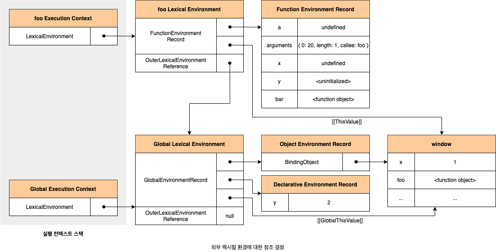

## 렉시컬 스코프

저희는 스코프를 배울 때 렉시컬 스코프에 대해서 잠깐 배웠습니다.

이번에는 실행 컨텍스트와 관련해서 렉시컬 스코프를 다시 보겠습니다.

실행 컨텍스트에서 배웠지만, 스코프의 실체는 **실행 컨텍스트의 렉시컬 환경**이었습니다.


이 렉시컬 환경은 자신의 '외부 렉시컬 환경에 대한 참조'를 통해서 상위 렉시컬 환경과 연결되었죠.

그리고 이것이 바로 ⛓<u>스코프 체인</u>이었습니다.



그래서 `함수의 상위 스코프를 결정한다` === `렉시컬 환경의 외부 렉시컬 환경에 대한 참조에 저장할 참조 값을 결정한다` 가 성립합니다.

이 관점에서 렉시컬 스코프를 다시 정의해보면 다음과 같습니다.

**렉시컬 스코프:** '외부 렉시컬 환경에 대한 참조'에 저장할 참조 값 (상위 스코프에 대한 참조)은 함수가 정의된 위치에 의해 결정되는 것을 말합니다.

<br>

## 함수 객체의 내부 슬롯 `[[Environment]]`

> 함수는 자신의 내부 슬롯 `[[Environment]]` 에 상위 스코프의 참조를 저장합니다.

<br>

## 클로저와 렉시컬 환경

> 이미 생명 주기가 종료된 외부 함수의 변수를 참조하는 중첩 함수를 '클로저(closure)' 라고 부릅니다.

```js
const x = 1;

function outer() {
    const x = 10;
    const inner = function () {
        console.log(x);
    };
    return inner;
}

// outer 함수를 호출하면 중첩 함수 inner를 반환합니다.
// 그리고 outer 함수의 실행 컨텍스트는 실행 컨텍스트 스택에서 pop되어 제거됩니다.
const innerFunc = outer();

innerFunc();
```

<br>

## 클로저의 활용

> 상태(state)를 안전하게 변경하고 유지하기 위해 사용합니다.

구체적으로 말씀드리면, 🥷**상태를 안전하게 은닉**하고 **특정 함수에게만 상태 변경을 ✅허용**하기 위해 사용됩니다.

아래의 코드는 문제가 있습니다. 어떤 문제가 있을까요?

```js
let num = 0;

const increase = function () {
    return ++num;
};

console.log(increase()); // 0
console.log(increase()); // 1
console.log(increase()); // 2
```

우선 가장 큰 문제점은 `num`이 전역 변수로 선언이 되었기에, 누구나 접근이 가능하고 변경할 수 있습니다.

이를 해결하기 위해서는 아래와 같은 조건이 필요합니다.

-   상태(num 변수 값)는 increase 함수가 호출되기 전까지 변경되지 않고 유지되어야 합니다.
-   상태(num 변수 값)는 increase 함수만이 변경할 수 있어야 합니다.

만약에 이를 해결하려고 아래의 코드를 짰다고 가정해봅시다.

```js
const increase = function () {
    let num = 0;

    return ++num;
};

console.log(increase()); // 1
console.log(increase()); // 1
console.log(increase()); // 1
```

여기서 문제는 `increase` 함수가 **호출될 때마다 지역 변수 num이 다시 선언되고 0으로 초기화** 되기 때문입니다.

즉 이전 상태 유지가 되지 않습니다.

이 문제를 `클로저`를 활용해서 해결하겠습니다.

```js
const increase = (function () {
    let num = 0;

    // 클로저
    return function () {
        return ++num;
    };
})();

console.log(increase()); // 1
console.log(increase()); // 2
console.log(increase()); // 3
```

위 코드가 실행되면 즉시 실행 함수가 호출되고, 즉시 실행 함수가 반환한 함수가 increase 변수에 할당됩니다.

increase 변수에 할당된 함수는 즉시 실행함수의 렉시컬 환경(상위스코프)을 기억하는 클로저입니다.

이번에는 감소하는 기능도 추가하죠.

```js
const counter = (function () {
    let num = 0;

    return {
        increase() {
            return ++num;
        },
        decrease() {
            return num > 0 ? --num : 0;
        },
    };
})();

console.log(counter.increase()); // 1
console.log(counter.increase()); // 2

console.log(counter.decrease()); // 1
console.log(counter.decrease()); // 0
```

클로저가 활용되는 다른 예시를 살펴보겠습니다.

```js
// 함수를 반환하는 고차함수
// 이 함수는 카운트 상태를 유지하기 위한 자유 변수 counter를 기억하는 클로저를 반환합니다.
const counter = (function () {
    let counter = 0;

    // 함수를 인수로 전달받는 클로저를 반환
    return function (predicate) {
        // 인수로 전달받은 보조 함수에 상태 변경을 위임합니다.
        counter = predicate(counter);
        return counter;
    };
})();

// 보조함수
function increase(n) {
    return ++n;
}

// 보조함수
function decrease(n) {
    return --n;
}

// 보조 함수를 전달하여 호출합니다.
console.log(counter(increase)); // 1
console.log(counter(increase)); // 2

// 자유 변수를 공유합니다.
console.log(counter(decrease)); // 1
console.log(counter(decrease)); // 0
```
