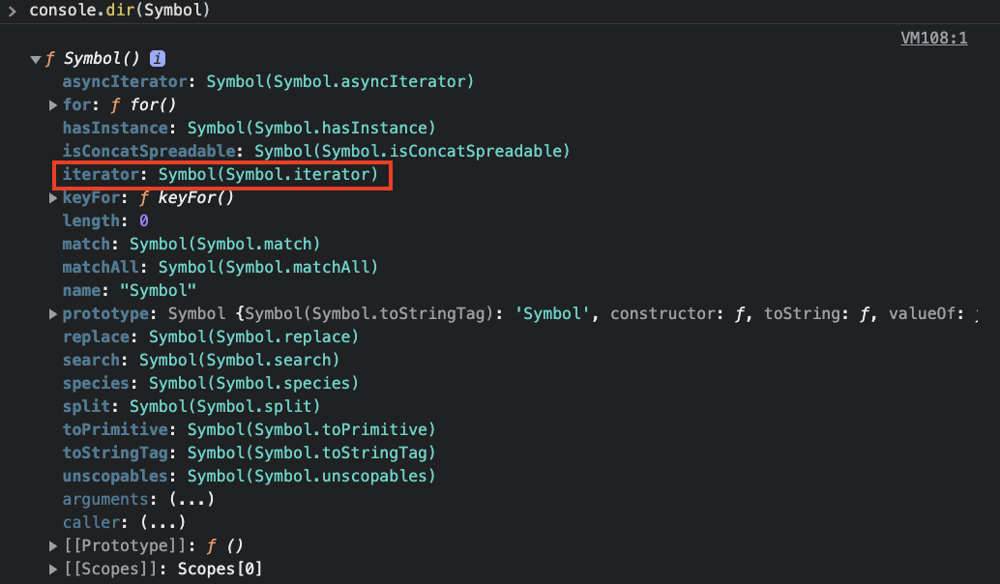

## 심벌(Symbol)

> 7번째 데이터 타입으로 변경 불가능한 원시 타입의 값입니다.

심벌 값은 다른 값과 중복되지 않는 유일무이한 값입니다.

따라서 주로 이름의 충돌 위험이 없는 유일한 프로퍼티 키를 만들기 위해 사용합니다.

## 심벌 값의 생성

심벌 값은 Symbol 함수를 호출하여 생성합니다.

이때 생성된 심벌 값은 외부로 노출되지 않아 확인할 수 없습니다.

또한 다른 값과 절대 중복되지 않는 유일무이한 값입니다.

## 심벌과 프로퍼티 키

심벌 값으로 프로퍼티 키를 동적 생성하여 프로퍼티를 만들어보겠습니다.

```js
const obj = {
    [Symbol.for('mySymbol')]: 1,
};

obj[Symbol.for('mySymbol')];
```

심벌 값은 유일무이한 값이므로 심벌 값으로 프로퍼티 키를 만들면 다른 프로퍼티 키와 절대 충돌하지 않습니다.

<br>

## Well-known Symbol

> ECMAScript 사양에서 부르는 빌트인 심벌 값입니다.

빌트인 심벌 값은 무엇일까요?

이는 Symbol 함수를 참조해보면 Symbol 함수의 프로퍼티에 할당되어 있습니다.



이처럼 자바스크립트가 기본적으로 제공하는 빌트인 심벌 값을 스펙에서는 **Well-know Symbol**이라고 부른답니다.

이 Well-known Symbol은 자바스크립트 엔진의 내부 알고리즘에 사용된다고 하네요.

가령, 빌트인 이터러블이라는 것이 있습니다.

이는 Array, String, Map, Set, arguments, NodeList, HTMLCollection 등 과 같이 `for...of` 문으로 순회가 가능합니다.

이들은 모두 `이터레이션 프로토콜`이라는 것을 따릅니다.

이터레이션 프로토콜은 다음과 같은 규정을 의미합니다.

-   Well-known Symbol인 Symbol.iterator를 키로 갖는 메서드를 가집니다.
-   Symbol.iterator 메서드를 호출하면 이터레이터를 반환합니다.

이러한 빌트인 이터러블 뿐 아니라, 일반 객체도 이터러블 처럼 구현하고 싶으면 이터레이션 프로토콜을 따르면 됩니다.

즉, Symbol.iterator를 키로 갖는 메서드를 객체에 추가하고, 이터레이터를 반환하도록 구현하면 되겠죠?

```js
const iterable = {
    [Symbol.iterator]() {
        // Symbol.iterator 메서드를 구현하여 이터러블 프로토콜을 준수합니다.
        let cur = 1;
        const max = 8;
        // Symbol.iterator 메서드는 next 메서드를 소유한 이터레이터를 반환합니다.
        return {
            next() {
                return { value: cur++, done: cur > max + 1 };
            },
        };
    },
};

for (const num of iterable) {
    console.log(num); // 1 2 3 4 5 6 7 8
}
```

Symbol.iterator는 기존 프로퍼티 키 또는 앞으로도 추가될 프로퍼티 키와 중복될 일이 없습니다.

이처럼 심벌의 도입된 목적은 기존 코드에 영향을 주지 않고, 새로운 프로퍼티를 추가하기 위함입니다.
