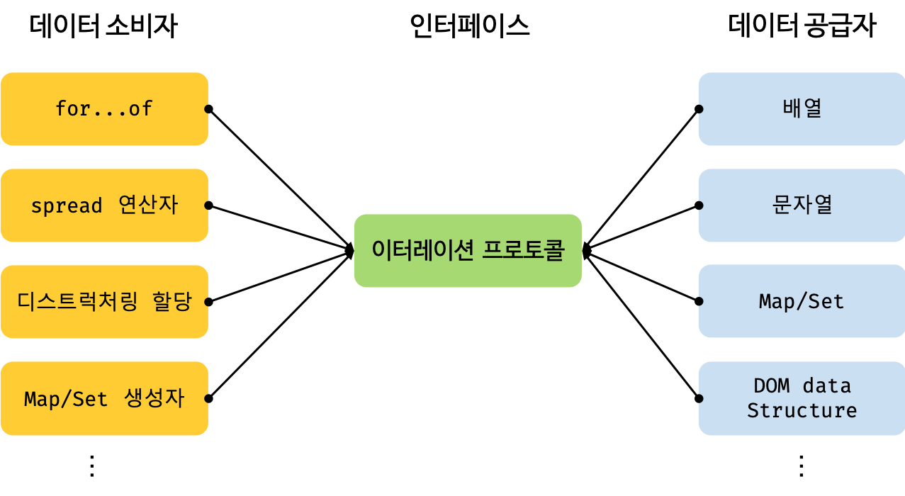

## 이터레이션 프로토콜

> 순회 가능(iterable)한 자료구조를 만들기위해 ECMAScript 사양에 정의한 규칙입니다.

ES6에서 도입되었습니다. 그렇다면 그 이전에는 어땠을까요?

ES6 이전에 순회 가능한 자료구조인 배열,문자열,유사 배열 객체, DOM 컬렉션 등은 통일된 규약이 따로 없었습니다.

그래서 각자의 구조를 가지고 for문, forEach 메서드, for...in 문 등 다양한 방법으로 순회 했었죠.

그러나 ES6부터는 순회 가능한 데이터 컬렉션(자료구조)를 **이터레이션 프로토콜을 준수하는 이터러블로 통일했습니다.**

그리고 for...of문, 스프레드 문법, 배열 디스트럭쳐링 할당의 대상으로 사용할 수 있도록 일원화 했습니다.

이터레이션 프로토콜에는 2가지 종류가 있습니다.

-   **이터러블 프로토콜:** Symobl.iterator 메서드를 호출하면 이터레이터 프로토콜을 준수한 이터레이터를 반환하는 규약을 말합니다.
-   **이터레이터 프로토콜:** next 메서드를 소유하며 next 메서드를 호출하면 이터러블을 순회하며 value와 done 프로퍼티를 갖는 이터레이터 객체를 반환하는 규약을 말합니다.


#### 이터러블

> 이터러블 프로토콜을 준수한 객체를 의미합니다.

즉, Symbol.iterator를 프로퍼티 키로 사용한 메서드를 직접 구현하거나 프로토타입 체인을 통해 상속 받은 객체를 의미합니다.

```js
// 이터러블인지 확인하는 함수 구현
const isIterable = (v) =>
    v !== null && typeof v[Symbol.iterator] === 'function';

// 배열, 문자열, Map, Set 등은 이터러블 입니다.
console.log(isIterable([])); // true

console.log(isIterable('hi')); // true

console.log(isIterable(new Map())); // true

console.log(isIterable(new Set())); // true

console.log(isIterable({})); // false
```

예를 들어 배열은 Array.prototype의 Symbol.iterator 메서드를 상속받는 이터러블입니다.

이터러블은 for...of문으로 순회할 수 있고, 스프레드 문법과, 배열 디스트럭처링 할당의 대상으로 사용 할 수 있습니다.

```js
const arr = [1, 'hi', true];

// 배열은 Array.prototype의 Symbol.iterator 메서드를 상속받는 이터러블입니다.
console.log(Symbol.iterator in arr); // true

for (const item of arr) {
    console.log(item);
}
/*
1
hi
true
*/

console.log([...arr]); // [ 1, 'hi', true ]

const [a, ...rest] = arr;
console.log(a, rest); // 1 [ 'hi', true ]
```

일반 객체는 이터러블 프로토콜을 준수하는 이터러블이 아닙니다.

```js
const obj = { x: 1, y: 2 };

// 일반 객체는 Symbol.iterator 메서드를 구현하거나 상속받지 않습니다.
// 따라서 일반 객체는 이터러블 프로토콜을 준수한 이터러블이 아닙니다.
console.log(Symbol.iterator in obj); // false

// 이터러블이 아닌 일반 객체는 for...of문으로 순회할 수 없습니다.
for (const item of obj) {
    console.log(item); // 🚫 Uncaught TypeError: obj is not iterable
}

// 이터러블이 아닌 일반 객체는 배열 디스트럭쳐링 할당의 대상으로 사용할 수 없습니다.
const [x, y] = obj; // 🚫 Uncaught TypeError: obj is not iterable
```

### 이터레이터

> 이터러블의 요소를 탐색하기 위한 포인터입니다.

이터러블의 Symbol.iterator 메서드를 호출하면 이터레이터 프로토콜을 준수한 이터레이터를 반환합니다.

이터러블의 Symbol.iterator 메서드가 반환한 이터레이터는 `next` 메서드를 갖습니다.

```js
// 배열은 이터러블 프로토콜을 준수한 이터러블입니다.
const array = [1, 2, 3];

// Symbol.iterator 메서드는 이터레이터를 반환합니다.
const iterator = array[Symbol.iterator]();

// Symbol.iterator 메서드가 반환한 이터레이터는 next 메서드를 갖습니다.
console.log('next' in iterator); // true
```

`next` 메서드는 이터러블의 각 요소를 순회하기 위한 포인터 역할을 하게됩니다.

다시 말해서, next 메서드를 호출하면 이터러블을 순차적으로 한 단계식 순회하며 순회 결과를 나타내는 **이터레이터 리절트 객체(iterator result object)** 를 반환합니다.

```js
// 배열은 이터러블 프로토콜을 준수한 이터러블입니다.
const array = [1, 2, 3];

// Symbol.iterator 메서드는 이터레이터를 반환합니다.
// 이터레이터는 next 메서드를 갖습니다.
const iterator = array[Symbol.iterator]();

// next 메서드를 호출하면 이터러블을 순회하며 순회 결과를 나타내는 이터레이터 리절트 객체를 반환합니다.
// 이터레이터 리절트 객체는 value와 done을 프로퍼티로 갖는 객체입니다.
console.log(iterator.next()); // { value: 1, done: false }
console.log(iterator.next()); // { value: 2, done: false }
console.log(iterator.next()); // { value: 3, done: false }
console.log(iterator.next()); // { value: undefined, done: true }
```

이터레이터 next 메서드가 반환하는 이터레이터 리절트 객체의 각 프로퍼티는 다음을 의미합니다.

-   value 프로퍼티는 현재 순회중인 이터러블의 값을 나타내며
-   done 프로퍼티는 이터러블의 순회 완료 여부를 나타냅니다.

## 이터레이션 프로토콜 왜 필요해?

> 하나의 순회 방식을 갖도록 규정하여 데이터 소비자가 효율적으로 데이터 공급자를 사용할 수 있도록 하기 위함입니다.

만약에 데이터 공급자가 각자의 순회 방식을 갖는다면 어떻게 될까요?

아마도 데이터 소비자는 데이터 공급자의 순회 방식을 모두 지원해야할 것이고, 이는 효율적이지 않습니다.

하지만, 다양한 데이터 공급자가 이터레이션 프로토콜을 준수하도록 규정하면 데이터 소비자는 이터레이션 프로토콜만 지원하도록 구현하면 됩니다.

다시 말해서 이터러블을 지원하는 데이터 소비자는 내부에서 Symbol.iterator 메서드를 호출해 이터레이터를 생성하고 이터레이터의 next 메서드를 호출하여 이터러블을 순회하며 이터레이터 리절트 객체를 반환합니다.

그리고 이터레이터 객체의 value, done 프로퍼티 값을 취득하게 되는 것입니다.



## 빌트인 이터러블

## for...of 문

> 이터러블을 순회하면서 이터러블의 요소를 변수에 할당합니다.

```js
for (변수선언문 of 이터러블) {...}
```

`for...of`문은 내부적으로 이터레이터의 next 메서드를 호출하여 이터러블을 순회합니다.

next 메서드가 반환한 이터레이터 리절트 객체의 value 프로퍼티 값을 `for...of` 문의 변수에 할당합니다.

그리고 이터레이터 리절트 객체의 done 프로퍼티 값이 false이면 이터러블의 순회를 계속하고 true이면 이터러블의 순회를 중단하게 됩니다.

```js
const array = [1, 2, 'hello'];

// item 변수에 순차적으로 1,2,hello가 할당됩니다.
for (const item of array) {
    console.log(item); // 1 2 hello
}
```

`for...of` 문의 내부 동작을 for문으로 표현해보겠습니다.

```js
// 이터러블
const iterable = [1, 2, 'hello'];

// 이터러블의 Symbol.iterator 메서드를 호출하여 이터레이터를 생성합니다.
const iterator = iterable[Symbol.iterator]();

for (;;) {
    // 이터레이터의 next 메서드를 호출하여 이터러블을 순회합니다.
    // 이때 next 메서드는 이터레이터 리절트를 반환합니다.
    const res = iterator.next();
    // next 메서드가 반환한 이터레이터 리절트 객체의 done 프로퍼티 값이 true이면 이터러블의 순회를 중단합니다.
    if (res.done) break;
    // 이터레이터 리절트 객체의 value 프로퍼티 값을 item 변수에 할당합니다.
    const item = res.value;
    console.log(item); // 1 2 hello
}
```

## 이터러블과 유사 배열 객체

유사 배열 객체에 대해서 기억 나시나요?

유사 배열 객체는 마치 배열처럼 length 프로퍼티를 가지면서, 인덱스로 프로퍼티 값에 접근할 수 있는 객체였습니다.

length 프로퍼티를 가지기에 for문으로 순회가 가능하였고, 인덱스를 나타내는 숫자 형식의 문자열을 프로퍼티 키로 가지기에 배열처럼 인덱스로 프로퍼티 값에 접근을 할 수 있었죠.

```js
// 유사 배열 객체입니다.
const arrayLike = {
    0: 1,
    1: 2,
    2: 3,
    length: 3,
};

// 유사 배열 객체는 length 프로퍼티를 갖기 때문에 for문으로 순횐할 수 있습니다.
for (let i = 0; i < arrayLike.length; i++) {
    // 유사 배열 객체는 마치 배열처럼 인덱스로 프로퍼티 값에 접근할 수 있습니다.
    console.log(arrayLike[i]); // 1 2 3
}
```

유사 배열 객체는 Symbol.iterator 메서드가 구현되어있지 않는 이상 기본적으로는 이터러블이 아닌 일반 객체입니다.

따라서 `for...of`문으로 순회 할 수 없습니다.

```js
// 유사 배열 객체입니다.
const arrayLike = {
    0: 1,
    1: 2,
    2: 3,
    length: 3,
};

// 유사 배열 객체는 이터러블이 아니기 때문에 for...of 문으로 순회할 수 없습니다.
for (const item of arrayLike) {
    console.log(item); // 🚫 TypeError: arrayLike is not iterable
}
```

ES6 이후부터 유사 배열 객체이면서 이터러블인 경우도 있습니다.

다음 예시가 대표적인 경우입니다.

-   arguments
-   NodeList
-   HTMLCollection
-   배열

이들은 모두 이터러블이 도입되면서 Symbol.iterator 메서드를 구현해서 이터러블이 되었습니다. 즉, 유사 배열 객체이면서 이터러블인 것이죠.

Symobl.iterator 메서드를 구현하는 것 말고도 ES6에 도입된 `Array.from` 메서드를 사용하여 유사 배열 객체를 배열로 간단히 변화시킬 수도 있습니다.

```js
// 유사 배열 객체입니다.
const arrayLike = {
    0: 1,
    1: 2,
    2: 3,
    length: 3,
};

// Array.from은 유사 배열 객체 or 이터러블을 배열로 변환합니다.
const array = Array.from(arrayLike);

console.log(array); // [ 1, 2, 3 ]
```

`Array.from` 메서드는 유사 배열 객체 또는 이터러블을 인수로 전달받아 배열로 변환하여 반환합니다.

## 사용자 정의 이터러블

#### 사용자 정의 이터러블 구현

```js
// 피보나치 수열을 구현한 사용자 정의 이터러블
const fibonacci = {
    // Symbol.iterator 메서드를 구현하여 이터러블 프로토콜을 준수합니다.
    [Symbol.iterator]() {
        let [pre, cur] = [0, 1];
        const max = 15; // 수열의 최대 값입니다.
        // Symbol.iterator 메서드는 next 메서드를 소유한 이터레이터를 반환해야 하고
        // next 메서드는 이터레이터 리절트 객체를 반환해야합니다.
        return {
            next() {
                [pre, cur] = [cur, pre + cur];
                // 이터레이터 리절트 객체를 반환합니다.
                return { value: cur, done: cur >= max };
            },
        };
    },
};

// 이터러블인 fibonacci 객체를 순회할 때마다 next 메서드가 호출됩니다.
// for...of 문은 done 프로퍼티가 true가 될때까지 반복합니다.
for (const num of fibonacci) {
    console.log(num); // 1 2 3 5 8 13
}

// 이터러블은 스프레드 문법의 대상이 될 수 있습니다.
const arr = [...fibonacci];
console.log(arr); // [ 1, 2, 3, 5, 8, 13 ]

// 이터러블은 배열 디스트럭처링 할당의 대상이 될 수 있습니다.
const [first, second, ...rest] = fibonacci;
console.log(first, second, rest); // 1 2 [ 3, 5, 8, 13 ]
```

#### 이터러블을 생성하는 함수

앞의 예제에서는 수열의 최대 값이 고정되어 있어 외부에서 전달한 값으로 변경할 수 없다는 단점이 있습니다.

최대값을 외부에서 전달할 수 있도록 개선해봅시다.

```js
// 피보나치 수열을 구현한 사용자 정의 이터러블을 반환하는 함수입니다.
// 수열의 최대값을 인수로 받습니다.
const fibonacci = function (max) {
    let [pre, cur] = [0, 1];

    // Symbol.iterator 메서드를 구현한 이터러블을 반환합니다.
    return {
        [Symbol.iterator]() {
            return {
                next() {
                    [pre, cur] = [cur, pre + cur];
                    return { value: cur, done: cur >= max };
                },
            };
        },
    };
};

// 이터러블을 반환하는 함수에 수열의 최대값을 인수로 전달하면서 호출합니다.
// fibonacci(15)은 이터러블을 반환합니다.
for (const num of fibonacci(15)) {
    console.log(num); // 1 2 3 5 8 13
}
```

#### 이터러블이면서 이터레이터인 객체를 생성하는 함수

#### 무한 이터러블과 지연 평가

```js
// 무한 이터러블을 생성하는 함수입니다.
const fibonacciFunc = function () {
    let [pre, cur] = [0, 1];

    return {
        [Symbol.iterator]() {
            return this;
        },
        next() {
            [pre, cur] = [cur, pre + cur];
            // 무한을 구현해야하므로 done 프로퍼티를 생략합니다.
            return { value: cur };
        },
    };
};

// fibonacciFunc 함수는 무한 이터러블을 생성합니다.
for (const num of fibonacciFunc()) {
    if (num > 10000) break;
    console.log(num); // 1 2 3 5 8 ... 4181 6765
}

// 배열 디스트럭쳐링 할당을 통해 무한 이터러블에서 3개의 요소만 취합니다.
const [f1, f2, f3] = fibonacciFunc();
console.log(f1, f2, f3); // 1 2 3
```

위 예제의 이터러블은 **지연 평가**를 통해 데이터를 생성합니다.

지연 평가는 미리 데이터를 생성하지 않고 있다가 데이터가 필요한 시점이 되면 비로소 데이터를 생성하는 기법입니다.

가령 위 예제의 경우 for...of 문이나 배열 디스트럭쳐링 할당 등이 실행되기 이전까지 데이터를 생성하지 않습니다.

for...of 문의 경우 이터러블을 순회할 때 내부에서 이터레이터의 next 메서드를 호출하는 이 때 데이터가 생성됩니다.

이처럼 지연 평가는 빠른 실행 속도기를 기대할 수 있고, 불필요한 메모리를 소비하지 않으며 무한도 표현할 수 있다는 장점이 있습니다.
