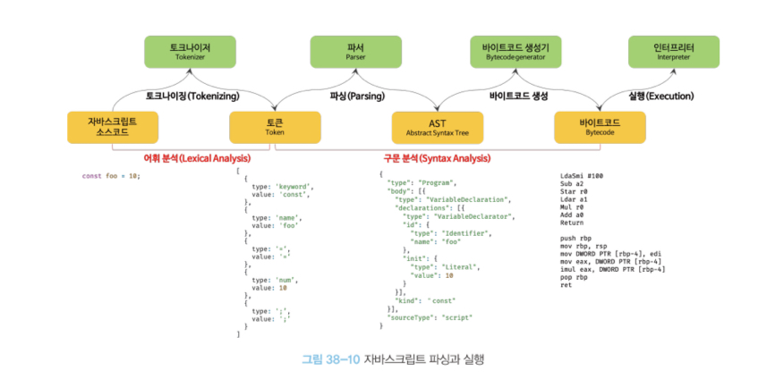
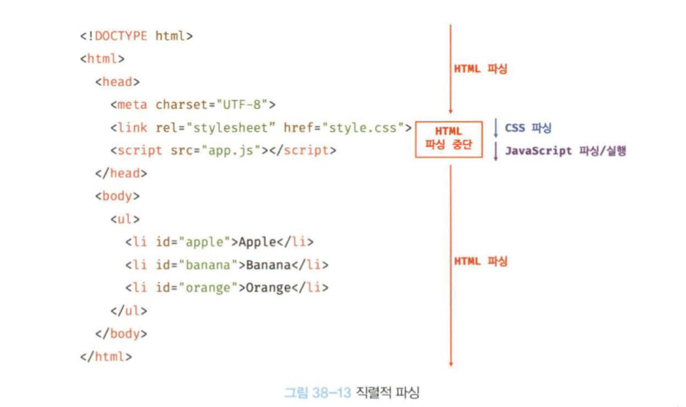

우리는 브라우저의 렌더링 과정을 왜 알아야 할까요?

가장 원초적인 이유는 저희는 프론트엔드 개발자이기 때문에 브라우저가 어떻게 렌더링하는지 당연히 알아야합니다.

부차적인 이유로는 브라우저의 렌더링 과정을 잘 이해해야 렌더링 성능 효율을 최대로 끌어올릴 수 있기 때문입니다.

즉, 어떤 부분에서 성능상 문제가 생기고 있는지 파악하는 문제정의를 할 수 있으면 그것을 개선시킬 수 있는 해결책도 자연스럽게 따라오겠죠.

이를 위해서 브라우저가 어떻게 텍스트 문서를 파싱하여 렌더링하는지 그 과정을 따라가봅시다.

<br>

## 브라우저의 렌더링 과정

책에 클라이언트 사이드라는 단어가 나오네요.

클라이언트 사이드가 무슨 뜻일까요?

말 그대로 **클라이언트(사용자)쪽에서 행해지는 처리를 의미**합니다.

우리는 클라이언트 사이드 어플리케이션을 이미 자주 사용하고 있는데요.

바로 웹 브라우저(크롬, 사파리, 파이어폭스 등)가 이에 해당합니다.

자세한 내용은 [링크](https://ko.wikipedia.org/wiki/%ED%81%B4%EB%9D%BC%EC%9D%B4%EC%96%B8%ED%8A%B8_%EC%82%AC%EC%9D%B4%EB%93%9C)를 참고하세요.

아래 그림은 브라우저의 렌더링 과정을 간단하게 표현한 그림입니다.


우선, 큰 그림을 그려야하니까 브라우저 렌더링 과정을 단계별로 흝어봅시다.

1️⃣ 브라우저는 HTML,CSS,JS,이미지,폰트 파일 등 렌더링에 필요한 리소스를 요청하고 서버로부터 응답을 받습니다.

2️⃣ 브라우저 렌더링 엔진은 서버로부터 응답된 HTML과 CSS를 파싱하여 DOM과 CSSOM을 생성하고 이들을 결합하여 렌더 트리를 생성합니다.

3️⃣ 브라우저 자바스크립트 엔진은 서버로부터 응답된 자바스크립트를 파싱하여 AST(Abstract Syntax Tree)를 생성하고 바이트코드로 변환하여 실행합니다. 이때 자바스크립트는 DOM API를 통해 DOM이나 CSSOM을 변경할 수 있습니다. 변경된 DOM과 CSSOM은 다시 렌더 트리로 결합됩니다.

4️⃣ 렌더 트리를 기반으로 HTML 요소의 레이아웃을 계산하고 브라우저 화면에 HTML 요소를 페인팅합니다.

굉장히 복잡하게 보이지만, 결국 핵심은 서버로부터 요청을 하고, 응답 받은 것을 어떠한 처리를 통해 시각적으로 렌더링 해주는 과정입니다.

이제 각 단계를 나누어서 세세하게 살펴보아요!

<br>

## 서버에 요청과 응답 (데이터를 받아오는 과정)

아까도 언급했지만, 브라우저의 핵심 기능은 **필요한 리소스를 서버에 요청하고 서버로부터 응답 받아 브라우저에 시각적으로 렌더링** 하는 것입니다.

그렇다면 서버에 요청을 어떻게 할까요?

서버에 요청을 전송하기 위해서는 제공된 브라우저 주소창을 사용하면 됩니다.

브라우저의 주소창에 URL을 입력하고 엔터키를 누르면, URL의 호스트 이름이 DNS를 통해 IP 주소를 갖는 서버에게 요청을 전송합니다.


<br>
<br>

예를 들어 `https://www.naver.com`을 입력하면, 루트 요청이 naver.com서버로 전성됩니다.

일반적으로 서버는 루트 요청에 대해 암묵적으로 <u>index.html을 응답하도록 설정</u>되어 있습니다.

즉, `https://www.naver.com/index.html`과 같은 요청인것이죠.

만약 다른 정적 파일을 서버에 요청하고 싶다면, 요청할 정적 파일의 경로와 파일 이름을 URI의 호스트 뒤의 path에 기술하여 서버에 요청하면 됩니다.

예를 들어 `https://www.naver.com/assets/data/data.json`처럼 말이죠.
(이는 단순 예시일 뿐 실제로는 찾을 수 없는 페이지입니다.)

그러나 반드시 브라우저 주소창을 통해서만 서버에 정적 파일을 요청할 수 있는 것은 아닙니다.

자바스크립트를 통해서도 서버에 정적/동적 데이터를 요청할 수 있습니다. 이는 REST API, ajax와 연관되어 있답니다.

요청과 응답은 개발자 도구의 Network 패널에서 볼 수 있습니다.


<br>
<br>

그림을 보면, index.html`(www.naver.com)` 뿐 만 아니라, 자바스크립트 파일, 이미지 등도 같이 응답이 되었네요.

이는 **브라우저 렌더링 엔진이 HTML을 파싱하는 도중에 외부 리소스를 로드하는 태그(link 태그, img 태그, script 태그 등)를 만나면 파싱을 일시 중단하고 해당 리소스 파일을 서버에 요청**하기 때문입니다.

<br>

## HTTP 1.1과 HTTP 2.0

> HTTP는 웹에서 브라우저와 서버가 통신하기 위한 규약(프로토콜)입니다.


HTTP 1.1과 HTTP 2.0의 차이는 다음과 같습니다.

-   HTTP 1.1: 하나의 요청과 응답만 처리합니다. 다중 요청/응답이 불가능합니다.
-   HTTP 2.0: 다중 요청/응답이 가능합니다. HTTP/1.1에 비해 속도가 약 50% 빠릅니다.

<br>

## HTML 파싱과 DOM 생성

> DOM은 서버로부터 응답받은 HTML 문서를 파싱한 결과물입니다.

브라우저 요청에 의해 서버가 응답한 HTML 문서는 문자열로 이루어진 텍스트입니다.

이것을 픽셀로 렌더링하려면 브라우저가 이해할 수 있는 자료구조로(객체)로 변환해야합니다.

이 자료구조가 바로 **DOM(Document Object Model)** 입니다.

즉, 브라우저는 응답받은 HTML 문서를 파싱하여 브라우저가 이해할 수 있는 자료구조인 DOM을 생성하게 됩니다.


<br>
<br>

어떻게 DOM을 생성하게 되는지 그 과정을 자세히 알아보겠습니다.

1️⃣ 서버는 브라우저가 요청한 HTML 파일을 읽어들여 메모리에 저장한 다음 메모리에 저장된 바이트(2진수)를 인터넷을 경유하여 응답합니다.

2️⃣ 브라우저는 응답받은 바이트(2진수) 형태의 HTML 문서를 인코딩 방식(ex.UTF-8)을 기준으로 문자열로 변환합니다. (이때 meta 태그의 charset 어트리뷰트를 참고합니다.)

3️⃣ 문자열로 변환된 HTML 문서를 읽어들이고 토큰들로 분해합니다.

4️⃣ 각 토큰들을 객체로 변환하여 **노드**들을 생성합니다. 토큰의 내용에 따라 문서 노드, 요소 노드, 어트리뷰트 노드, 텍스트 노드가 됩니다. 노드는 DOM을 구성하는 기본 요소가 됩니다.

5️⃣ HTML 요소간에는 중첩관계에 의해 부자관계가 형성됩니다. 이 부자관계를 반영하여 모든 노드들을 **트리 자료 구조**로 구성합니다. 이 트리 자료 구조가 바로 **DOM**입니다.

<br>

## CSS 파싱과 CSSOM 생성

렌더링 엔진은 DOM을 생성해 나가다가 CSS를 로드하는 link 태그나 style 태그를 만나면 DOM 생성을 일시 중단합니다.

link 태그의 href 어트리뷰트에 지정된 CSS 파일을 서버에 요청하여 로드한 CSS 파일이나 style 태그 내의 CSS를 동일한 파싱 과정 (바이트 -> 문자 -> 토큰 -> 노드 -> CSSOM)을 거치며 해석하여 **CSSOM (CSS Object Model)** 을 생성합니다.


<br>
<br>

이후 CSS 파싱을 완료하면 HTML 파싱이 중단된 지점부터 다시 HTML을 파싱하기 시작하여 DOM 생성을 재개합니다.


<br>
<br>

CSSOM은 CSS의 상속을 반영하여 생성됩니다. 예를 들어 body 요소에 적용한 font-size 프로퍼티와 ul 요소에 적용한 list-style-type 프로퍼티는 모두 li 요소에 상속됩니다.

<br>

## 렌더 트리 생성

생성된 DOM과 CSSOM을 렌더링을 위해 **렌더 트리(render tree)** 로 결합합니다.

렌더 트리는 렌더링을 위한 트리 구조의 자료구조입니다.

렌더 트리는 브라우저 화면에 렌더링되는 노드만으로 구성됩니다.

따라서 `meta 태그`, `script 태그`, `display:none` 과 같은 노드들은 포함되지 않습니다.


<br>
<br>

이렇게 만들어진 렌더 트리는 어떻게 활용될까요?

렌더 트리는 HTML 요소의 **레이아웃(위치와 크기)** 을 계산하는데 사용되며, 브라우저 화면에 픽셀을 렌더링하는 **페인팅** 처리에 입력됩니다.


<br>
<br>

지금까지 살펴본 과정은 반복해서 실행될 수 있습니다.

다음과 같은 경우 레이아웃 계산과 페인팅을 다시 실행하는 <u>리렌더링</u>이 발생합니다.

-   자바스크립트에 의한 노드 추가 or 삭제
-   브라우저 창의 viewport 크기 변경
-   HTML 요소의 레이아웃에 변경을 발생시키는 width/height, margin, padding, border, display, position, top, right, bottom, left 등의 스타일 변경

<br>

## 자바스크립트 파싱과 실행

> AST를 생성하고 이를 기반으로 중간 코드인 바이트코드로 변환되고 인터프리터에 의해 실행됩니다.

HTML 문서를 파싱한 결과물로서 생성된 DOM은 HTML 문서의 구조와 정보 외에도 **DOM API**를 제공합니다.

DOM API는 무엇일까요?

DOM API는 HTML 요소와 스타일 등을 변경할 수 있는 프로그래밍 인터페이스입니다.

자바스크립트 코드에서 DOM API를 사용하면 **이미 생성된 DOM을 동적으로 조작**할 수 있습니다.

아시다시피, 렌더링 엔진은 script 태그를 만나면 DOM 생성을 일시 중단하게 됩니다.

그리고 script 태그의 src 어트리뷰트에 정의된 자바스크립트 파일을 서버에 요청하게 되죠.

로드한 자바스크립트 파일이나 script 태그 내의 자바스크립트 코드를 파싱하기 위해서 **자바스크립트 엔진**에 제어권을 넘기게 됩니다.

이후 자바스크립트 파싱과 실행 모두 종료되면 렌더링 엔진으로 다시 제어권을 넘겨 HTML 파싱이 중단된 시점부터 다시 HTML 파싱을 시작하여 DOM 생성을 재개합니다.

자바스크립트 파싱과 실행은 브라우저의 렌더링 엔진이 아닌❗️자바스크립트 엔진이 처리합니다.

자바스크립트 엔진은 자바스크립트 코드를 파싱하여 CPU가 이해할 수 있는 저수준 언어로 변환하고 실행하는 역할을 합니다.

마치 렌더링 엔진이 HTML,CSS를 파싱하여 DOM과 CSSOM을 생성하듯이, 자바스크립트 엔진은 자바스크립트를 해석하여 **AST(Abstract Syntax Tree)** 를 생성합니다.

그리고 AST를 기반으로 인터프리터가 실행할 수 있는 중간코드인 바이트코드를 생성하여 실행합니다.



1️⃣ **토크나이징 (tokenizing)**

단순한 문자열인 자바스크립트 소스코드를 토큰들로 분해합니다.

2️⃣ **파싱 (parsing)**

토큰들의 집합을 구문 분석하여 **AST(Abstract Syntax Tree)**를 생성합니다.

AST는 토큰에 문법적 의미와 구조를 반영한 트리 구조의 자료구조입니다.

3️⃣ **바이트코드 생성과 실행**

파싱의 결과물로 생성된 AST는 인터프리터가 실행할 수 있는 중간 코드인 바이트 코드로 변환되고 인터프리터에 의해 실행됩니다.

<br>

## 리플로우와 리페인트

만약 자바스크립트 코드에 DOM 혹은 CSSOM을 변경하는 DOM API가 사용된다면 DOM이나 CSSOM이 변경됩니다.

변경된 DOM 혹은 CSSOM은 다시 렌더 트리로 결합되고 변경된 렌더 트리를 기반으로 레이아웃과 페인트 과정을 거쳐서 브라우저 화면에 다시 렌더링합니다.

이를 **리플로우(reflow)**, **리페인트(repaint)** 라고 합니다.


<br>
<br>

-   **리플로우:** 레이아웃을 다시 계산하는 것을 말합니다. (노드 추가 or 삭제, 요소의 크기/위치 변경, 윈도우 리사이즈 등 레이아웃에 영향을 주는 변경이 발생한 경우에만 실행됩니다. )

<br>

-   **리페인트:** 재결합된 렌더 트리를 기반으로 다시 페인트 하는 것을 의미합니다.

<br>

## 자바스크립트 파싱에 의한 HTML 파싱 중단

> script 태그는 body 요소의 가장 아래에 위치시키는 편이 좋습니다.

이 목차는 자바스크립트 코드를 HTML 코드에서 어디에 위치시킬 것이냐에 대한 내용입니다.

이러한 고민을 하는 이유는 **브라우저가 동기적(synchronous)으로 파싱을 수행**하기 때문입니다.

즉, 위에서 아래 방향으로 순차적으로 HTML, CSS, 자바스크립트를 파싱하고 실행합니다.



그래서 **script의 위치에 따라서 HTML 파싱이 블록킹되어 DOM 생성이 지연될 수 있기에** script 태그의 위치는 중요합니다.

scipt 태그를 body 요소 가장 아래에 위치시켜야하는 이유는 다음과 같습니다.

-   DOM이 완성되지 않은 상태에서 DOM API를 사용해 DOM을 조작하면 에러가 발생할 수 있습니다.
-   자바스크립트로 인해 HTML 요소들의 렌더링이 지장받는 일이 발생하지 않아 페이지 로딩 시간이 단축됩니다.

<br>

## script 태그의 async/defer 어트리뷰트

> 자바스크립트 파싱에 의한 DOM 생성이 블록킹되는 문제를 해결하기 위한 어트리뷰트입니다.

```js
<script async src="extern.js"> </script>
<script defer src="extern.js"> </script>
```

`async`와 `defer` 어트리뷰트를 사용하면 HTML 파싱과 외부 자바스크립트 파일의 <u>로드</u>가 **비동기적으로(asynchronous)** 동시에 진행됩니다.

#### async 어트리뷰트

자바스크립트의 파싱과 실행은 자바스크립트 파일의 로드가 완료된 직후 진행되며, 이때 HTML 파싱이 중단됩니다.

로드가 완료된 자바스크립트부터 먼저 실행되므로 ❗️순서가 보장되지 않습니다.

#### defer 어트리뷰트

자바스크립트의 파싱과 실행은 HTML 파싱이 완료된 직후(DOM 생성이 완료된 직후)에 진행됩니다.

DOM 생성이 완료된 이후 실행되어야할 자바스크립트에 유용합니다.
