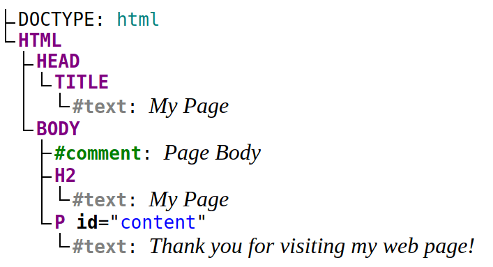
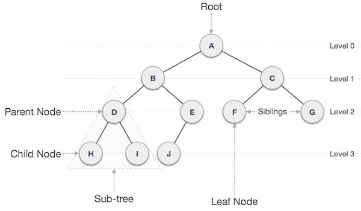
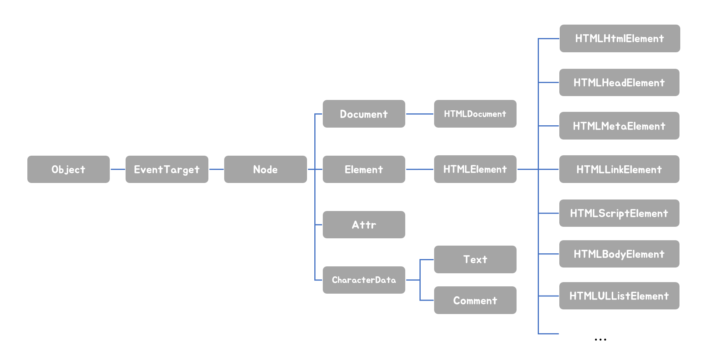

## DOM

> HTML 문서의 계층적 구조와 정보를 표현하며 이를 제어할 수 있는 API를 제공하는 트리 자료구조입니다.

<br>

## DOM이 꼭 필요해?

DOM이 존재해야하는 이유는 무엇일까요?

MDN에서는 DOM이 필요한 이유를 다음과 같이 설명하고 있어요.

```
DOM은 문서의 구조화된 표현(structured representation)을 제공하며
프로그래밍 언어가 DOM 구조에 접근할 수 있는 방법을 제공하여 그들이 문서 구조, 스타일, 내용 등을 변경할 수 있게 돕는다.
DOM 은 nodes와 objects로 문서를 표현한다.
이들은 웹 페이지를 스크립트 또는 프로그래밍 언어들에서 사용될 수 있게 연결시켜주는 역할을 담당한다.
```

다른 외국 자료를 찾아보니 맥락이 비슷하더군요!

```
the browser creates a representation of the document known as the Document Object Model.
This model allows JavaScript to access the text content and elements of the website document as objects.
```

결국 DOM이 필요한 핵심 이유는 ✅JavaScript 때문이었습니다.

왜냐하면 JavaScript가 문서의 내용을 동적으로 조작하려면, 그 전에 문서가 객체 형태로 되어야 접근이 가능하기 때문이죠.

DOM은 그 조작을 위한 중간다리 역할을 해주신다고 보시면 됩니다.

<br>

## 노드 (node)

> HTML 요소를 객체화한 것으로서, DOM을 구성하는 기본 요소입니다.

#### HTML 요소와 노드 객체

HTML 요소가 무엇인지 기억나시나요?

HTML 요소는 말 그대로 HTML 문서를 구성하는 개별적인 요소를 의미합니다.

이 HTML 요소는 렌더링 엔진에 의해 파싱되어 `요소 노드 객체`로 변환됩니다.

그리고 요소의 어트리뷰트는 `어트리뷰 노드`가 되고, 텍스트 콘텐츠는 `텍스트 노드`로 변환됩니다.



<br>
<br>

#### 트리 자료구조

트리 자료구조의 핵심은 **계층적**이라는 것입니다.

즉, 부모와 자식같은 계층적 구조로 이루어진 것이죠.

이러한 트리 자료구조는 단 한개의 최상위 노드에서 시작을 하게 됩니다.

여기서 최상위 노드는 `루트 노드(root node)` 그리고 자식 노드가 없는 노드를 `리프 노드(leaf node)`라고 합니다.



한마디로 **DOM**은 **노드 객체들의 계층적 구조를 보여주는 트리 자료구조**라고 볼 수 있겠네요.

<br>

#### 문서 노드

> HTML 문서 전체를 가리키는 객체입니다. DOM의 최상위에 존재합니다.

노드의 종류는 크게 4가지로 분류할 수 있습니다.

-   문서 노드(document node)
-   요소 노드(element node)
-   어트리뷰트 노드(attribute node)
-   텍스트 노드(text node)

<br>


<br>
<br>

이 구조도에서 흥미로운 것은 텍스트 노드는 요소 노드의 자식 노드이고, 어트리뷰트 노드는 요소 노드와 연결되어 있다는 점입니다.

이중에서 문서 노드만 잠깐 언급하고 넘어가겠습니다.

문서 노드는 DOM 트리의 최상위에 존재하는 루트 노드로서, **document 객체**를 가리킵니다.

그러면 document 객체는 무엇일까요?

document 객체는 <u>HTML 문서 전체를 가리키는 객체</u>입니다.

이는 전역 객체 window의 document 프로퍼티에 바인딩되어 있습니다.

그래서 문서 노드는 window.document 혹은 document로 참조가 가능한 것입니다.

문서 노드(document 객체)는 DOM 트리에 노드들이 접근하기 위한 진입점(entry point) 역할을 합니다.

즉, 요소, 어트리뷰트, 텍스트 노드에 접근하려면 🚙문서 노드를 통해야하는 것이죠.

(그래서 저희가 document.querySelector 등으로 요소를 잡아오기 앞서서 document를 항상 써줬던 이유이겠네요.)

<br>

## 노드 객체의 상속 구조

앞에서 말씀드렸듯, 노드도 결국 객체입니다.

즉, **자바스크립트 객체이기에 프로토타입에 의한 상속 구조**를 갖게됩니다.

따라서 프로토타입 체인에 있는 모든 프로토타입의 프로퍼티나 메서드를 상속받아서 사용 가능합니다.



아래는 노드 객체가 갖는 특성들입니다.

-   `Object`: JS 객체의 특성을 가집니다.
-   `EventTarget`: 이벤트를 발생시킬 수 있습니다. (EventTarget.addEventListener 사용 가능)
-   ` Node`: 트리 자료 구조에 속합니다. 트리 탐색 기능(Node.parentNode, Node.childNodes 등), 노드 정보 제공 기능 등을 사용할 수 있습니다.
-   `Element`: 브라우저가 렌더링할 수 있는 웹 문서의 요소를 표현한 객체입니다.
-   `HTMLElement`: HTML 요소를 표현한 객체입니다.

노드 객체는 공통된 기능일수록 프로토타입 체인의 상위에, 개별적인 고유 기능일 수록 프로토타입 체인의 하위에 프로토타입 체인을 구축하였습니다.

<br>

## 요소 노드 취득

> 요소 노드의 취득은 HTML 요소를 조작하는 시작점입니다.

만약 취득하려는 HTML 요소가 존재하지 않는 경우에는 `null`을 반환하거나 빈 객체를 반환합니다.

DOM은 요소 노드를 취득할 수 있는 다양한 메서드를 제공합니다.

그렇지만, id 어트리뷰트가 있는 경우에만 `getElementById` 메서드를 사용하고 그 외에는 `querySelector`, `querySelectorAll` 메서드를 권장합니다.

왜냐하면 querySelector, querySelectorAll 메서드 같은 CSS 선택자 문법을 사용할 때는 다른 메서드들보다 느리지만, 구체적이고 일관된 방식으로 요소를 취득할 수 있기 때문입니다.

예제를 같이 살펴보시죠.

```html
<!DOCTYPE html>
<html lang="ko">
    <body>
        <ul id="animal">
            <li id="pig">Pig</li>
            <li id="bird">Bird</li>
            <li id="lion">Lion</li>
        </ul>
        <script>
            // getElementById 메서드는 Document.prototype의 프로퍼티입니다.
            // getElementById 메서드는 언제나 단 하나의 요소 노드를 반환합니다.
            const $bird = document.getElementById('bird');

            // 취득한 요소 노드의 style.color 프로퍼티 값을 변경합니다.
            $bird.style.color = 'blue';
        </script>
    </body>
</html>
```

```html
<!DOCTYPE html>
<html lang="ko">
    <body>
        <ul>
            <li class="pig">Pig</li>
            <li class="bird">Bird</li>
            <li class="lion">Lion</li>
        </ul>
        <script>
            // querySelector 메서드는 인수로 전달한 CSS 선택자를 만족시키는 하나의 요소 노드를 탐색하여 반환합니다.
            const $bird = document.querySelector('.bird');

            // 취득한 요소 노드의 style.color 프로퍼티 값을 변경합니다.
            $bird.style.color = 'blue';
        </script>
    </body>
</html>
```

```html
<!DOCTYPE html>
<html lang="ko">
    <body>
        <ul>
            <li class="pig">Pig</li>
            <li class="bird">Bird</li>
            <li class="lion">Lion</li>
        </ul>
        <script>
            // querySelectorAll 메서드는 NodeList 객체를 반환합니다.
            // ul 요소의 자식 요소인 li 요소를 모두 탐색하여 반환합니다.
            const $elems = document.querySelectorAll('ul > li');

            // 취득한 요소들은 NodeList 객체에 담겨 반환됩니다.
            console.log($elems); // NodeList(3) [li.pig, li.bird, li.lion]

            // 취득한 모든 요소 노드의 style.color 프로퍼티 값을 변경합니다.
            // NodeList는 forEach 메서드를 제공합니다.
            $elems.forEach((elem) => {
                elem.style.color = 'blue';
            });
        </script>
    </body>
</html>
```

추가로 특정 요소 노드를 취득할 수 있는지 확인하는 메서드가 있습니다.

`Element.prototype.matches` 메서드입니다.

이 메서드는 이벤트 위임시에 유용하다고 하니 알아둡시다.

```html
<!DOCTYPE html>
<html lang="ko">
    <body>
        <ul id="animals">
            <li class="pig">Pig</li>
            <li class="bird">Bird</li>
            <li class="lion">Lion</li>
        </ul>
        <script>
            const $pig = document.querySelector('.pig');

            // $pig 노드는 #animals > li.pig로 취득할 수 ✅ 있습니다.
            console.log($pig.matches('#animals > li.pig')); // true

            // $pig 노드는 #animals > li.bird로  취득할 수 🚫없습니다.
            console.log($pig.matches('#animals > li.bird')); // false
        </script>
    </body>
</html>
```

<br>

#### HTMLCollection과 NodeList

> DOM API가 여러 개의 결과 값을 반환하기 위한 DOM 컬렉션 객체입니다.

HTMLCollection과 NodeList 모두 **유사 배열 객체이면서 이터러블**입니다.

따라서 `for...of`문으로 순회가능하고, 스프레드 문법을 사용하여 간단히 배열로 변환이 가능합니다.

책에서는 안전하게 DOM 컬렉션을 사용하려면 HTMLCollection과 NodeList 객체를 **배열로 변환하여 사용하는 것을 권장하고 있습니다.**

왜냐하면 HTMLCollection과 NodeList 객체는 예상과 다르게 동작할 가능성이 있고, 상태 변경의 위험도 있기 때문입니다.

```html
<!DOCTYPE html>
<html lang="ko">
    <body>
        <ul id="animals">
            <li>Pig</li>
            <li>Bird</li>
            <li>Lion</li>
        </ul>
        <script>
            const $animals = document.getElementById('animals');

            // childNodes 프로퍼티는 NodeList 객체를 반환합니다.
            const { childNodes } = $animals;

            // 스프레드 문법을 사용하여 NodeList 객체를 배열로 반환합니다.
            [...childNodes].forEach((childNode) => {
                $animals.removeChild(childNode);
            });

            // $animals 요소의 모든 자식 노드가 삭제되었습니다.
            console.log(childNodes); // NodeList []
        </script>
    </body>
</html>
```

<br>

## 노드 탐색

> 취득한 요소 노드를 기점으로 DOM 트리 노드를 옮겨다니며 부모, 형제, 자식 노드 등을 탐색합니다.

대표적으로 잘 쓰이는 노드 탐색 프로퍼티를 살펴보겠습니다.

`Node.prototype.parentNode`: 부모 노드 탐색합니다.
`Node.prototype.childNodes`: 자식 노드들을 NodeList에 담아 반환합니다.
`Node.prototype.previousElementSibling(nextElementSibling)`: 형제 노드를 탐색하여 반환합니다.

```html
<!DOCTYPE html>
<html lang="ko">
    <body>
        <ul id="animals">
            <li class="pig">Pig</li>
            <li class="bird">Bird</li>
            <li class="lion">Lion</li>
        </ul>
        <script>
            const $animals = document.getElementById('animals');
            const $bird = document.querySelector('.bird');

            // #animals 요소의 모든 자식 노드를 탐색합니다.
            // childNodes 프로퍼티각 반환한 NodeList에는 요소 노드 뿐 아니라, 텍스트 노드도 포함되어있습니다.
            console.log($animals.childNodes); // NodeList(7) [text, li.pig, text, li.bird, text, li.lion, text]

            // .bird 요소 노드의 부모 노드를 탐색합니다.
            console.log($bird.parentNode);
            /*<ul id="animals">
            <li class="pig">Pig</li>
            <li class="bird">Bird</li>
            <li class="lion">Lion</li>
            </ul>*/

            console.log($bird.nextElementSibling); // <li class="lion">Lion</li>

            console.log($bird.previousElementSibling); // <li class="pig">Pig</li>
        </script>
    </body>
</html>
```

<br>

## 텍스트 조작

대표적으로 `Node.prototype.textContent`가 있습니다.

getter, setter 모두 존재하는 접근자 프로퍼티로, 요소 노드의 텍스트 노드와 모든 자손 노드의 텍스트를 모두 취하거나 변경합니다.

```html
<!DOCTYPE html>
<html lang="ko">
    <body>
        <div id="foo">안녕 <span>김정희!</span></div>
        <script>
            // #foo 요소 노드의 텍스트를 모두 취득합니다. 이때 HTML 마크업은 무시됩니다.
            console.log(document.getElementById('foo').textContent); // 안녕 김정희!
        </script>
    </body>
</html>
```

```html
<!DOCTYPE html>
<html lang="ko">
    <body>
        <div id="foo">안녕 <span>김정희!</span></div>
        <script>
            // #foo 요소 노드의 모든 자식 노드가 제거되고 할당한 문자열이 텍스트로 추가됩니다.
            // 이때 HTML 마크업이 파싱되지는 않습니다.
            document.getElementById('foo').textContent = '안녕하세요 <span>유재석씨!</span>';
        </script>
    </body>
</html>
```

<br>

## 노드 생성과 추가

#### createElement

> 요소 노드를 생성하여 반환합니다.

매개변수에는 태그 이름을 나타내는 문자열을 인수로 전달합니다.

#### createTextNode

> 텍스트 노드를 생성하여 반환합니다.

매개변수에는 텍스트 노드의 값으로 사용할 문자열을 인수로 전달합니다.

#### appendChild

> 인수로 전달 받은 노드를 마지막 자식 노드로 추가합니다.

지금까지 사용된 메서드를 예제를 통해서 봅시다.

```html
<!DOCTYPE html>
<html lang="ko">
    <body>
        <ul id="animals">
            <li class="bird">Bird</li>
        </ul>
        <script>
            const $animals = document.getElementById('animals');

            // 1. 요소 노드 생성
            const $li = document.createElement('li');

            // 2. 텍스트 노드 생성
            const textNode = document.createTextNode('Lion');

            // 3. 텍스트 노드를 $li 요소 노드의 자식 노드로 추가
            $li.appendChild(textNode);

            // $li 요소 노드를 #animals 요소 노드의 마지막 자식 노드로 추가
            $animals.appendChild($li);
        </script>
    </body>
</html>
```

### 복수의 노드 생성과 추가 (feat. DocumentFragment)

아래 예제와 같이 여러 개의 노드를 추가하는 경우, 리플로우와 리페인트가 3번 실행되는 👾문제가 생깁니다.

```html
<!DOCTYPE html>
<html lang="ko">
    <body>
        <ul id="animals"></ul>
        <script>
            const $animals = document.getElementById('animals');

            ['Pig', 'Bird', 'Lion'].forEach((text) => {
                // 1. 요소 노드 생성
                const $li = document.createElement('li');

                // 2. 텍스트 노드 생성
                const textNode = document.createTextNode(text);

                // 3. 텍스트 노드를 $li 요소 노드의 자식 노드로 추가
                $li.appendChild(textNode);

                // $li 요소 노드를 #animals 요소 노드의 마지막 자식 노드로 추가
                $animals.appendChild($li);
            });
        </script>
    </body>
</html>
```

이러한 문제는 **DocumentFragment 노드**를 통해서 해결할 수 있습니다.

즉, DocumentFragment 노드가 컨테이너 역할을 하고 여기에 자식 노드를 모두 추가하고 한 번만 DOM이 변경되게 하는 것이죠.

DocumentFragment 노드의 유용한 특징은 부모 노드가 없어서 <u>기존 DOM과는 별도로 존재</u>한다는 점입니다.

이러한 성질 덕분에 자식 노드를 추가하여도 기존 DOM에는 어떠한 변경도 발생하지 않습니다.

그러면서도 DocumentFragment 노드를 DOM에 추가하면 자신은 제거되고 자신의 자식 노드만 DOM에 추가됩니다.

```html
<!DOCTYPE html>
<html lang="ko">
    <body>
        <ul id="animals"></ul>
        <script>
            const $animals = document.getElementById('animals');

            // DocumentFragment 노드를 생성합니다.
            const $fragment = document.createDocumentFragment();

            ['Pig', 'Bird', 'Lion'].forEach((text) => {
                // 1. 요소 노드 생성
                const $li = document.createElement('li');

                // 2. 텍스트 노드 생성
                const textNode = document.createTextNode(text);

                // 3. 텍스트 노드를 $li 요소 노드의 자식 노드로 추가
                $li.appendChild(textNode);

                // $li 요소 노드를 DocumentFragment 노드의 마지막 자식 노드로 추가
                $fragment.appendChild($li);
            });

            $animals.appendChild($fragment);
        </script>
    </body>
</html>
```

이처럼 여러 개의 요소 노드를 DOM에 추가하는 경우 DocumentFragment 노드를 사용하는 것이 효율적입니다.

<br>

#### cloneNode

> 노드의 사본을 생성하여 반환합니다.

매개변수에 true를 인수로 전달하면 깊은복사를 하여 모든 자손 노드가 포함된 사본을 생성합니다.

반면, false로 인수를 전달하거나 생략하면 얕은 복사를 하여 노드 자신만의 사본을 생성합니다.

```html
<!DOCTYPE html>
<html lang="ko">
    <body>
        <ul id="animals">
            <li>Pig</li>
        </ul>
        <script>
            const $animals = document.getElementById('animals');
            // 첫번째 자식 요소 노드를 반환합니다.
            const $pig = $animals.firstElementChild;

            // $pig 요소를 얕은 복사하여 사본을 생성합니다.
            // 텍스트 노드가 없는 사본이 생성됩니다.
            const $shallowClone = $pig.cloneNode();

            // 사본 요소에 텍스트 노드를 추가합니다.
            $shallowClone.textContent = 'Bird';

            // 사본 요소 노드를 #animals 요소 노드의 마지막에 추가합니다.
            $animals.appendChild($shallowClone);

            // #animals 요소를 깊은 복사하여 모든 자손 노드가 포홤된 사본을 생성합니다.
            const $deepClone = $animals.cloneNode(true);
            // 사본 요소 노드를 #animals 요소 노드의 마지막 노드로 추가합니다.
            $animals.appendChild($deepClone);
        </script>
    </body>
</html>
```

<br>

#### removeChild

> 인수로 전달한 노드를 DOM에서 삭제합니다.

단❗️ 인수로 전달한 노드는 removeChild 메서드를 호출한 노드의 자식 노드이어야 합니다.

```html
<!DOCTYPE html>
<html lang="ko">
    <body>
        <ul id="animals">
            <li>Pig</li>
            <li>Bird</li>
        </ul>
        <script>
            const $animals = document.getElementById('animals');

            // #animals 요소 노드의 마지막 요소를 DOM에서 삭제합니다.
            $animals.removeChild($animals.lastElementChild);
        </script>
    </body>
</html>
```

<br>

## DOM 조작

> 새로운 노드를 생성하여 DOM에 추가하거나 기존 노드를 삭제 or 교체하는 것을 말합니다.

DOM 조작에 의해 DOM에 새로운 노드가 추가되거나 삭제되면 리플로우와 리페인트가 발생하는 원인이 되기에 성능에 영향을 줍니다.

#### innerHTML

> 요소 노드의 HTML 마크업을 취득하거나 변경합니다.

요소 노드의 innerHTML 프로퍼티를 참조하면 요소 노드의 콘텐츠 영역 (시작태그와 종료 태그 사이)내에 포함된 모든 HTML 마크업을 <u>문자열</u>로 반환합니다.

```html
<!DOCTYPE html>
<html lang="ko">
    <body>
        <div id="foo">
            Hello
            <span>world!</span>
        </div>
        <script>
            // #foo 요소의 콘텐츠 영역 내의 HTML 마크업을 문자열로 취득합니다.
            console.log(document.getElementById('foo').innerHTML);
            //   Hello  <span>world!</span>
        </script>
    </body>
</html>
```

textContent 프로퍼티를 참조하면 HTML 마크업을 무시하고 텍스트만 반환하지만, innerHTML 프로퍼티는 **HTML 마크업이 포함된 문자열을 그대로 반환합니다.**

요소 노드의 innerHTML 프로퍼티에 문자열을 할당하면 요소 노드의 모든 자식 노드가 제거되고 할당한 문자열에 포함되어 있는 HTML 마크업이 파싱되어 요소 노드의 자식 노드로 DOM에 반영됩니다.

```html
<!DOCTYPE html>
<html lang="ko">
    <body>
        <div id="foo">
            Hello
            <span>world!</span>
        </div>
        <script>
            // HTML 마크업이 파싱되어 요소 노드의 자식 노드로 DOM에 반영됩니다.
            document.getElementById('foo').innerHTML = 'Hi <span>there!</span>';
        </script>
    </body>
</html>
```

innerHTML 프로퍼티를 사용하면 HTML 마크업 문자열로 간단히 DOM 조작이 가능합니다.

이때 사용자로부터 입력받은 데이터를 그대로 innerHTML 프로퍼티에 할당하는 것은 **크로스 사이트 스크립팅 공격(XSS: Cross-Site Scripting Attacks )** 에 취약하므로 위험합니다.

왜냐하면 HTML 마크업 내에 자바스크립트 악성 코드가 포함되어 있다면 파싱 과정에서 그대로 실행될 가능성이 있기 때문입니다.

이를 막고자, HTML5는 innerHTML 프로퍼티로 삽입된 script 요소 내의 자바스크립트 코드를 실행하지 않습니다.

```html
<!DOCTYPE html>
<html lang="ko">
    <body>
        <div id="foo"></div>
        <script>
            // innerHTML 프로퍼티로 스크립트 태그를 삽입하여 자바스크립트가 실행되도록 합니다.
            // HTML5는 innerHTML 프로퍼티로 삽입된 script 요소 내의 자바스크립트 코드를 실행하지 않습니다.
            document.getElementById('foo').innerHTML = '<script>alert(document.cookie)</script>';
        </script>
    </body>
</html>

```

❗️하지만 scipt 요소 없이도 크로스 사이트 스크립팅 공격은 가능합니다.

```html
<!DOCTYPE html>
<html lang="ko">
    <body>
        <div id="foo"></div>
        <script>
            // 에러 이벤트를 강제로 발생시켜 자바스크립트 코드가 실행되도록 합니다.
            document.getElementById('foo').innerHTML = '';
        </script>
    </body>
</html>
```

innerHTML 프로퍼티의 단점을 정리하면 다음과 같습니다.

-   크로스 사이트 스크립팅 공격에 취약합니다.
-   유지되어도 좋은 기존의 자식 노드까지 모두 제거하고 다시 처음부터 새롭게 자식 노드를 생성하여 DOM에 반영합니다.
-   새로운 요소를 삽입할 때 삽입될 위치를 지정할 수 없습니다.

<br>

#### insertAdjacentHTML 메서드

> 기존 요소를 제거하지 않으면서 위치를 지정해 새로운 요소를 삽입합니다.

insertAdjacentHTML 메서드는 기존 요소에는 영향을 주지 않고 새롭게 삽입될 요소만을 파싱하여 자식 요소로 추가합니다.

첫번째 인수로 전달할 수 있는 문자열은 beforebegin, afterbegin, beforeend, afterend 입니다.

그기존의 자식 노드를 모두 제거하고 다시 처음부터 새롭게 자식 노드를 생성하여 자식요소로 추가하는 innerHTML 프로퍼티보다 효율적이고 빠릅니다.

```html
<!DOCTYPE html>
<html lang="ko">
    <body>
        <!-- beforebegin -->
        <div id="foo">
            <!-- afterbegin -->

            text
            <!-- beforeend -->
        </div>
        <!-- afterend -->
        <script>
            const $foo = document.getElementById('foo');

            $foo.insertAdjacentHTML('beforebegin', '<p>beforebegin</p>');
            $foo.insertAdjacentHTML('afterbegin', '<p>afterbegin</p>');
            $foo.insertAdjacentHTML('beforeend', '<p>beforeend</p>');
            $foo.insertAdjacentHTML('afterend', '<p>afterend</p>');
        </script>
    </body>
</html>
```

❗️그러나 innerHTML, insertAdjacentHTML 모두 HTML 마크업 문자열을 파싱하므로 **크로스 사이트 스크립팅 공격에 취약한 것은 동일합니다.**

<br>

## 어트리뷰트

#### 어트리뷰트 노드와 attributes 프로퍼티

HTML 요소는 여러 개의 **어트리뷰트(속성)** 를 가집니다.

HTML 어트리뷰트는 HTML 요소의 동작을 제어하기 위한 추가적인 정보를 제공하는 역할을 하게 됩니다.

```html
<input id="user" type="text" name="myInput" value="JungHee" />
```

HTML 문서가 파싱될때 HTML 요소의 어트리뷰트는 어트리뷰트 노드로 변환되어 요소 노드와 연결됩니다.

이때 HTML 어트리뷰트당 하나의 어트리뷰트 노드가 생성된다고 합니다.

즉 위의 예제는 총 4개의 어트리뷰트 노드가 생성되겠네요.

모든 어트리뷰트 노드의 참조는 NamedNodeMap 객체에 담겨서 요소 노드의 attribute 프로퍼티에 저장됩니다.

NamedNodeMap은 유사 배열 객체이자 이터러블입니다.

따라서 요소 노드의 모든 어트리뷰트 노드는 **요소 노드의 Element.prototype.attributes 프로퍼티로 취득** 할 수 있습니다.

```html
<!DOCTYPE html>
<html lang="ko">
    <body>
        <input id="user" type="text" name="myInput" value="JungHee" />
        <script>
            // 요소 노드의 attribute 프로퍼티는 요소 노드의 모든 어트리뷰트 노드의 참조가 담긴
            // NamedNodeMap 객체를 반환합니다.
            const { attributes } = document.getElementById('user');
            console.log(attributes);
            // NamedNodeMap {0: id, 1: type, 2: name, 3: value, id: id, type: type, name: name, value: value, length: 4}

            // 어트리뷰트 값 취득
            console.log(attributes.id); // user
            console.log(attributes.type); // text
            console.log(attributes.name); // myInput
            console.log(attributes.value); // JungHee
        </script>
    </body>
</html>
```

attribute 프로퍼티는 getter만 존재하는 읽기 전용 접근자 프로퍼티이며, 요소 노드의 모든 어트리뷰트 노드의 참조가 담긴 NamedNodeMap 객체를 반환합니다.

따라서 변경은 조금 힘들수도 있겠다는 유추를 해볼 수 있겠네요.

<br>

#### HTML 어트리뷰트 조작

앞에서 얘기한 것처럼 요소 노드의 attributes 프로퍼티는 getter만 존재하는 읽기 전용 접근자 프로퍼티이므로,

HTML 어트리뷰트 값을 취득할 수 있지만, 변경은 불가합니다.

그러나 **Element.prototype.getAttribute/setAttribute 메서드**를 사용하면 attribute 프로퍼티를 통하지 않고,요소 노드에서 메서드를 통해 직접 HTML 어트리뷰트 값을 취득하거나 변경할 수 있어서 편리합니다.

-   **HTML 어트리뷰트 값 참조:** Element.prototype.getAttribute (attributeName)
-   **HTML 어트리뷰트 값 변경:** Element.prototype.setAttribute (attributeName, attributeValue)
-   **HTML 어트리뷰트 존재 확인:** Element.prototype.hasAttribute (attributeName)
-   **HTML 어트리뷰트 삭제:** Element.prototype.removeAttribute

```html
<!DOCTYPE html>
<html lang="ko">
    <body>
        <input id="user" type="text" name="myInput" value="JungHee" />
        <script>
            const $input = document.getElementById('user');
            // value 어트리뷰트 값 취득
            const inputValue = $input.getAttribute('value');
            console.log(inputValue); // JungHee

            // value 어트리뷰트 값 변경
            $input.setAttribute('value', 'Kim');
            console.log($input.getAttribute('value')); // Kim
        </script>
    </body>
</html>
```

```html
<!DOCTYPE html>
<html lang="ko">
    <body>
        <input id="user" type="text" name="myInput" value="JungHee" />
        <script>
            const $input = document.getElementById('user');
            // value 어트리뷰트 존재 확인
            if ($input.hasAttribute('value')) {
                // value 어트리뷰트 삭제
                $input.removeAttribute('value');
            }
            // value 어트리뷰트가 삭제되었습니다.
            console.log($input.hasAttribute('value'));
        </script>
    </body>
</html>
```

<br>

#### HTML 어트리뷰트 vs DOM 프로퍼티

아까의 예시를 다시 살펴보겠습니다.

```html
<input id="user" type="text" name="myInput" value="JungHee" />
```

위 요소가 파싱되어 생성된 요소 노드 객체에는 id, type, name, value 어트리뷰트에 대응하는 id, type, name, value라는 프로퍼티가 존재하며 이 **DOM 프로퍼티들은 HTML 어트리뷰트의 값을 초기값으로 가지고 있습니다.**

이 DOM 프로퍼티는 getter,setter 모두 존재하는 접근자 프로퍼티입니다.

따라서 DOM 프로퍼티는 참조와 변경이 가능합니다.

```html
<!DOCTYPE html>
<html lang="ko">
    <body>
        <input id="user" type="text" name="myInput" value="JungHee" />
        <script>
            const $input = document.getElementById('user');

            // 요소 노드의 value 프로퍼티 값을 변경한다.
            $input.value = 'Kim';

            // 요소 노드의 value 프로퍼티 값을 참조
            console.log($input.value); // Kim
        </script>
    </body>
</html>
```

근데 조금 이상하지 않나요?

앞에서 우리는 요소 노드의 attribute 프로퍼티에서도 어트리뷰트 값들을 볼 수 있었습니다.

즉, HTML 어트리뷰트는 다음과 같이 DOM에서 중복 관리되어 있는 것처럼 보입니다.

-   요소 노드의 attributes 프로퍼티에서 관리하는 어트리뷰트 노드
-   HTML 어트리뷰트에 대응하는 요소 노드의 프로퍼티 (DOM 프로퍼티)

```html
<!DOCTYPE html>
<html lang="ko">
    <body>
        <input id="user" type="text" name="myInput" value="JungHee" />
        <script>
            const $input = document.getElementById('user');

            // attribute 프로퍼티에 저장된 value 어트리뷰트 값
            console.log($input.getAttribute('value')); // JungHee

            // 요소 노드의 value 프로퍼티에 저장된 value 어트리뷰트 값
            console.log($input.value); // JungHee
        </script>
    </body>
</html>
```

결론부터 말씀드리면 **요소 노드의 초기 상태는 어트리뷰트 노드가 관리하며, 요소 노드의 최신 상태는 DOM 프로퍼티가 관리하게 됩니다.**

<br>

#### 어트리뷰트 노드

HTML 어트리뷰트의 역할은 HTML 요소의 **초기 상태를 지정하는 것입니다.**

어트리뷰트 노드에서 관리하는 어트리뷰트 값은 사용자의 입력에 의해 상태가 변경되어도 변하지 않고, HTML 어트리뷰트로 지정한 HTML 요소의 초기 상태를 그대로 유지합니다.

어트리뷰트 노드가 관리하는 초기 상태 값을 취득하거나 변경하려면 getAttribute/setAttribute 메서드를 사용합니다.

getAttribute 메서드로 취득한 값은 어트리뷰트 노드에서 관리하는 HTML 요소에 지정한 어트리뷰트 값, 즉 **초기값입니다.**

setAttribute 메서드는 어트리뷰트 노드에서 관리하는 HTML 요소에 지정한 어트리뷰트 값, 즉 **초기 상태 값을 변경**합니다.

<br>

#### DOM 프로퍼티

사용자가 입력한 **최신 상태는 HTML 어트리뷰트에 대응하는 요소 노드의 DOM 프로퍼티가 관리합니다.**

DOM 프로퍼티는 사용자의 입력에 의한 상태 변화에 반응하여 언제나 최신 상태를 유지합니다.

```html
<!DOCTYPE html>
<html lang="ko">
    <body>
        <input id="user" type="text" name="myInput" value="JungHee" />
        <script>
            const $input = document.getElementById('user');

            // 사용자가 input 요소의 입력 필드에 값을 입력할 때마다 input 요소 노드의 value 프로퍼티 값,
            // 즉 최신 상태 값을 취득합니다. value 프로퍼티 값은 사용자의 입력에 의해 동적으로 변경됩니다.
            $input.oninput = () => {
                console.log('value 프로퍼티 값', $input.value);
            };

            // getAttribute 메서드로 취득한 HTML 어트리뷰트 값, 즉 초기 상태 값은 변하지 않고 유지됩니다.
            console.log('value 어트리뷰트 값', $input.getAttribute('value'));
        </script>
    </body>
</html>
```

DOM 프로퍼티에 값을 할당하는 것은 HTML 요소의 **최신 상태 값을 변경**하는 것을 의미합니다.

즉, 사용자가 상태를 변경하는 행위와 같습니다.

이때 HTML 요소에 지정한 어트리뷰트 값에는 어떤 영향도 주지 않습니다.

```html
<!DOCTYPE html>
<html lang="ko">
    <body>
        <input id="user" type="text" name="myInput" value="JungHee" />
        <script>
            const $input = document.getElementById('user');

            // DOM 프로퍼티에 값을 할당하여 HTML 요소의 최신 상태를 변경합니다.
            $input.value = 'Kim';

            // getAttribute 메서드로 취득한 HTML 어트리뷰트 값, 즉 초기 상태 값은 변하지 않고 유지됩니다.
            console.log($input.getAttribute('value')); // JungHee
        </script>
    </body>
</html>
```

살짝 조심해야할 지점은 사용자 입력에 의한 상태 변화와 관계있는 DOM 프로퍼티 최신 상태 값을 관리한다는 점입니다.

그 외의 사용자 입력에 의한 상태 변화와 관계 없는 어트리뷰트와 DOM 프로퍼티는 항상 동일한 값으로 연동됩니다.

예를 들어 사용자 입력에 의한 상태 변화와 관계없는 id 어트리뷰트와 id 프로퍼티는 사용자 입력과 관계없이 항상 동일한 값을 유지합니다.

즉, id 어트리뷰트 값이 변하면 id 프로퍼티 값도 변하고 그 반대도 마찬가지입니다.

```html
<!DOCTYPE html>
<html lang="ko">
    <body>
        <input id="user" type="text" name="myInput" value="JungHee" />
        <script>
            const $input = document.getElementById('user');

            // id 어트리뷰트와 id 프로퍼티는 사용자 입력과 관계없이 항상 동일한 값으로 연동합니다.
            $input.id = 'foo';

            console.log($input.id); // foo
            console.log($input.getAttribute('id')); // foo
        </script>
    </body>
</html>
```

<br>

### data 어트리뷰트와 dataset 프로퍼티

> HTML 요소에 정의한 사용자 정의 어트리뷰트와 자바스크립트 간에 데이터를 교환할 수 있습니다.

data 어트리뷰트는 data-user-id, data-role과 같이 data- 접두사 다음에 임의의 이름을 붙여서 사용하게 됩니다.

```html
<!DOCTYPE html>
<html lang="ko">
    <body>
        <ul class="users">
            <li id="'1" data-user-id="1234" data-role="admin">CEO</li>
            <li id="'2" data-user-id="9876" data-role="subscriber">직원1</li>
        </ul>
        <script>
            // HTMLColleciton은 유사배열 객체이므로, 배열 메서드를 사용하기 위해 배열안에 복사해줍니다.
            const users = [...document.querySelector('.users').children];

            console.log(users); // [li#'1, li#'2]

            // user-id가 '9876'인 요소 노드를 취득합니다.
            const user = users.find((user) => user.dataset.userId === '9876');

            // user-id가 '9876'인 요소 노드에서 data-role의 값을 취득합니다.
            console.log(user.dataset.role); // subscriber

            // user-id가 '9876'인 요소 노드의 data-role의 값을 변경합니다.
            user.dataset.role = 'admin';

            // dataset 프로퍼티는 DOmStringMap 객체를 반환합니다.
            console.log(user.dataset); // DOMStringMap {userId: '9876', role: 'admin'}
        </script>
    </body>
</html>
```

data 어트리뷰트의 data- 접두사 다음에 존재하지 않는 이름을 키로 사용하여 dataset 프로퍼티에 값을 할당하면 HTML 요소에 data 어트리뷰트가 추가됩니다.

```html
<!DOCTYPE html>
<html lang="ko">
    <body>
        <ul class="users">
            <li id="'1" data-user-id="1234">CEO</li>
            <li id="'2" data-user-id="9876">직원1</li>
        </ul>
        <script>
            const users = [...document.querySelector('.users').children];

            // user-id가 '9876'인 요소 노드를 취득합니다.
            const user = users.find((user) => user.dataset.userId === '9876');

            // user-id가 '9876'인 요소 노드에 새로운 data 어트리뷰트를 추가합니다.
            user.dataset.role = 'admin';
            console.log(user.dataset);
            // DOMStringMap {userId: '9876', role: 'admin'}
        </script>
    </body>
</html>
```

<br>

## class 조작

> `classList`를 잘 알아둡시다!

```html
<!DOCTYPE html>
<html lang="ko">
    <head>
        <style>
            .box {
                width: 100px;
                height: 100px;
                background-color: cadetblue;
            }
            .red {
                color: red;
            }
            .blue {
                color: blue;
            }
        </style>
    </head>
    <body>
        <div class="box red">안녕~</div>
        <script>
            const $box = document.querySelector('.box');

            // .box 요소의 class 어트리뷰트 정보를 담은 DOMTokenList 객체를 취득합니다.
            // classList가 변화하는 DOMTokenList 객체는 HTMLCollection과 NodeList와 같이
            // 노드 객체의 상태 변화를 실시간으로 반영하는 살아있는 객체입니다.
            console.log($box.classList); // DOMTokenList(2) ['box', 'red', value: 'box red']

            // .box 요소의 class 어트리뷰트 값 중에 'red'만 'blue'로 변경
            $box.classList.replace('red', 'blue');
        </script>
    </body>
</html>
```

```js
$box.classList.add('foo'); // 클래스를 추가합니다.
$box.classList.remove('foo'); // 클래스 이름 제거합니다.
$box.classList.contains('box'); // true;
$box.classList.replace('red', 'blue'); // 클래스 이름을 red에서 blue로 변경합니다.
$box.classList.toggle('foo'); // 클래스 이름 존재하면 제거하고, 아니면 추가됩니다.
```

#### 참고자료

<hr>

-   [How To Understand and Modify the DOM in JavaScript — Tania Rascia](https://www.digitalocean.com/community/tutorials/introduction-to-the-dom)

-   [MDN, DOM 소개 ](https://developer.mozilla.org/en-US/docs/Web/API/Document_Object_Model/Introduction)
