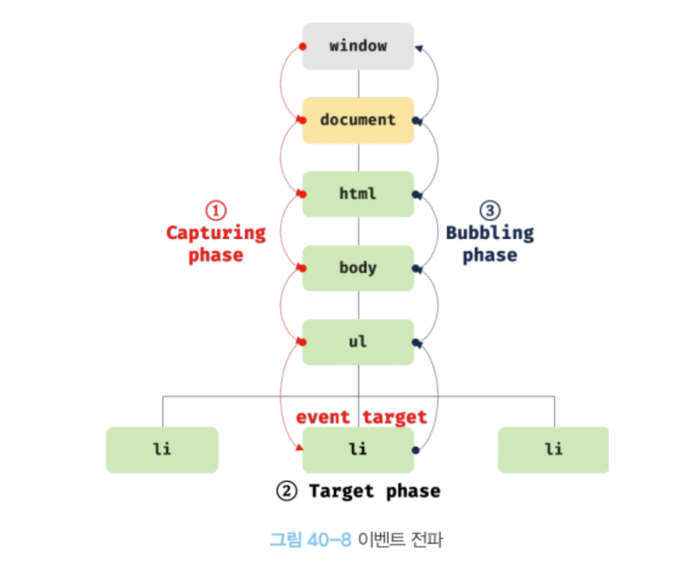

## 이벤트 드리븐 프로그래밍

> 프로그램의 흐름을 이벤트 중심으로 제어하는 프로그래밍 방식입니다.

브라우저는 처리해야 할 특정 사건이 발생하면 이를 감지하여 **이벤트(event)를 발생(trigger)시킵니다.**

예를 들어, 클릭, 키보드 입력, 마우스 이동 등이 일어나면 브라우저는 이를 감지하여 특정한 타입의 이벤트를 발생시킵니다.

만약 특정 타입의 이벤트에 대해서 반응하여 어떤 일을 하고 싶다면 해당하는 타입의 이벤트가 발생했을 때 호출될 함수를 브라우저에게 알려 호출을 위임합니다.

이때 이벤트가 발생했을 때 호출될 함수를 **이벤트 핸들러(event handler)** 라고 합니다.

또한 이벤트가 발생했을 때 브라우저에게 이번트 핸들러의 호출을 위임하는 것을 **이벤트 핸들러 등록**이라고 합니다.

예를 들어 사용자가 버튼을 클릭했을 때 함수를 호출하여 어떤 처리를 하고 싶다고 가정해봅시다.

여기서 문제는 개발자는 <u>사용자가 언제 버튼을 클릭했는지를 알 수 없기에 언제 함수를 호출해야하는지 알기 어렵습니다.</u>

그래서 브라우저에게 부탁하는 것입니다.

즉, 함수를 언제 호출할지 알 수 없기에 **개발자가 명시적으로 함수를 호출하는 것이 아니라, 브라우저에게 함수 호출을 위임하는 것입니다.**

왜냐하면 브라우저는 사용자의 버튼 클릭을 감지하여 클릭 이벤트를 발생시킬 수 있으니까요.

즉, 특정 버튼 요소에서 클릭 이벤트가 발생하면 특정 함수(이벤트 핸들러)를 호출하도록 브라우저에게 위임(이벤트 핸들러 등록)하는 것입니다.

```html
<!DOCTYPE html>
<html lang="ko">
    <body>
        <button>버튼을 클릭해보세요.</button>
        <script>
            const $button = document.querySelector('button');
            // 사용자가 버튼을 클릭하면 함수를 호출하도록 요청합니다.
            $button.onclick = () => {
                alert('버튼이 클릭되었습니다.');
            };
        </script>
    </body>
</html>
```

위 예제는 버튼 요소 $button의 onclick 프로퍼티에 함수를 할당했습니다.

Window, Document, HTMLElement 타입의 객체는 onclick과 같은 특정 이벤트에 대응하는 다양한 이벤트 핸들러 프로퍼티를 가지고 있습니다.

이벤트 핸들러 프로퍼티에 함수를 할당하면 해당 이벤트가 발생했을 때 할당한 함수가 브라우저에 의해 호출됩니다.

이처럼 이벤트와 그에 대응하는 함수(이벤트 핸들러)를 통해 사용자와 애플리케이션은 상호작용을 할 수 있게 됩니다.

<br>

## 이벤트 핸들러 등록

#### 이벤트 핸들러 어트리뷰트 방식

```html
<!DOCTYPE html>
<html lang="ko">
    <body>
        <button onclick="sayHello('Kim')">이름 출력 버튼</button>
        <script>
            function sayHello(name) {
                console.log(`Hello ${name}`);
            }
        </script>
    </body>
</html>
```

이벤트 핸들러를 등록할 때 콜백함수와 마찬가지로 함수 참조를 등록해야 브라우저가 이벤트 핸들러를 호출할 수 있습니다.

만약 함수가 아닌 값을 반환하는 함수 호출문을 이벤트 핸들러로 등록하면 브라우저가 이벤트 핸들러를 호출할 수 없겠지요.

근데 왜 위와 같은 예제가 작동하는 것일까요?

**그것은 바로 이벤트 핸들러 어트리뷰트 값은 사실 암묵적으로 생성될 이벤트 핸들러의 함수 몸체를 의미하기 때문입니다.**

즉, 함수를 암묵적으로 생성하고, 이벤트 핸들러 어트리뷰트 이름과 동일한 키 onclick 이벤트 핸들러 프로퍼티에 할당합니다.

```js
// 이와 같은 함수가 할당되는 것입니다.
function onclick(event) {
    sayHello('Kim');
}
```

이와 같은 방식을 채택한 이유는 함수 참조를 할당해야한다면 이벤트 핸들러에 인수를 전달하기 곤란하기 때문이라고 하네요!

```html
<!-- 이벤트 핸들러에 인수를 전달하기 곤란합니다. -->
<button onclick="sayHello">이름 출력 버튼</button>
```

이벤트 핸들러 어트리뷰트 값으로 할당한 문자열은 암묵적으로 생성되는 이벤트 핸들러의 함수 몸체라고 했습니다.

그래서 이벤트 핸들러 어트리뷰트 값으로 여러개의 문을 할당할 수 도 있습니다.

```html
<button onclick="console.log('hi'); console.log('hello')">클릭해주세요</button>
```

자바스크립트에서 이벤트 핸들러 어트리뷰트 방식은 사용하지 않는 것이 좋다고 합니다.

왜냐하면 HTML과 자바스크립트는 관심사가 다르므로 분리하는 것이 좋기 때문입니다.

다만, CBD방식의 프레임워크, 라이브러리는 이벤트 핸들러 어트리뷰트 방식으로 이벤트를 처리합니다.

왜냐하면 CBD에서는 HTML,CSS,JS를 뷰를 구성하기위한 구성 요소로 간주하기에, 다르다고 보지 않기 때문입니다.

<br>

#### 이벤트 핸들러 프로퍼티 방식

> 이벤트 핸들러 프로퍼티에 함수를 바인딩하면 이벤트 핸들러가 등록됩니다.

window 객체와 Document,HTMLElement 타입의 DOM 노드 객체는 이벤트에 대응하는 이벤트 핸들러 프로퍼티를 가지고 있습니다.

```html
<!DOCTYPE html>
<html lang="ko">
    <body>
        <button>이벤트 핸들러 프로퍼티 방식</button>
        <script>
            const $button = document.querySelector('button');
            // 이벤트 핸들러 프로퍼티에 이벤트 핸들러를 바인딩 했습니다.
            // 이벤트 타깃($button) , 이벤트 타입(click), 이벤트 핸들러(function 이하)
            $button.onclick = function () {
                console.log('버튼이 클릭되었습니다.');
            };
        </script>
    </body>
</html>
```

이벤트 핸들러 어트리뷰트 방식도 결국 DOM 노드 객체의 이벤트 핸들러 프로퍼티로 변환되기에 이벤트 핸들러 프로퍼티 방식과 동일하다고 볼 수 있습니다.

이벤트 핸들러 프로퍼티 방식은 HTML과 자바스크립트과 뒤섞이는 문제를 해결할 수 있습니다.

❗️하지만 이벤트 핸들러 프로퍼티에 하나의 이벤트 핸들러만 바인딩할 수 있다는 단점이 있습니다.

<br>

#### addEventListner 메서드 방식

첫번째 매개변수에는 문자열인 이벤트 타입을 전달합니다.

두번째 매개변수에는 이벤트 핸들러를 전달합니다.

마지막 매개변수에는 이벤트를 캐치할 이벤트 전파 단계(캡쳐링 or 버블링)를 지정합니다.

true를 지정하면 캡쳐링 단계에서 이벤트를 캐치하고, false이면 버블링 단계에서 이벤트를 캐치합니다.

```html
<!DOCTYPE html>
<html lang="ko">
    <body>
        <button>addEventListener 메서드 방식</button>
        <script>
            const $button = document.querySelector('button');
            // addEventListener 메서드 방식입니다.
            $button.addEventListener('click', function () {
                console.log('버튼이 클릭되었습니다.');
            });
        </script>
    </body>
</html>
```

addEventListener 메서드는 하나 이상의 이벤트 핸들러를 등록할 수 있습니다.

```html
<!DOCTYPE html>
<html lang="ko">
    <body>
        <button>addEventListener 메서드 방식 두개!</button>
        <script>
            const $button = document.querySelector('button');

            // addEventListener 메서드는 동일한 요소에서 발생한 동일한 이벤트에 대해
            // 하나 이상의 이벤트 핸들러를 등록할 수 있습니다.
            $button.addEventListener('click', function () {
                console.log('[1]버튼이 클릭되었다!');
            });

            $button.addEventListener('click', function () {
                console.log('[2]버튼이 클릭되었다!');
            });
        </script>
    </body>
</html>
```

<br>

## 이벤트 객체

이벤트가 발생하면 이벤트에 관련한 다양한 정보를 담고 있는 이벤트 객체가 동적으로 생성됩니다.

**생성된 이벤트 객체는 이벤트 핸들러의 첫 번째 인수로 전달됩니다.**

```html
<!DOCTYPE html>
<html lang="ko">
    <body>
        <p>클릭한 곳의 좌표가 표시된답니다.</p>
        <em class="message"></em>
        <script>
            const $msg = document.querySelector('.message');

            function showCoords(e) {
                $msg.textContent = `clientX: ${e.clientX}, clientY: ${e.clientY}`;
            }

            document.onclick = showCoords;
        </script>
    </body>
</html>
```

<br>

## 이벤트 전파 (event propagation)

> DOM 트리 상에 존재하는 DOM 요소 노드에서 발생한 이벤트는 DOM 트리를 통해 전파됩니다.

생성된 이벤트 객체는 이벤트를 발생시킨 DOM 요소인 이벤트 타킷을 중심으로 DOM 트리를 통해 전파됩니다.

이벤트 전파는 이벤트 객체가 전파되는 방향에 따라 3단계로 구분합니다.



<br>
<br>

📌 **캡처링 단계:** 이벤트가 상위요소에서 하위요소 방향으로 전파합니다.
<br>
📌 **타킷 단계:** 이벤트가 이벤트 타깃에 도달합니다.
<br>
📌 **버블링 단계:** 이벤트가 하위요소에서 상위 요소 방향으로 전파합니다.

```html
<!DOCTYPE html>
<html lang="ko">
    <body>
        <ul id="animal">
            <li id="pig">Pig</li>
            <li id="bird">Bird</li>
            <li id="lion">Lion</li>
        </ul>
        <script>
            const $animal = document.getElementById('animal');

            // #animal 요소의 하위 요소인 li를 클릭한 경우
            $animal.addEventListener('click', (e) => {
                console.log(`이벤트 단계: ${e.eventPhase}`); // 이벤트 단계: 3 (버블링단계)
                console.log(`이벤트 타깃: ${e.target}`); // 이벤트 타깃: [object HTMLLIElement]
                console.log(`커런트 타깃: ${e.currentTarget}`); // 커런트 타깃: [object HTMLUListElement]
            });
        </script>
    </body>
</html>
```

참고로 target은 이벤트가 처음 발생한 대상,

currentTarget은 이벤트가 버블링 혹은 캡처링 되는 과정에서 현재 이벤트가 위치하고 있는 대상을 뜻합니다.

li 요소를 클릭하면 클릭 이벤트가 발생하여 클릭 이벤트 객체가 생성됩니다.

그리고 클릭된 li 요소가 이벤트 타깃이 됩니다.

이때 클릭 이벤트 객체는 window에서 시작하여 이벤트 타깃 방향으로 전파됩니다. 이것이 **캡쳐링 단계**입니다.

이후 이벤트 객체는 이벤트를 발생시킨 이벤트 타깃에 도달합니다. 이것이 **타깃 단계** 입니다.

이후 이벤트 객체는 이벤트 타깃에서 시작해서 window 방향으로 전파됩니다. 이것이 **버블링 단계**입니다.

이벤트 핸들로 어트리뷰트/프로퍼티 방식으로 등록한 이벤트 핸들러는 타깃 단계와 버블링 단계의 이벤트만 캡쳐할 수 있습니다.

그러나 addEventListener 방식으로 등록한 이벤트 핸들러는 **타깃 단계와 버블링 단계 그리고 캡쳐링 단계의 이벤트도 선별적으로 캐치**할 수 있습니다.

캡쳐링 단계의 이벤트를 캐치하려면 addEventListener 메서드의 3번째 인수로 true를 전달해야합니다.

3번째 인수를 생략하거나 false를 전달하면 타깃단계와 버블링 단계의 이벤트만 캐치할 수 있습니다.

```html
<!DOCTYPE html>
<html lang="ko">
    <body>
        <ul id="animal">
            <li id="pig">Pig</li>
            <li id="bird">Bird</li>
            <li id="lion">Lion</li>
        </ul>
        <script>
            const $animal = document.getElementById('animal');
            const $bird = document.getElementById('bird');

            // #animal 요소의 하위 요소인 li를 클릭한 경우 캡쳐링 단계의 이벤트를 캐치합니다.
            $animal.addEventListener(
                'click',
                (e) => {
                    console.log(`이벤트 단계: ${e.eventPhase}`); // 이벤트 단계: 1 (캡쳐링 단계)
                    console.log(`이벤트 타깃: ${e.target}`); // 이벤트 타깃: [object HTMLLIElement]
                    console.log(`커런트 타깃: ${e.currentTarget}`); // 커런트 타깃: [object HTMLUListElement]
                },
                true
            );

            // 타깃 단계의 이벤트를 캐치합니다.
            $bird.addEventListener('click', (e) => {
                console.log(`이벤트 단계: ${e.eventPhase}`); // 이벤트 단계: 2 (타깃 단계)
                console.log(`이벤트 타깃: ${e.target}`); // 이벤트 타깃: [object HTMLLIElement]
                console.log(`커런트 타깃: ${e.currentTarget}`); // 커런트 타깃: [object HTMLUListElement]
            });

            // 버블링 단계의 이벤트를 캐치합니다.
            $animal.addEventListener('click', (e) => {
                console.log(`이벤트 단계: ${e.eventPhase}`); // 이벤트 단계: 3(버블링 단계)
                console.log(`이벤트 타깃: ${e.target}`); // 이벤트 타깃: [object HTMLLIElement]
                console.log(`커런트 타깃: ${e.currentTarget}`); // 커런트 타깃: [object HTMLUListElement]
            });
        </script>
    </body>
</html>
```

이처럼 이벤트는 이벤트를 발생시킨 이벤트 타깃은 물론 상위 DOM 요소에서도 캐치할 수 있습니다.

즉, DOM 트리를 통해 전파되는 이벤트는 이벤트 path(이벤트가 통과하는 DOM 트리상의 경로, Event.prototype.composedPath 메서드로 확인할 수 있다)에 위치한 모든 DOM 요소에서 캐치할 수 있습니다.

<br>

## 이벤트 위임

> 여러 개의 하위 DOM 요소에 각각 이벤트 핸들러를 등록하는 대신 하나의 상위 DOM 요소에 이벤트 핸들러를 등록하는 방법을 말합니다.

```html
<!DOCTYPE html>
<html lang="ko">
    <head>
        <style>
            #animals {
                display: flex;
                list-style-type: none;
                padding: 0;
            }
            #animals li {
                width: 100px;
                cursor: pointer;
            }
            #animals .active {
                color: red;
                text-decoration: underline;
            }
        </style>
    </head>
    <body>
        <nav>
            <ul id="animals">
                <li id="pig" class="active">Pig</li>
                <li id="bird">Bird</li>
                <li id="lion">Lion</li>
            </ul>
        </nav>
        <div>선택된 네비게이션 아이템 <em class="msg">pig</em></div>
        <script>
            const $animals = document.getElementById('animals');
            const $msg = document.querySelector('.msg');

            // 사용자 클릭에 의해 선택된 네비게이션 아이템에 active 클래스를 추가하고
            // 그 외에 모든 네비게이션 아이템의 active 클래스를 제거합니다.
            function activate({ target }) {
                [...$animals.children].forEach(($animal) => {
                    $animal.classList.toggle('active', $animal === target);
                    $msg.textContent = target.id;
                });
            }
            // 모든 네비게이션 아이템(li 요소)에 이벤트 핸들러를 등록합니다.
            document.getElementById('pig').onclick = activate;
            document.getElementById('bird').onclick = activate;
            document.getElementById('lion').onclick = activate;
        </script>
    </body>
</html>
```

위 예제는 모든 내비게이션 아이템이 클릭 이벤트에 반응하도록 모든 네비게이션 아이템에 이벤트 핸들러인 activate를 등록했습니다.

만일 네비게이션 아이템이 100개라면 100개의 이벤트 핸들러를 등록해야합니다.

이 경우 많은 DOM 요소에 이벤트 핸들러를 등록하므로 성능 저하의 원인이 될뿐더러 유지 보수에도 부적합한 코드를 생산하게 됩니다.

이벤트 위임을 통해 상위 DOM 요소에 이벤트 핸들러를 등록하면 여러개의 하위 DOM 요소에 이벤트 핸들러를 등록할 필요가 없습니다.

또한 동적으로 하위 DOM 요소를 추가하더라도 일일이 추가된 DOM 요소에 이벤트 핸들러를 등록할 필요가 없습니다.

```html
<!DOCTYPE html>
<html lang="ko">
    <head>
        <style>
            #animals {
                display: flex;
                list-style-type: none;
                padding: 0;
            }
            #animals li {
                width: 100px;
                cursor: pointer;
            }
            #animals .active {
                color: red;
                text-decoration: underline;
            }
        </style>
    </head>
    <body>
        <nav>
            <ul id="animals">
                <li id="pig" class="active">Pig</li>
                <li id="bird">Bird</li>
                <li id="lion">Lion</li>
            </ul>
        </nav>
        <div>선택된 네비게이션 아이템 <em class="msg">pig</em></div>
        <script>
            const $animals = document.getElementById('animals');
            const $msg = document.querySelector('.msg');

            // 사용자 클릭에 의해 선택된 네비게이션 아이템에 active 클래스를 추가하고
            // 그 외에 모든 네비게이션 아이템의 active 클래스를 제거합니다.
            function activate({ target }) {
                if (!target.matches('#animals > li')) return;

                [...$animals.children].forEach(($animal) => {
                    $animal.classList.toggle('active', $animal === target);
                    $msg.textContent = target.id;
                });
            }
            // 이벤트 위임: 상위 요소(ul#animals)는 하위 요소의 이벤트를 캐치할 수 있습니다.
            $animals.onclick = activate;
        </script>
    </body>
</html>
```

<br>

## 이벤트 핸들러 내부의 this

#### 이벤트 핸들러 어트리뷰트 방식

이벤트 핸들러 어트리뷰트 방식에서 이벤트 핸들러 내부 함수의 this는 전역객체(window)를 가리키게 됩니다.

```html
<!DOCTYPE html>
<html lang="ko">
    <body>
        <button onclick="handleClick()">클릭해주세요!</button>
        <script>
            function handleClick() {
                console.log(this); // Window
            }
        </script>
    </body>
</html>
```

단, 이벤트 핸들러를 호출할 때 인수로 전달한 this는 이벤트를 바인딩한 DOM 요소를 가리킵니다.

```html
<!DOCTYPE html>
<html lang="ko">
    <body>
        <button onclick="handleClick(this)">클릭해주세요!</button>
        <script>
            function handleClick(button) {
                // 이벤트를 바인딩한 button 요소
                console.log(button); // <button onclick="handleClick(this)">클릭해주세요!</button>

                console.log(this); // Window
            }
        </script>
    </body>
</html>
```

#### 이벤트 핸들러 프로퍼티 방식 & addEventListener 방식

이벤트 핸들러 내부의 this는 이벤트를 바인딩한 DOM 요소를 가리키게 됩니다.

즉, 이벤트 핸들러 내부의 this는 이벤트 객체의 currentTarget 프로퍼티와 같게 됩니다.

```html
<!DOCTYPE html>
<html lang="ko">
    <body>
        <button class="btn1">0</button>
        <button class="btn2">0</button>
        <script>
            const $button1 = document.querySelector('.btn1');
            const $button2 = document.querySelector('.btn2');
            // 이벤트 핸들러 프로퍼티 방식
            $button1.onclick = function (e) {
                // this는 이벤트를 바인딩한 DOM요소를 가리킵니다.
                console.log(this); // $button1
                console.log(e.currentTarget); // $button1
                console.log(this === e.currentTarget); // true

                // $button1의 textContent를 1 증가시킨다.
                ++this.textContent;
            };
            // addEventListener 메서드 방식
            $button2.addEventListener('click', function (e) {
                // this는 이벤트를 바인딩한 DOM 요소를 가리킨다.
                console.log(this); // $button2
                console.log(e.currentTarget); // $button2
                console.log(this === e.currentTarget); // true

                // $button1의 textContent를 2 증가시킨다.
                ++this.textContent;
            });
        </script>
    </body>
</html>
```

화살표 함수로 정의한 이벤트 핸들러 내부의 this는 상위 스코프의 this를 가리키게 됩니다.

왜냐하면 화살표 함수는 함수 자체의 this 바인딩을 갖지 않기 때문입니다. 기억나시죠?

```html
<!DOCTYPE html>
<html lang="ko">
    <body>
        <button class="btn1">0</button>
        <button class="btn2">0</button>
        <script>
            const $button1 = document.querySelector('.btn1');
            const $button2 = document.querySelector('.btn2');
            // 이벤트 핸들러 프로퍼티 방식
            $button1.onclick = (e) => {
                // 화살표 함수 내부의 this는 상위 스코프의 this를 가리킵니다.
                console.log(this); // window
                console.log(e.currentTarget); // $button1
                console.log(this === e.currentTarget); // false

                // this는 window를 가리키므로 window.textContent에 NaN(undefined + 1)을 할당합니다.
                ++this.textContent;
            };

            // addEventListener 메서드 방식
            $button2.addEventListener('click', (e) => {
                // 화살표 함수 내부의 this는 상위 스코프의 this를 가리킵니다.
                console.log(this); // window
                console.log(e.currentTarget); // $button2
                console.log(this === e.currentTarget); // false

                // this는 window를 가리키므로 window.textContent에 NaN(undefined + 1)을 할당합니다.
                ++this.textContent;
            });
        </script>
    </body>
</html>
```
