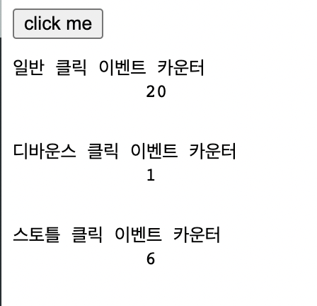

이번 챕터부터는 비동기에 관련된 내용들입니다.

## 호출 스케줄링 (scheduling a call)

말 그대로 함수가 즉시 호출되지 않도록 함수 호출을 조정하는 것입니다.

함수를 명시적으로 호출하면 함수가 즉시 실행되게 됩니다.

만약 함수를 명시적으로 호출하지 않고 일정 시간이 지난 이후에 함수 호출을 예약하고 싶다면 어떡할까요?

이는 **타이머 함수**를 사용하면 됩니다.

타이머 함수는 타이머를 생성할 수 있는 함수와 타이머를 제거할 수 있는 함수 2종류가 있습니다.

-   타이머 생성: setTimeout, setInterval
-   타이머 제거: clearTimeout, clearInterval

타이머 함수는 <u>호스트 객체</u>입니다. (기억나시나요? 객체에는 빌트인 객체, 호스트 객체, 사용자 정의 객체가 있었죠!)

즉 타이머 함수는 브라우저 환경과 Node.js 환경에서 모두 전역 객체의 메서드로서 제공됩니다.

타이머 함수 `setTimeout`과 `setInterval`은 모두 일정 시간이 경과된 이후 콜백함수가 호출되도록 타이머를 생성합니다.

`setTimeout`은 타이머가 완료되면 콜백함수가 **단 한번만 호출**됩니다.

반면 `setInterval`은 타이머가 만료될때마다 콜백함수가 **반복 호출**됩니다.

자바스크립트는 **싱글 스레드** 언어이신것 기억나시나요?

이는 자바스크립트 엔진이 **단 하나의 실행 컨텍스트 스택을 갖기에 2가지 이상의 테스크를 동시에 실행할 수 없음**을 의미합니다.

그래서 타이머 함수 `setTimeout`과 `setInterval`은 **비동기 처리 방식**으로 동작합니다.

<br>

## 타이머 함수

#### setTimeout / clearTimeout

두 번째 인수로 전달받은 시간으로 단 한 번 동작하는 타이머를 생성합니다.

타이머가 완료되면 첫 번째 인수로 전달받은 콜백함수가 호출됩니다.

즉, setTimeout의 콜백함수는 두번째 인수로 전달받은 시간 이후 단 한 번 실행되도록 호출 스케줄링됩니다.

```js
// 3초후 타이머가 만료되면 콜백함수가 호출됩니다.
setTimeout(() => console.log('Hello ~'), 3000); // Hello ~

// 콜백 함수에 'Kim'이 인수로 전달됩니다.
setTimeout((name) => console.log(`Hello ~ ${name}`), 3000, 'KIM'); // Hello ~ KIM

// 두 번째 인수(delay)를 생략하면 기본값 0이 지정됩니다.
setTimeout(() => console.log('Hello ~')); // Hello ~
```

setTimeout 함수는 생성된 타이머를 식별할 수 있는 고유의 타이머 id를 반환합니다.

setTimeout 함수가 반환환 id를 clearTimeout 함수의 인수로 전달하여 타이머를 취소 할 수 있습니다.

즉, clearTimeout 함수는 호출 스케줄링을 취소합니다.

```js
// setTimeout 함수는 생성된 타이머를 식별할 수 있는 고유한 타이머 id를 반환합니다.
const timerId = setTimeout(() => console.log('Hello ~'), 3000);

// setTimeout 함수가 반환한 타이머 id를 clearTimeout 함수의 인수로 전달하여 타이머를 취소합니다.
// 타이머가 취소되면 setTimeout 함수의 콜백 함수가 실행되지 않습니다.
clearTimeout(timerId);
```

#### setInterval / clearInterval

두 번째 인수로 전달받은 시간으로 반복 동작하는 타이머를 생성합니다.

타이머가 만료될 때마다 첫 번째 인수로 전달받은 콜백함수가 반복 호출됩니다.

이는 타이머가 취소될때까지 계속됩니다.

즉, setInterval의 콜백함수는 두번째 인수로 전달받은 시간이 경과할때마다 반복 실행되도록 호출 스케줄링됩니다.

setInterval 함수는 생성된 타이머를 식별할 수 있는 고유의 타이머 id를 반환합니다.

setInterval 함수가 반환환 id를 clearInterval 함수의 인수로 전달하여 타이머를 취소 할 수 있습니다.

즉, clearInterval 함수는 호출 스케줄링을 취소합니다.

```js
let count = 1;

// 3초후 타이머가 만료될 때마다 콜백함수가 호출됩니다.
// setInterval 함수는 생성된 타이머를 식별할 수 있는 고유한 타이머 id를 반환합니다.
const timeoutId = setInterval(() => {
    console.log(count);
    // count가 5이면 setInterval 함수가 반환한 타이머 id를 clearInterval 함수의 인수로 전달하여
    // 타이머를 취소합니다. 타이머가 취소되면 setInterval 함수의 콜백 함수가 실행되지 않습니다.
    if (count++ === 5) clearInterval(timeoutId); // 1 2 3 4 5
}, 3000);
```

<br>

## 디바운스와 스로틀

> 과도한 이벤트 핸들러의 호출을 방지하는 프로그래밍 기법입니다.

scroll, resize, input, mousemove 같은 이벤트는 짧은 시간 간격으로 연속해서 발생합니다.

그러면 이벤트 핸들러는 과도하게 호출되어 성능에 문제를 일으킬 가능성이 있습니다.

그래서 과도한 이벤트 핸들러의 호출을 방지하는 프로그래밍 기법이 나왔고, 그것이 `디바운스`와 `스로틀`입니다.

디바운스와 스로틀은 짧은 시간 간격으로 연속해서 발생하는 이벤트를 그룹화합니다.

아래의 예제는 일반적인 이벤트 핸들러와 디바운스, 스로틀된 이벤트 핸들러의 호출 빈도가 얼마나 다른지를 나타낸 예제입니다.

```html
<!DOCTYPE html>
<html lang="ko">
    <head>
        <meta charset="UTF-8" />
        <meta http-equiv="X-UA-Compatible" content="IE=edge" />
        <meta name="viewport" content="width=device-width, initial-scale=1.0" />
        <title>일반적인 이벤트 핸들러와 비교</title>
    </head>
    <body>
        <button>click me</button>
        <pre>일반 클릭 이벤트 카운터
            <span class='normal-msg'>0</span>
        </pre>
        <pre>디바운스 클릭 이벤트 카운터
            <span class='debounce-msg'>0</span>
        </pre>
        <pre>스토틀 클릭 이벤트 카운터
            <span class='throttle-msg'>0</span>
        </pre>
        <script>
            const $button = document.querySelector('button');
            const $normalMsg = document.querySelector('.normal-msg');
            const $debounceMsg = document.querySelector('.debounce-msg');
            const $throttleMsg = document.querySelector('.throttle-msg');

            const debounce = (callback, delay) => {
                let timerId;
                return (event) => {
                    if (timerId) clearTimeout(timerId);
                    timerId = setTimeout(callback, delay, event);
                };
            };
            const throttle = (callback, delay) => {
                let timerId;
                return (event) => {
                    if (timerId) return;
                    timerId = setTimeout(
                        () => {
                            callback(event);
                            timerId = null;
                        },
                        delay,
                        event
                    );
                };
            };

            $button.addEventListener('click', () => {
                $normalMsg.textContent = +$normalMsg.textContent + 1;
            });

            $button.addEventListener(
                'click',
                debounce(() => {
                    $debounceMsg.textContent = +$debounceMsg.textContent + 1;
                }, 500)
            );

            $button.addEventListener(
                'click',
                throttle(() => {
                    $throttleMsg.textContent = +$throttleMsg.textContent + 1;
                }, 500)
            );
        </script>
    </body>
</html>
```

cf. `<pre>` 요소 내의 텍스트는 시스템에서 미리 지정된 고정폭 글꼴(fixed-width font)을 사용하여 표현되며, 텍스트에 사용된 여백과 줄바꿈이 모두 그대로 브라우저 화면에 나타납니다.



<br>
<br>

디바운스와 스로틀을 통해 타이머 함수의 활용에 대해 살펴보자.

### 디바운스

> 디바운스는 짧은 시간 간격으로 발생하는 이벤트를 그룹화해서 마지막 한 번만 이벤트 핸들러가 호출되도록 합니다.

가령, input 이벤트를 생각해봅시다.

input 이벤트는 사용자가 텍스트 입력 필드에 값을 입력할 때마다 연속해서 발생합니다.

만약 input의 이벤트 핸들러에서 사용자가 입력 필드에 입력한 값으로 Ajax 요청과 같은 무거운 처리를 수행한다면,

사용자가 아직 입력을 완료하지 않았어도 Ajax 요청이 전송될 것입니다.

이것은 서버에 부담을 주는 불필요한 처리입니다.

따라서 사용자가 입력을 완료했을 때 한 번만 Ajax 요청을 전송하는 것이 좋습니다.

일정 시간 동안 텍스트 입력 필드에 값을 입력하지 않으면 입력이 완료된 것으로 간주합니다.

이를 위해 debounce 함수가 반환한 함수는 debounce 함수에 두번째 인수로 전달한 시간(delay)보다 짧은 간격으로 이벤트가 발생하면 이전 타이머를 취소하고 새로운 타이머를 재설정합니다.

따라서 delay보다 짧은 간격으로 이벤트가 연속해서 발생하면 debounce 함수의 첫 번째 인수로 전달한 콜백함수는 호출되지 않다가

delay 기간 동안 input 이벤트가 더 이상 발생하지 않으면 한 번만 호출됩니다.

디바운스는 resize 이벤트 처리 or input 요소에 입력된 값으로 ajax 요청하는 입력 필드 자동완성 UI 구현, 버튼 중복 클릭 방지 처리 등에 유용하게 사용됩니다.

### 스로틀

> 스로틀은 짧은 시간 간격으로 연속해서 발생하는 이벤트를 그룹화해서 일정 시간 단위로 이벤트 핸들러가 호출되도록 호출 주기를 만듭니다.
