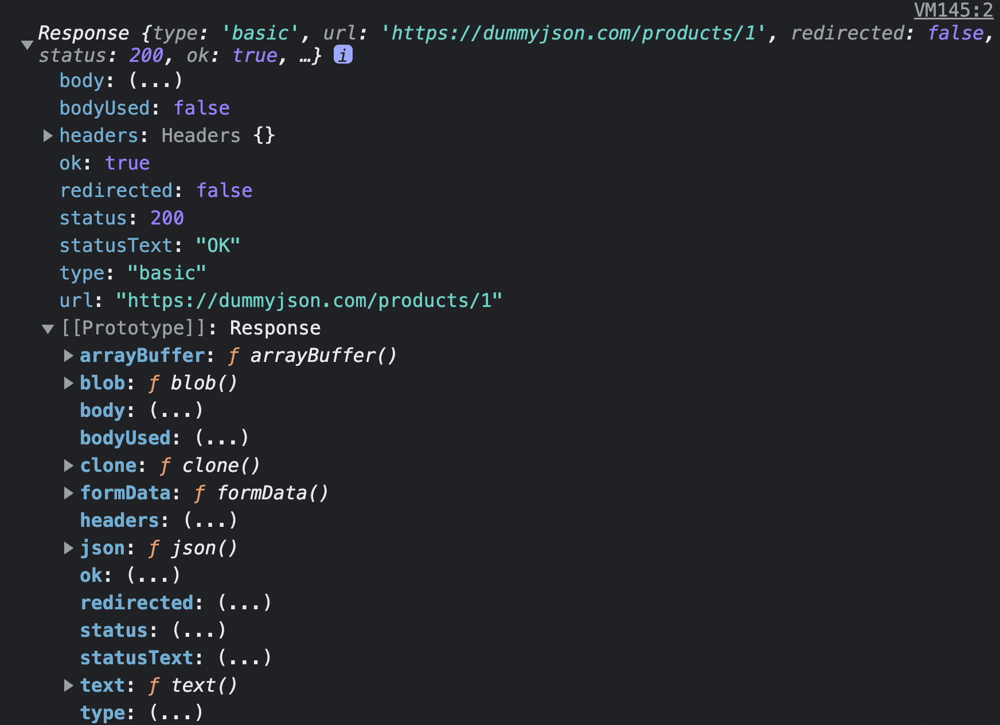

## 콜백 지옥

콜백 함수를 통해 비동기 처리 결과에 대한 후속 처리를 수행하는 비동기 함수를 생각해봅시다.

비동기 처리 결과를 가지고 또 다시 비동기 함수를 호출해야 한다면 콜백 함수의 호출이 중첩되어 복잡도가 높아지는 현상이 발생합니다.

이를 **콜백 헬 (callback hell)** 이라고 합니다.

```js
// GET 요청을 위한 비동기 함수
const get = (url, callback) => {
    const xhr = new XMLHttpRequest();
    xhr.open('GET', url);
    xhr.send();

    xhr.onload = () => {
        if (xhr.status === 200) {
            // 서버의 응답을 콜백 함수에 전달하면서 호출하여 응답에 대한 후속 처리를 한다.
            callback(JSON.parse(xhr.response));
        } else {
            console.error(`${xhr.status} ${xhr.statusText}`);
        }
    };
};

const url = 'https://jsonplaceholder.typicode.com';

// id가 1인 post의 userId를 취득
get(`${url}/posts/1`, ({ userId }) => {
    console.log(userId); // 1
    // post의 userId를 사용하여 user 정보를 취득
    get(`${url}/users/${userId}`, (userInfo) => {
        console.log(userInfo); // {id: 1, name: "Leanne Graham", username: "Bret",...}
    });
});
```

#### 에러 처리의 한계

```js
try {
    setTimeout(() => {
        throw new Error('Error!');
    }, 1000);
} catch (e) {
    // 에러를 캐치하지 못한다
    console.error('캐치한 에러', e);
}
```

try 코드 블록 내에서 호출한 setTimeout 함수는 1초 후에 콜백 함수가 실행되도록 타이머를 설정하고, 이후 콜백 함수는 에러를 발생시킵니다.

하지만 에러는 catch 코드 블록에서 캐치되지 않습니다.

이는 에러가 호출자 방향으로 전파되기 때문이라고 하네요. 그런데 setTimout 함수의 콜백 함수를 호출한 것은 setTimeout 함수가 아니기 때문이라고 합니다.

이처럼 비동기 처리를 위한 콜백 패턴의 문제점 중 가장 큰 요소는 에러 처리가 곤란하다는 점입니다.

이를 극복하기 위해 ES6부터 프로미스가 도입되었습니다.

<br>

## 프로미스 (Promise)

> 콜백 함수의 패턴의 단점을 보완한 또 다른 비동기 패턴입니다.

전통적인 콜백 패턴은 콜백 지옥으로 인해 가독성이 나쁘고, 비동기 처리 중 발생한 에러의 처리가 곤란하다는 단점이 있었습니다.

또한 여러개의 비동기 처리를 한 번에 처리하는데도 한계가 있습니다.

이를 위해 ES6에서 프로미스를 도입하였습니다.

프로미스는 기존 콜백 패턴이 가진 단점을 극복하고, 비동기 처리 시점을 명확하게 표현할 수 있다는 장점이 있습니다.

Promise 생성자 함수를 new 연산자와 함께 호출하면 프로미스(Promise 객체)를 생성합니다.

```js
const promise = new Promise((resolve,reject)=>{
    // promise 함수의 콜백 함수 내부에서 비동기 처리를 수행합니다.
    if(/*비동기 처리 성공 */){
        resolve('결과나왔음!')
    }
    else{ /*비동기 처리 실패 */
        reject('응답 실패!!')
    }
})
```

```js
// GET 요청을 위한 비동기함수 입니다.
const promiseGet = (url) => {
    return new Promise((resolve, reject) => {
        const xhr = new XMLHttpRequest();
        xhr.open('GET', url);
        xhr.send();

        xhr.onload = () => {
            if (xhr.status === 200) {
                // 성공적으로 응답을 전달받으면 reslove 함수를 호출합니다.
                resolve(JSON.parse(xhr.response));
            } else {
                // 에러 처리를 위해 reject 함수를 호출합니다.
                // new Error는 JSON에서 제공하는 객체입니다.
                reject(new Error(xhr.status));
            }
        };
    });
};
// promiseGet 함수는 프로미스를 반환합니다.
promiseGet('https://dummyjson.com/products/1');
```

비동기 함수인 promiseGet은 함수 내부에서 프로미스를 생성하고 반환합니다.

만약 비동기 처리가 성공하면 비동기 처리 결과를 **resolve 함수에 인수로 전달하면서 호출**합니다.

비동기 처리가 실패하면 에러를 **reject 함수에 인수로 전달하면서 호출**합니다.

프로미스는 현재 비동기 처리가 어떻게 진행되고 있는지를 나타내는 **상태 정보(state)** 를 갖습니다.

-   pending: 비동기 처리가 아직 수행되지 않은 상태
-   fulfilled: 비동기 처리가 수행된 상태 (성공) - settled 상태
-   rejected : 비동기 처리가 수행된 상태 (실패) - settled 상태

비동기 처리 성공: resolve 함수 호출해 프로미스를 fulfilled 상태로 변경합니다.
비동기 처리 실패: reject 함수 호출해 프로미스를 rejected 상태로 변경합니다.

이처럼 **프로미스의 상태는 resolve 또는 reject 함수를 호출하는 것으로 결정됩니다.**

이처럼 **프로미스는 비동기 처리 상태와 처리 결과를 관리하는 객체입니다.**

<br>

## 프로미스 후속 처리 메서드

프로미스의 비동기 처리 상태가 변화하면 이에 따른 후속 처리를 해야합니다.

예를 들어 프로미스가 fulfilled 상태가 되면 프로미스의 처리 결과를 가지고 무엇을 해야합니다.

프로미스가 rejected 상태가 되면 에러를 처리해야겠죠.

이를 위해서 프로미스는 후속 메서드 **then, catch, finally**를 제공합니다.

후속 처리 메서드의 콜백 함수에 프로미스의 처리 결과가 인수로 전달됩니다.

모든 후속 처리 메서드는 **프로미스를 반환하며 비동기로 동작합니다.**

### Promise.prototype.then

then 메서드는 두 개의 콜백 함수를 인수로 전달받습니다.

첫번째 콜백 함수는 비동기 처리가 성공했을 때 호출되는 성공 처리 콜백 함수입니다.

두번째 콜백 함수는 비동기 처리가 실패했을 때 호출되는 실패 처리 콜백 함수입니다.

```js
new Promise((resolve) => resolve('✅완료됨')) //
    .then(
        (v) => console.log(v),
        (e) => console.error(e)
    );
// ✅완료됨

new Promise((_, reject) => reject(new Error('🚫실패함!'))) //
    .then(
        (v) => console.log(v),
        (e) => console.error(e)
    );
// Error: 🚫실패함!
```

### Promise.prototype.catch

catch 메서드의 콜백 함수는 프로미스가 rejected 상태인 경우에만 호출합니다.

```js
new Promise((_, reject) => reject(new Error('🚫실패함!'))) //
    .catch((e) => console.error(e));
// Error: 🚫실패함!
```

### Promise.prototype.finally

> finally 메서드의 콜백 함수는 프로미스의 성공 또는 실패와 상관없이 무조건 한 번 호출합니다.

finally 메서드는 프로미스의 상태와 상관없이 공통적으로 수행해야 할 처리가 있을 때 유용합니다.

```js
new Promise(() => {}) //
    .finally(() => console.log('finally'));
```

<br>

## 프로미스의 에러 처리

앞에서도 설명했지만, 비동기 처리에서 발생한 에러는 then 메서드의 두 번째 콜백 함수로 처리할 수 있었습니다.

그러나 then 메서드의 두 번째 콜백 함수는 첫 번째 콜백 함수에서 발생한 에러를 캐치하지 못하고 가독성이 좋지 않습니다.

따라서 에러 처리는 catch 메서드에서 진행하는 것이 좋습니다.

catch 메서드는 then 메서드 내부에서 발생한 에러까지 모두 캐치할 수 있습니다.

```js
promiseGet()
    .then((res) => console.xxx(res))
    .catch((err) => console.error(err));
// TypeError: console.xxx is not a function
```

<br>

## 프로미스 체이닝

> then, catch, finally 후속 처리 메서드는 언제나 **프로미스를 반환**하기에 연속적 호출이 가능합니다.

```js
const promiseGet = (url) => {
    return new Promise((resolve, reject) => {
        const xhr = new XMLHttpRequest();
        xhr.open('GET', url);
        xhr.send();

        xhr.onload = () => {
            if (xhr.status === 200) {
                // 성공적으로 응답을 전달받으면 reslove 함수를 호출합니다.
                resolve(JSON.parse(xhr.response));
            } else {
                // 에러 처리를 위해 reject 함수를 호출합니다.
                // new Error는 JSON에서 제공하는 객체입니다.
                reject(new Error(xhr.status));
            }
        };
    });
};

const url = 'https://dummyjson.com/products/1';

promiseGet(`${url}`)
    .then(({ title }) => console.log(title))
    .catch((err) => console.error(err));
// iPhone 9
```

<br>

## 프로미스의 정적 메서드

> Promise는 5가지의 정적 메서드를 제공합니다.

### Promise.resolve / Promise.reject

`Promise.resolve`는 인수로 전달받은 값을 resolve하는 프로미스를 생성합니다.

```js
const resolvedPromise = Promise.resolve([1, 'hi', 'hello']);

resolvedPromise.then(console.log); // [ 1, 'hi', 'hello' ]
```

위 예제는 아래의 예제와 동일합니다.

```js
const resolvedPromise = new Promise((resolve) => resolve([1, 'hi', 'hello']));

resolvedPromise.then(console.log); // [ 1, 'hi', 'hello' ]
```

`Promise.reject`는 인수로 전달받은 값을 resolve하는 프로미스를 생성합니다.

```js
const rejectedPromise = Promise.reject(new Error('Error'));

rejectedPromise.catch(console.log); // 🚫Error: Error
```

위 예제는 아래 코드와 동일합니다.

```js
const rejectedPromise = new Promise((_, reject) => reject(new Error('Error')));

rejectedPromise.catch(console.log); // 🚫Error: Error
```

<br>

### Promise.all

> 여러개의 비동기 처리를 모두 병렬 처리할 때 사용합니다.

아래 예제의 경우 1번째 비동기 처리에 3초, 2번째 비동기 처리에 2초, 3번째 비동기 처리에 1초가 소요되어 총 6초 이상이 소요됩니다.

```js
const requestData1 = () => new Promise((resolve) => setTimeout(() => resolve(1), 3000));
const requestData2 = () => new Promise((resolve) => setTimeout(() => resolve(2), 2000));
const requestData3 = () => new Promise((resolve) => setTimeout(() => resolve(3), 1000));

// 세 개의 비동기 처리를 순차적으로 처리
const res = [];
requestData1()
    .then((data) => {
        res.push(data);
        return requestData2();
    })
    .then((data) => {
        res.push(data);
        return requestData3();
    })
    .then((data) => {
        res.push(data);
        console.log(res); // [1, 2, 3] ⇒ 약 6초 소요
    })
    .catch(console.error);
```

그런데 세 개의 비동기 처리는 모두 앞선 비동기 처리 결과를 다음 비동기 처리가 사용하지 않습니다.

즉 서로 의존하지 않고 개별적으로 수행되는 것이지요.

이럴 경우 순차적으로 처리할 필요가 없습니다.

이는 Promise.all 메서드를 사용해 3개의 비동기 처리를 병렬로 처리할 수 있습니다.

```js
const requestData1 = () => new Promise((resolve) => setTimeout(() => resolve(1), 3000));
const requestData2 = () => new Promise((resolve) => setTimeout(() => resolve(2), 2000));
const requestData3 = () => new Promise((resolve) => setTimeout(() => resolve(3), 1000));

Promise.all([requestData1(), requestData2(), requestData3()])
    .then(console.log) // [ 1, 2, 3 ] ⇒ 약 3초 소요
    .catch(console.error);
```

Promise.all 메서드는 프로미스를 요소로 갖는 배열 등의 이터러블을 인수로 전달 받습니다.

그리고 전달받은 모든 프로미스가 fulfilled 상태가 되면 모든 처리 결과를 배열에 저장해 새로운 프로미스를 반환합니다.

위 예제의 경우 모든 처리 시간이 가장 늦게 fulfilled 상태가 되는 첫 번째 프로미스의 처리 시간인 3초보다 조금 더 소요됩니다.

참고로 Promise.all 메서드는 인수로 전달받은 배열의 프로미스가 하나라도 rejected 상태가 되면 나머지 프로미스가 fulfilled 상태가 되는 것을 기다리지 않고 즉시 종료합니다.

<br>

### Promise.race

> 가장 먼저 fulfilled 상태가 된 프로미스의 처리 결과를 resolve하는 새로운 프로미스를 반환합니다.

```js
Promise.race([
    new Promise((resolve) => setTimeout(() => resolve('3초 걸리는 통신 '), 3000)),
    new Promise((resolve) => setTimeout(() => resolve('2초 걸리는 통신 '), 2000)),
    new Promise((resolve) => setTimeout(() => resolve('1초 걸리는 통신 '), 1000)),
])
    .then(console.log)
    .catch(console.log);
// 1초 걸리는 통신
```

❗️Promise.race 메서드에 전달된 프로미스가 하나라도 rejected 상태가 되면 에러를 reject하는 새로운 프로미스를 즉시 반환합니다.

```js
Promise.race([
    new Promise((_, reject) => setTimeout(() => reject(new Error('3초 뒤 발생하는 에러')), 3000)),
    new Promise((_, reject) => setTimeout(() => reject(new Error('2초 뒤 발생하는 에러')), 2000)),
    new Promise((_, reject) => setTimeout(() => reject(new Error('1초 뒤 발생하는 에러')), 1000)),
])
    .then(console.log)
    .catch(console.log);
// Error: 1초 뒤 발생하는 에러
```

<br>

### Promise.allSettled

> 인수로 전달받은 모든 프로미스가 settled 상태가 되면 처리 결과를 배열로 반환합니다.

ES11에서 도입되었으며, 프로미스를 요소로 갖는 배열 등의 이터러블을 인수로 전달받습니다.

Promise.allSettled 메서드가 반환한 배열에는 fulfiled 또는 rejected 상태(비동기 처리가 수행되 상태)가 된 모든 프로미스들의 처리 결과가 담겨 있습니다.

```js
Promise.allSettled([
    new Promise((resolve) => setTimeout(() => resolve('✅통신 완료!'), 2000)),
    new Promise((_, reject) => setTimeout(() => reject(new Error('🚫에러 발생!')), 1000)),
]).then(console.log);

/*
[
  { status: 'fulfilled', value: '✅통신 완료!' },
  {
    status: 'rejected',
    reason: Error: 🚫에러 발생!
        at Timeout._onTimeout (/Users/jungheekim/Desktop/ex.js:3:56)
        at listOnTimeout (node:internal/timers:557:17)
        at processTimers (node:internal/timers:500:7)
  }
]
*/
```

<br>

## 마이크로태스크 큐

> 프로미스의 후속 처리 메서드의 콜백 함수는 마이크로태스크 큐에 저장됩니다.

아래의 코드는 어떤 순서로 실행될까요?

```js
setTimeout(() => console.log(1), 0);

Promise.resolve()
    .then(() => console.log(2))
    .then(() => console.log(3));
```

정답은 2 -> 3 -> 1 입니다.

왜 그럴까요? 결론부터 말씀드리면 **마이크로태스크 큐는 태스크 큐보다 우선순위가 높습니다.**

마이크로태스크 큐는 태스크 큐와는 별도의 큐입니다.

마이크로태스크 큐에는 프로미스의 후속 처리 메서드의 콜백 함수가 일시 저장됩니다.

그 외에 비동기 함수의 콜백 함수나 이벤트 핸들러는 태스크 큐에 일시 저장됩니다.

**이벤트 루프는 콜 스택이 비면 먼저 마이크로태스크 큐에서 대기하고 있는 함수를 가져와 실행합니다.**

그 이후에 마이크로태스크 큐가 비면 태스크 큐에서 대기하고 있는 함수를 가져와 실행하게 됩니다.

마이크로태스크 큐에 담기는 예시로는 Promise 콜백과 then, catch, finally 콜백, async 함수 등 이 있습니다.

<br>

## fetch

> 프로미스를 지원하는 HTTP 요청 전송 기능을 제공하는 클라이언트 사이드 Web API입니다.

fetch 함수는 XMLHttpRequest 객체보다 사용법이 간단하고 프로미스를 지원하기에 콜백 패턴의 단점을 극복했습니다.

**fetch 함수는 HTTP 응답을 나타내는 Response 객체를 래핑한 Promise 객체를 반환합니다.**

따라서 후속 처리 메서드 then을 통해 프로미스가 resolve한 Response 객체를 전달 받을 수 있습니다.

```js
fetch('https://dummyjson.com/products/1') //
    .then((response) => console.log(response));
```



Response.prototype에는 Response 객체에 포함되어 있는 HTTP 응답 몸체를 위한 다양한 메서드를 제공합니다.

예를 들어 Response.prototype.json 메서드는 Response 객체에서 HTTP 응답 몸체를 취득하여 역질렬화합니다.

```js
fetch('https://dummyjson.com/products/1')
    // response HTTP 응답을 나타내는 Response 객체입니다.
    // json 메서드를 사용하여 Response 객체로서 HTTP 응답 몸체를 취득하여 역직렬화합니다.
    .then((response) => response.json())
    // json은 역직렬화된 HTTP 응답 몸체입니다.
    .then((json) => console.log(json));
// {id: 1, title: 'iPhone 9', description: 'An apple mobile which is nothing like apple', price: 549, discountPercentage: 12.96, …}
```

fetch 함수에 첫번째 인수로 HTTP 요청을 전송할 URL과 두번째 인수로 HTTP 요청 메서드, HTTP 요청 헤더, 페이로드 등을 설정한 객체를 전달합니다.

```js
const request = {
    get(url) {
        return fetch(url);
    },
    post(url, payload) {
        return fetch(url, {
            method: 'POST',
            headers: { 'content-Type': 'application/json' },
            body: JSON.stringify(payload),
        });
    },
    patch(url, payload) {
        return fetch(url, {
            method: 'PATCH',
            headers: { 'content-Type': 'application/json' },
            body: JSON.stringify(payload),
        });
    },
    delete(url) {
        return fetch(url, { method: 'DELETE' });
    },
};
```

-   Get 요청

```js
request
    .get('https://dummyjson.com/products/1')
    .then((response) => response.json())
    .then((json) => console.log(json))
    .catch((err) => console.error(err));
```

-   POST 요청

```js
request
    .post('https://dummyjson.com/products/add', {
        title: 'React',
        brand: 'Samsung',
    })
    .then((response) => response.json())
    .then((json) => console.log(json))
    .catch((err) => console.error(err));
// {id: 101, title: 'React', brand: 'Samsung'}
```

-   PATCH 요청

```js
request
    .patch('https://dummyjson.com/products/1', {
        title: 'Samsung',
    })
    .then((response) => response.json())
    .then((json) => console.log(json))
    .catch((err) => console.error(err));
// {id: '1', title: 'Samsung', price: 549, stock: 94, rating: 4.69, …}
```

-   DELETE 요청

```js
request
    .delete('https://dummyjson.com/products/1')
    .then((response) => response.json())
    .then((json) => console.log(json))
    .catch((err) => console.error(err));
```
