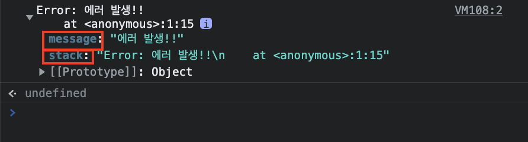
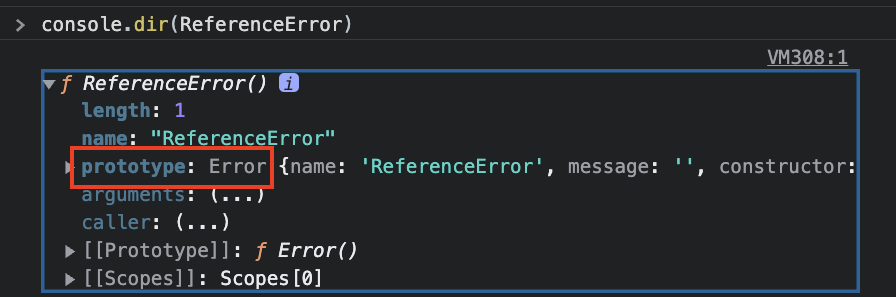
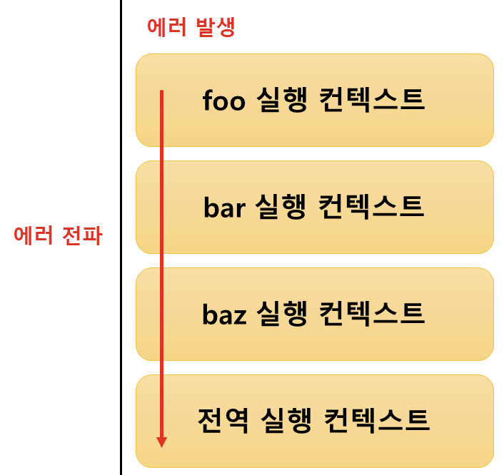

## 에러 처리의 필요성

> 에러가 발생하면 뒤의 코드는 실행되지 않고 프로그램이 강제 종료가 됩니다.

```js
console.log('시작하겠습니다!');

foo(); // 🚫ReferenceError: foo is not defined

// 에러에 의해서 프로그램이 강제 종료되어 아래 코드는 실행되지 않습니다.
console.log('저도 출력해주세요!');
```

```js
console.log('시작하겠습니다!');

try {
    foo();
} catch (err) {
    console.log(err); // 🚫ReferenceError: foo is not defined
}

// 발생한 에러에 대응을 하면 프로그램이 강제 종료되지 않습니다.
console.log('저도 출력해주세요!'); // 저도 출력해주세요!
```

직접적인 에러를 발생시키지는 않지만, 예외(exception) 상황에 적절하게 대응하지 않으면 에러로 이어질 가능성이 큽니다.

가령, querySelector 메서드는 인수로 전달한 CSS 선택자 문자열로 DOM에서 요소 노드를 찾을 수 없는 경우 에러를 발생시키지 않고 null을 반환합니다.

그러나 다음 처리에서 에러로 이어질 가능성이 있습니다.

```js
// 찾으려는 요소가 존재하지 않으면 querySelector 메서드는 에러를 발생시키지 않고 null을 반환합니다.
const $button = document.querySelector('.btn'); // null

$button.classList.add('disabled');
// 🚫TypeError: Cannot read properties of null
```

따라서 if문으로 querySelector 메서드의 반환 값을 확인하거나 단축 평가 or 옵셔널 체이닝 연산자를 사용하여 에러를 처리해야 합니다.

```js
const $button = document.querySelector('.btn');

// 옵셔널 체이닝 연산자 사용 -> undefined 반환
$button?.classList.add('disabled');
```

<br>

## try...catch...finally 문

에러 처리를 하는 방법은 크게 2가지가 있습니다.

-   if 문 또는 단축 평가 또는 옵셔널 체이닝 연산자를 통해 에러 처리 코드를 미리 등록
-   `try...catch...finally` 문 사용

일반적으로 `try...catch...finally` 문을 사용하는 것을 에러 처리(error handling)이라고 합니다.

불필요하다면 finally문은 생략 가능합니다.

```js
try {
    // 실행할 코드 (에러가 발생할 가능성이 있는 코드 )
} catch (err) {
    // try 코드 블록에서 에러가 발생하면 이 코드 블록의 코드가 실행됩니다.
    // err에는 try 코드 블록에서 발생한 Error 객체가 전달됩니다.
} finally {
    // 에러 발생과 상관 없이 반드시 한 번 실행됩니다.
}
```

<br>

## Error 객체

Error 생성자 함수는 에러 객체를 생성합니다.

Error 생성자 함수에는 에러를 상세히 설명하는 에러 메시지를 인수로 전달할 수 있습니다.

```js
const error = new Error('에러 발생!!');
```

Error 생성자 함수가 생성한 에러 객체는 message 프로퍼티와 stack 프로퍼티를 갖습니다.



<br>
<br>

message 프로퍼티의 값은 Error 생성자 함수에 인수로 전달한 에러 메시지입니다.

stack 프로퍼티의 값은 에러를 발생시킨 콜 스택의 호출 정보를 나타내는 문자열이며 디버깅 목적으로 사용된다고 합니다.

자바스크립트는 Error 생성자 함수를 포함해 7가지 에러 객체를 생성할 수 있는 Error 생성자 함수를 제공합니다.

-   `Error` : 일반적인 에러 객체입니다.
-   `SyntaxError` : 자바스크립트 문법에 맞지 않을 때 발생하는 에러 객체
-   `ReferenceError` : 참조할 수 없는 식별자를 참조했을 때 발생하는 에러 객체
-   `TypeError`: 피연산자 or 인수의 데이터 타입이 유효하지 않을 때 발생하는 에러 객체
-   `RangeError`: 숫자값의 허용 범위를 벗어났을 때 발생하는 에러 객체
-   `URIError`: encodeURI 또는 decodeURI 함수에 부적절한 인수를 전달했을 때 발생하는 에러 객체
-   `EvalError`: eval 함수에서 발생하는 에러 객체

```js
1 @ 1 // SyntaxError: Invalid or unexpected token

foo(); // ReferenceError: foo is not defined

null.foo; // TypeError: Cannot read properties of null

new Array(-1); // RangeError: Invalid array length

decodeURIComponent('%'); // Uncaught URIError: URI malformed

```

이들의 프로토타입은 모두 `Error.prototype`을 상속받습니다.



<br>
<br>

## throw 문

Error 생성자 함수로 에러 객체를 생성했다고 해서 에러가 발생하는 것은 아닙니다.

```js
try {
    // 에러 객체를 생성한다고 에러가 발생하는 것은 아닙니다.
    new Error('문제가 감지되었습니다.');
} catch (error) {
    console.log(error);
}
```

에러를 발생시키려면 throw 문으로 에러 객체를 던져야 합니다.

```js
try {
    // 에러 객체를 던지면 catch 코드 블록이 실행되기 시작합니다.
    throw new Error('문제가 감지되었습니다.');
} catch (error) {
    console.log(error); // 🚫Error: 문제가 감지되었습니다.
}
```

외부에서 전달받은 콜백 함수를 n번만큼 반복 호출하는 함수를 구현해 봅시다.

그리고 두 번째 인수가 함수가 아니면 TypeError를 발생시켜 봅시다.

```js
// 외부에서 전달받은 콜백 함수를 n번 만큼 반복 호출합니다.
const repeat = (n, f) => {
    if (typeof f !== 'function') throw new Error('두 번째 인수는 함수여야 합니다.');

    for (let i = 0; i < n; i++) {
        f(i); // i를 전달하면서 f를 호출
    }
};

try {
    repeat(2, 1); // 두 번째 인수가 함수가 아니므로 TypeError가 발생합니다.
} catch (err) {
    console.error(err); // 🚫Error: 두 번째 인수는 함수여야 합니다.
```

<br>

## 에러의 전파

> 에러는 호출자(caller) 방향으로 전파됩니다.

예제를 보겠습니다.

```js
function foo() {
    throw Error('foo에서 에러 발생!!');
}

function bar() {
    foo();
}

function baz() {
    bar();
}

try {
    baz();
} catch (error) {
    console.log(error); // 🚫Error: foo에서 에러 발생!!
}
```

foo 함수가 throw한 에러는 다음과 같이 호출자에게 전파되어 전역에서 캐치됩니다.



<br>
<br>

❗️비동기 함수인 setTimeout이나 프로미스 후속 처리 메서드의 콜백 함수는 호출자가 없다는 것을 주의해야 합니다.

setTimeout이나 프로미스 후속 처리 메서드의 콜백 함수는 태스크 큐 or 마이크로태스크 큐에 일시 저장되었다가 콜 스택이 비면 이벤트 루프에 의해 콜 스택으로 푸시되어 실행됩니다.

이때 콜 스택에 푸시된 콜백 함수의 실행 컨텍스트는 **콜 스택의 가장 하부에 존재하게 됩니다.**

따라서 에러를 전파할 호출자가 존재하지 않게 됩니다.
