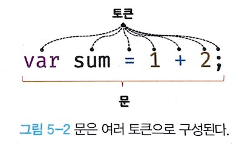
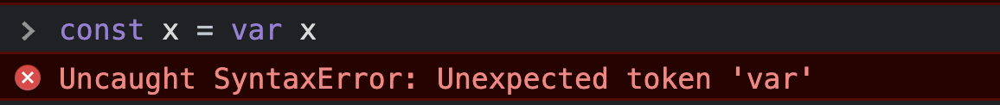
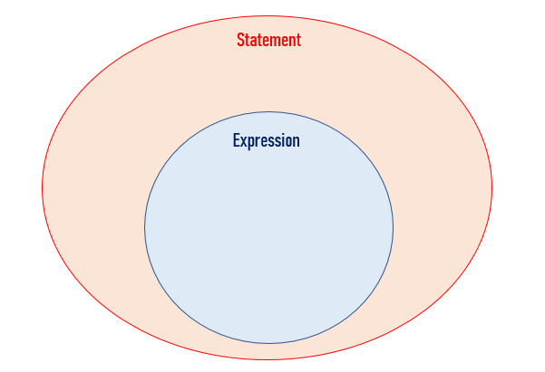

이번 05장의 주제는 표현식과 문입니다.
자바스크립트는 표현식과 문을 다르게 구별하기 때문에 명확하게 차이점을 중심으로 알아 놓을 필요가 있겠죠?

제가 생각하기에 이번 챕터는 영어로 이해하는 것도 하나의 좋은 학습 방법이라고 생각해요.
한글보다 영어 단어를 보면 훨씬 개념을 이해하는데 도움이 될 때가 있습니다.
🤢 영어 울렁증을 잠시 내려놓고 한 번 살펴봅시다.

## 📌05장 학습목표

- 값이 무엇인지 설명할 수 있다.
- 리터럴이 무엇인지 설명할 수 있다.
- 표현식이 무엇인지 설명할 수 있다.
- 문이 무엇인지 설명할 수 있다.
- 표현식인 문과 표현식이 아닌 문을 구분할 수 있다.

## 값(value)

> 값은 표현식이 평가되어 생성된 결과입니다.

예시를 살펴보겠습니다.

```js
var sum = 20 + 30;
```

과연 sum이라는 변수에 할당된 것은 `20 + 30`일까요? 아니면 `50`일 까요?

sum이 기억하는 메모리 공간에 저장된 것은 값 `50`입니다. `20 + 30`이 할당전에 평가(해석)되어서 값을 생성하는 것이죠.

이처럼 값을 생성하는 방법에는 `20 + 30` 같이 식으로 생성도 가능하지만, `리터럴`이 가장 기본적인 방법입니다.

<br>

## 리터럴(literal)

> 리터럴은 값을 프로그램안에서 직접 지정하자는 의미입니다.

즉, 리터럴은 값을 만드는 방법이라고 이해하시면 됩니다.

아래의 예시를 통해서 식별자와 리터럴의 개념을 명확히 짚고 넘아가겠습니다.

```js
var x = "x";
```

어떤 것이 식별자이고, 리터럴일까요?

`x`는 식별자이고, `"x"`는 리터럴이면서 동시에 식별자 x의 **값**이라고 할 수 있습니다.

이처럼 자바스크립트에서는 `따옴표`를 통해서 식별자와 리터럴을 구분합니다. :)

```
리터럴에 대해서 영어로 이해해보면 조금 더 의미가 명확해질겁니다.

위키피디아에서는 리터럴을 다음과 같이 정의하고 있어요.

In computer science, a literal is a notation for representing a fixed value in source code.

Almost all programming languages have notations for atomic values such as integers, floating-point numbers, and strings, and usually for booleans and characters;
some also have notations for elements of enumerated types and compound values such as arrays, records, and objects.

An anonymous function is a literal for the function type.
```

리터럴 표기에 대한 자세한 내용은 [여기](<https://en.wikipedia.org/wiki/Literal_(computer_programming)>)를 참고해주세요!

<br>

## 문(statement)

> 문은 instruction 혹은 action이라고 생각하세요!

여기서 instruction은 한글로 명령,지시를 의미합니다. action은 실행이라는 뜻이기도 합니다. (컴퓨터가 명령을 실행하는 것)

때문에 문을 `명령문`이라고 부르기도 한다고해요.

책에는 조금 더 어려운 표현으로 정의를 아래와 같이 해놓았더라구요.

```
문(statement)이란 프로그램을 구성하는 기본 단위이자 최소 실행 단위이다.
```

조금 어렵다면, `세미콜론(;)` 전까지를 묶어서 `문`이라고 생각해주시면 됩니다.

왜냐하면 세미콜론이 문의 종료를 표시하는 기호이기 때문이죠.

자바스크립트 엔진은 세미콜론으로 문이 종료한 위치를 파악하여 순차적으로 문을 실행합니다.

- 참고로 자바스크립트 엔진에는 **ASI(automatic semicolon insertion)** 기능이 있기 때문에 세미콜론을 생략하여도 정사적으로 해석할 수 있습니다.

이러한 문의 종류에는 선언문, 할당문, 조건문, 반복문 등이 있어요!
(이 부분은 암기하시지 말고 이런 예시들이 있구나라고 생각해주시면 됩니다.)

```js
// 변수 선언문
var score;

// 변수 할당문
score = 100;

// 함수 선언문
function foo(){}

// 조건문
if(true){
    console.log('always true')
}

//반복문
for(let i=0; i<2; i++>){
    console.log(i)
}

```

참고로 조건문과 반복문과 같은 코드 블록은 자체 종결성을 가지기 때문에 따로 세미클론을 붙이지 않습니다.

그렇다면 `문`은 어떻게 구성이 되어있을까요?

문은 여러 `토큰(token)`으로 구성이 되어 있습니다.

✋ 여기서 잠깐! **토큰**은 무엇일까요?

토큰(token)은 한 마디로 코드에서 더 나누게 되면 문법적인 의미를 잃게 되는 요소를 뜻해요.

저는 한국말의 형태소 같은 것을 떠올리면서 이해하기도 했어요.

형태소도 문법적 혹은 실질적인 의미를 가지게 되는 가장 작은 말의 단위이니까요.

<br>

<div>

</div>

<br>

혹시 아래와 같은 에러를 겪어보신적이 있나요?

<div>

</div>

<br>

이와 같은 오류는 제가 변수에 값을 할당하려면 뒤에 표현식이 와야하는데 표현식이 아닌 문이 왔기 때문에 일어난 에러입니다.

여기서 token도 앞에 설명한 token과 동일한 의미입니다.

<br>

## 표현식(expression)

> 엔진이 코드를 해석하면 값이 되는 구문입니다.(becomes a value.)

아래의 예시를 통해서 이해를 해봅시다.

```js
let score = 100; // 리터럴 100은 값을 생성하므로 그 자체로 표현식입니다.
```

```js
let result = 10 + 20; // 10 + 20은 숫자값 30을 생성하므로 표현식입니다.

//식별자 참조도 값을 생성하지는 않지만 값으로 평가(해석)되기 때문에 표현식입니다.
result; // -> 30
```

표현식의 종류는 다음과 같습니다.

- 값(리터럴)
- 변수
- 객체 프로퍼티
- 배열
- 피연산자와 연산자의 조합
- 함수 호출

```js
// 리터럴 표현식
100;
("Hi");

// 식별자 표현식
sum;
person.name;
arr[0];

// 연산자 표현식
1 + 2;
sum = 3;

// 함수/메서드 호출 표현식
foo();
person.getName(); //함수도 결국 값을 return하기 때문에 표현식입니다.
```

표현식은 값과 동등한 관계에 있기 때문에, `값`처럼 사용할 수 있습니다.

```js
let score = 50 + 50;

//식별자 표현식 score는 값으로 평가(해석)됩니다.
score + 10; //110
```

<br>

## 표현식과 문

> 문(statement)은 표현식의 상위 집합입니다.



보충해서 설명하자면, 문에는 표현식인 문과 표현식이 아닌 문이 있습니다.

표현식인 문은 그 자체로 값이 될 수 있지만, 표현식이 아닌 문은 값이 될 수 없습니다.

조금 헷갈리신다면, `변수에 할당`을 해보시면 둘의 차이를 명확히 알 수 있습니다.

왜냐하면 표현식인 문은 값으로 해석되기 때문에 변수에 할당할 수 있으니까요.

반대로 표현식이 아닌 문은 값이 아니기에 변수에 할당할 수 없습니다.

예시를 통해서 더 자세히 알아봅시다!

```js
function add(a, b) {
  return a + b; // 만약 return을 안쓰고 a+b만 있어도 undefined를 반환하기에 add(1,2)는 표현식이 맞다.
}

const result = add(1, 2); //add(1,2)는 평가되어 3이라는 결과값을 생성하고 result에 할당할 것이다.

console.log(result); // 3
```

`add(1,2)`는 표현식인 문입니다. (함수 호출 표현식)

```js
const x = const y // SyntaxError: Unexpected token 'const'
```

선언문은 값이 아니기에 변수에 할당할 수 없습니다. 따라서 선언문은 표현식이 아닌 문입니다.

```js
const x = if(true){} //SyntaxError: Unexpected token 'if'
```

조건문도 표현식이 아닌 문이기에 값이 될 수 없습니다.

```js
console.log(if(true){}) //SyntaxError: Unexpected token 'if'
```

`console.log()` 안에도 표현식이 아닌 문을 넣게 되면 에러가 생깁니다.

```js
const x = if(x > 1){ return 100} //SyntaxError: Unexpected token 'if'
```
