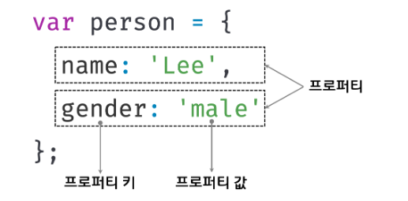

자바스크립트를 구성하는 거의 모든것이 객체입니다. 객체에 대해서 잘 알아봅시다.

## 📌10장 학습목표

-   객체란 무엇인지 설명할 수 있어야 합니다.
-   프로퍼티 동적 생성, 값 갱신, 프로퍼티 삭제하는 방법에 대해서 설명할 수 있어야 합니다.
-   프로퍼티 접근 방법 2가지를 설명할 수 있어야 합니다.
-   ES6에 추가된 객체 리터럴의 확장 기능을 설명할 수 있어야 합니다.

## 객체란?

> 프로퍼티라는 개념을 통해서 여러 개의 값을 하나의 단위로 구성한 복합적인 자료구조입니다.

자바스크립트의 객체는 **키(key)** 과 **값(value)** 으로 구성된 **프로퍼티(Property)** 들의 집합이라고 표현할 수 있습니다.

키, 값, 프로퍼티는 뭘까요? 새로운 용어들이 등장했습니다. 하나씩 살펴보죠.

<br>



<br>

이처럼 객체는 0개 이상의 프로퍼티로 구성된 집합이며, 프로퍼티는 키(key)와 값(value)으로 구성되어있습니다.

참고로 자바스크립트에서 사용할 수 있는 <u>모든 값은 프로퍼티 값이 될 수 있습니다.</u>

이에 비추어본다면 함수도 일급객체이기에 값으로 취급할 수 있어 프로퍼티 값으로 사용 가능합니다.

우리는 이것을 일반 함수와 구분하기 위해서 **메서드(method)** 라고 부르기로 했습니다.

```js
const counter ={
    num:0; //프로퍼티
    increase: function(){
        this.num++;
    } //메서드
}
```

메서드라는 용어를 사용해서 새로 객체를 정의해보겠습니다.

_객체는 프로퍼티와 메서드로 구성된 집합체라고 할 수 있습니다._

각각의 역할은 아래와 같습니다.

-   **프로퍼티**: 객체의 상태를 나타내는 값 (데이터에 해당합니다.)
-   **메서드**: 프로퍼티(상태 데이터)를 참조하고 조작할 수 있는 동작(behavior)입니다.

이처럼 객체는 <u>상태(프로퍼티)와 동작(메서드)을 하나의 단위로 구조화</u>할 수 있어서 매우 유용합니다.

<br>

## 객체 리터럴에 의한 객체 생성

> 객체를 생성하는 가장 일반적이고 간단한 방법입니다.

아래 예시를 같이 봅시다.

```js
const person = {
    name: 'Kim',
    sayHello: function () {
        console.log(`Hello my name is ${this.name}`);
    },
};

console.log(typeof person); //object
console.log(person); //{name: 'Kim', sayHello: ƒ}
```

객체 리터럴은 이렇게 중괄호 내에 0개 이상의 프로퍼티를 정의하면 됩니다.

여기서 짚고 넘어가야할 지점은, **변수에 할당되는 시점**에 자바스크립트 엔진은 <u>객체 리터럴을 해석해 객체를 생성</u>하게 된다는 것입니다.

자바스크립트는 그 외에도 다양한 객체 생성 방법을 지원합니다.

-   객체 리터럴
-   Object 생성자 함수
-   생성자 함수
-   Object.create 메서드
-   클래스(ES6)

❗️ 그렇다면 이런 다양한 방식들과 다르게 객체 리터럴의 장점은 무엇일까요?

바로 객체 리터럴은 숫자 값이나 문자열을 만드는 것과 유사하게 리터럴로 객체를 생성할 수 있다는 점입니다.

비교해보자면, 객체를 생성하기 위해 클래스를 먼저 정의하고 new 연산자와 함께 생성자를 호출할 필요가 없습니다.

객체 리터럴은 **객체를 생성함과 동시에 프로퍼티를 만들 수도 있고, 객체를 생성한 이후에 프로퍼티를 동적으로 추가**할 수 도 있습니다.

이처럼 객체 리터럴은 자바스크립트의 유연함과 강력함을 대표하는 객체 생성 방식입니다.

<br>

## 프로퍼티

> 프로퍼티는 키와 값으로 구성되어있습니다.

```js
const person = {
    //프로퍼티 키는 name, 프로퍼티 값은 'Kim'입니다.
    name: 'Kim',
    //프로퍼티 키는 age, 프로퍼티 값은 19입니다.
    age: 19,
};
```

키와 값으로 사용할 수 있는 값은 아래와 같습니다.

-   **프로퍼티 키**: 모든 문자열 또는 심벌 값
-   **프로퍼티 값**: 자바스크립트에서 사용할 수 있는 모든 값

여기서 중요한 점은 프로퍼티 키가 프로퍼티 값에 접근할 수 있는 이름으로서 **식별자** 역할을 한다는 점입니다.

프로퍼티 키의 경우 식별자 네이밍 규칙을 따르면 따옴표를 생략하고, 그렇지 않으면 반드시 따옴표를 사용해야 합니다.

```js
const person = {
    //프로퍼티 키는 name, 프로퍼티 값은 'Kim'입니다.
    firstName: 'JungHee',
    'last-name': 'Kim',
};

console.log(person); //{firstName: 'JungHee', last-name: 'Kim'}
```

❗️**문자열 or 문자열로 평가할 수 있는 표현식**을 사용해 프로퍼티 키를 동적으로 생성도 가능합니다.

이 경우에는 프로퍼티 키로 사용할 표현식을 대괄호 `[ ]`로 묶어서 사용하면 됩니다.

```js
const obj = {};
const greeting = 'hello';

obj[greeting] = 'world';

console.log(obj); // { hello: 'world'}
```

이제 몇가지 프로퍼티가 가지는 특징들에 대해 살펴 봅시다.

1. 프로퍼티 키는 문자열이나 심벌 값 이외에 값을 사용하면 <u>암묵적 타입 변환을 통해 문자열</u>이 됩니다.

```js
const foo = {
    0: 1,
    1: 2,
    2: 3,
};

console.log(foo); //{0: 1, 1: 2, 2: 3}
```

2. 이미 존재하는 프로퍼티 키가 중복 선언되면, 나중에 선언한 프로퍼티가 먼저 선언한 프로퍼티를 <u>덮어 씌우게 됩니다.</u>

```js
const person = {
    name: 'Kim',
    name: 'Park',
};

console.log(person); //{name: 'Park'}
```

<br>

## 메서드

> 객체에 묶여있는 함수입니다.

<br>

## 프로퍼티 접근

프로퍼티 접근하는 방법에는 두 가지가 있습니다.

-   마침표 표기법 (dot notation)
-   대괄호 표기법 (bracket notation)

```js
const person = {
    name: 'Kim',
};

//마침표 표기법에 의한 접근입니다.
console.log(person.name); // Kim

//대괄호 표기법에 의한 접근입니다.
//반드시 프로퍼티 키는 따옴표로 감싼 문자열이어야 합니다.
console.log(person['name']); // Kim
```

객체에 존재하지 않는 프로퍼티에 접근하면 ⚠️**undefined**를 반환합니다.

```js
const person = {
    name: 'Kim',
};
console.log(person.age); //undefined
```

<br>

## 프로퍼티 값 갱신

> 이미 존재하는 프로퍼티에 값을 할당하는 방식으로 갱신이 이루어집니다.

```js
const person = {
    name: 'Kim',
};

person.name = 'Lee';

console.log(person); //{name: 'Lee'}
```

<br>

## 프로퍼티 동적 생성

> 존재하지 않는 프로퍼티에 값을 할당하면 프로퍼티가 동적으로 생성되어 추가되고 프로퍼티 값이 할당됩니다.

```js
const person = {
    name: 'Kim',
};

person.age = 19;

console.log(person); //{name: 'Kim', age: 19}
```

<br>

## 프로퍼티 삭제

> delete 연산자를 사용하여 객체의 프로퍼티를 삭제합니다.

```js
const person = {
    name: 'Kim',
};

//프로퍼티 동적 생성
person.age = 19;

//age 프로퍼티가 존재하기에 삭제 가능 ✅
delete person.age;

//height 프로퍼티가 존재하기에 삭제 불가능 🚫 (에러는 나지 않는다.)
delete person.height;

console.log(person); //{name: 'Kim'}
```

<br>

## ES6에 추가된 객체 리터럴의 확장 기능

-   프로퍼티 축약 표현

    > ES6에서 **변수 이름과 프로퍼티 키가 동일한 이름일 때 프로퍼티 키를 생략**할 수 있습니다.

    이때 <u>프로퍼티 키는 변수 이름으로 자동 생성</u> 됩니다.

    ```js
    //ES5
    var a = 1,
        b = 2;

    var obj = {
        a: a,
        b: b,
    };

    console.log(obj); //{a: 1, b: 2}
    ```

    ```js
    //ES6
    const a = 1,
        b = 2;
    //프로퍼티 축약 표현
    const obj = { a, b };

    console.log(obj); //{a: 1, b: 2}
    ```

-   계산된 프로퍼티 이름

    > ES6에서는 객체 리터럴 내부에서도 계산된 프로퍼티 이름으로 프로퍼티 키를 동적 생성할 수 있습니다.

    ```js
    //ES5
    var person = '사람';
    var i = 0;

    var obj = {};

    //객체 리터럴 외부애서 대괄호 표기법을 사용해야 합니다.
    //계샨된 프로퍼티 이름으로 프로퍼티 키를 동적으로 생성합니다.
    obj[person + '-' + ++i] = i;
    obj[person + '-' + ++i] = i;
    obj[person + '-' + ++i] = i;

    console.log(obj); //{사람-1: 1, 사람-2: 2, 사람-3: 3}
    ```

    ```js
    //ES6
    const person = '사람';
    let i = 0;

    //객체 리터럴 내부에서도 계산된 프로퍼티 이름으로 프로퍼티 키를 동적 생성할 수 있습니다..
    const obj = {
        [`${person}-${++i}`]: i,
        [`${person}-${++i}`]: i,
        [`${person}-${++i}`]: i,
    };

    console.log(obj); //{사람-1: 1, 사람-2: 2, 사람-3: 3}
    ```

-   메서드 축약 표현

    > ES6에서는 메서드를 정의할 때 function 키워드를 생략한 축약 표현을 사용 할 수 있습니다.

    ```js
    //ES5
    const person = {
        name: 'Kim',
        //프로퍼티에 함수를 할당합니다.
        sayHi: function () {
            console.log('Hello ' + this.name);
        },
    };

    person.sayHi(); //Hello Kim
    ```

    ```js
    //ES6
    const person = {
        name: 'Kim',
        //메서드 축약 표현입니다.
        sayHi() {
            console.log('Hello ' + this.name);
        },
    };

    person.sayHi(); //Hello Kim
    ```

    하지만 축약 표현은 다르게 동작하니 참고하세요.
