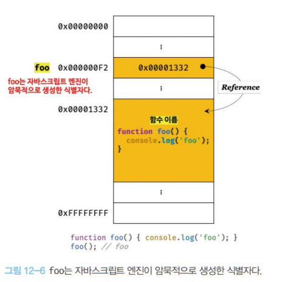

함수 단원은 뒤에 나올 스코프, 실행 컨텍스트, 클로저 등과 관련이 깊으니 집중해주세요.

## 📌12장 학습목표

- 함수와 관련된 용어들을 설명 할 수 있다.
- 함수 리터럴이 어떻게 구성되는지 설명할 수 있다.
- 함수 선언문과 함수 표현식의 차이를 설명할 수 있다.

## 함수란?

> 함수는 하나의 특별한 목적의 작업을 수행하기 위해 독립적으로 설계된 프로그램 코드의 집합입니다.

여기에서는 함수와 관련된 용어들만 짚고 넘어가겠습니다.


- **매개변수(parameter)**: 함수 내부로 입력을 전달받는 변수입니다.
- **인수(argument)**: `입력`으로 이해해주세요.
- **반환값(return value)**: `출력 값`으로 이해해주세요.
- 함수는 **함수 정의(function definition)** 를 통해 생성합니다.
- **함수호출(function call / invoke)**: 인수를 매개변수를 통해 함수에 전달하면서 함수의 실행을 명시적으로 지시하는 행위입니다.

## 함수를 사용하는 이유?

함수를 사용하는 이유는 다음과 같습니다.

- 반복적으로 작성되는 코드를 함수로 정의하여 재사용 (함수의 존재 이유는 `재사용성`에 기반을 두고 있습니다.)
- 객체 생성
- 객체의 행위 정의(메서드로 동작)
- 정보 은닉
- 클로저
- 모듈화

## 함수 리터럴

> 함수는 객체 타입의 값입니다.

따라서 숫자 값을 숫자 리터럴로 생성하듯이 함수도 함수 리터럴로 생성할 수 있습니다.

함수 리터럴은 다음과 같이 구성됩니다.

```js
//변수에 함수 리터럴을 할당한 형태입니다.
const f = function sum(a, b) {
  return a + b;
};
```

- function 키워드
- 함수 이름: 함수 몸체 내부에서만 참조할 수 있는 식별자입니다.
- 매개변수 목록: 0개 이상의 매개변수를 소괄호로 감싸고 쉼표로 구분합니다.
- 함수 몸체: 함수가 호출되었을 때 실행될 문들을 하나의 실행단위로 정의한 코드블록입니다. <u>함수호출</u>에 의해서 함수몸체는 실행됩니다.

모든 리터럴이 그러하듯, 함수 리터럴도 평가되어 값을 생성합니다.

그 값이 **객체**이기 때문에 <u>함수는 객체</u>라고 볼 수 있습니다.

하지만 함수를 일반 객체와는 구별을 지을수 있는 하나의 특징이 있습니다.

바로 **일반 객체는 호출이 불가능하지만, 함수는 호출이 가능**하다는 점이죠.

그래도 함수가 객체라는 사실은 자바스크립트와 다른 언어를 구별짓는 중요한 특징이니 기억해둡시다. 😃

## 함수 정의

> 함수를 호출하기 이전에 매개변수,실행할 문, 반환 값을 지정하는 것입니다.

함수를 정의하는 방법에는 크게 4가지가 있습니다.

- 함수 선언문
  ```js
  function sum(a, b) {
    return a + b;
  }
  ```
- 함수 표현식
  ```js
  const sum = function (a, b) {
    return a + b;
  };
  ```
- Function 생성자 함수
  ```js
  const sum = new Function("a", "b", "return a+b");
  ```
- 화살표 함수 (ES6)
  ```js
  const sum = (a, b) => a + b;
  ```

하나씩 천천히 살펴보겠습니다.

### 함수 선언문

> 함수 선언문은 표현식이 아닌 문입니다.

함수 선언문에서 알아두어야 할 포인트는 2가지입니다.

- 함수 선언문은 함수 이름을 생략할 수 없습니다.
- 함수는 **함수 객체를 가리키는 식별자**로 호출을 합니다. (함수 이름으로 호출하는 것이 아닙니다.)

먼저 함수 선언문은 함수 이름을 생략할 수 없다는 예시를 살펴봅시다.

```js
function (a,b) {
    return a+b // 🚫 SyntaxError: Function statements require a function name
}
```

이처럼 함수 리터럴은 함수 이름을 생략할 수 있지만, 함수 선언문은 이름을 생략할 수 없습니다.

따라서 올바른 함수 선언문은 다음과 같습니다.

```js
function sum(a, b) {
  return a + b;
}

console.log(sum(2, 3)); //5
```

두 번째 포인트였던 '함수는 함수 이름으로 호출하는 것이 아니라 함수 객체를 가리키는 식별자로 호출한다.'를 살펴봅시다.

이것을 이해하려면 우선 자바스크립트 엔진이 문맥에 따라 코드를 다르게 해석한다는 것을 아셔야합니다.

예를 들어 자바스크립트 엔진은 `{}`은 문맥에 따라 블록문 혹은 객체 리터럴로 다르게 해석합니다.

```js
if () {} // {}이 단독으로 존재하면 블록문으로 해석합니다.

const obj = {}; // {}이 값으로 평가되기에(피연산자로 사용됨) 객체 리터럴로 해석됩니다.
```

이와 마찬가지로 자바스크립트 엔진은 문맥에 따라 `함수 선언문` 혹은 `함수 리터럴 표현식`으로 다르게 해석합니다.

```js
// 기명 함수 리터럴을 단독으로 사용하면 함수 선언문으로 해석됩니다.
function foo() {
  console.log("foo");
}

foo(); //foo

// 함수 리터럴을 피연산자로 사용하면 함수 리터럴 표현식으로 해석됩니다.
(function bar() {
  console.log("bar");
});

bar(); // 🚫 ReferenceError: bar is not defined
```

<br>

<div>


</div>

<br>

<u>함수 이름은 함수 몸체 내부에서만 유효한 식별자</u>이기에 함수 이름으로는 함수를 참조할 수 없습니다. (호출할 수 없습니다)

따라서 우리는 함수 객체를 참조할 수 있도록 `함수 객체를 가리키는 식별자`가 필요합니다.

자바스크립트 엔진은 생성된 함수를 호출하기 위해 함수 이름과 동일한 이름의 **식별자를 암묵적으로 생성**하고, 그곳에 **함수 객체를 할당**합니다.

정리하자면 함수는 <u>함수 이름으로 호출하는 것이 아닌, 함수 객체를 가리키는 식별자로 호출하게 됩니다.</u>

그래서 자바스크립트 엔진은 함수 선언문을 해석할 때 함수 표현식으로 변환해 함수 객체를 생성하게 됩니다.

<br>

> 이렇게 함수 선언문으로 함수를 생성하여도

```js
function sum(a, b) {
  return a + b;
}
```

> 자바스크립트 엔진은 아래와 같이 변환하여 함수 객체를 생성합니다.

```js
const sum = function sum(a, b) {
  return a + b;
};
```


### 함수 표현식

> 함수 표현식은 함수 리터럴로 생성한 함수 객체를 변수에 할당하는 방식입니다.

자바스크립트에서 함수는 <u>일급 객체</u>이기 때문에 `값`처럼 사용 가능합니다.

따라서 함수 리터럴로 생성한 함수 객체를 변수에 할당하여 사용할 수 있습니다.

함수 리터럴의 함수명은 생략이 가능합니다.

따라서 함수 표현식의 함수 리터럴은 일반적으로 함수명을 생략합니다. (익명 함수)

예시는 아래와 같습니다.

```js
const sum = function foo(a, b) {
  return a + b;
};

//함수 객체를 가리키는 식별자로 호출한 경우입니다.
console.log(sum(2, 3)); //5

//함수 이름으로 호출한 경우입니다.
// 함수 이름은 함수 몸체 내부에서만 유효한 식별자입니다.
console.log(foo(2, 3)); //🚫 ReferenceError: foo is not defined
```

### Function 생성자 함수

바람직하지 않은 함수 정의 방식이니 가볍게 넘어갑시다.

왜냐하면 Function 생성자 함수로 생성한 함수는 앞에서 나온 방식들과 다르게 동작하기 때문입니다.

예를들면 클로저(closure)를 생성하지 않는다 등 문제점이 있습니다.

```js
const sum = new Function("a", "b", "return a + b");

console.log(sum(2, 3)); // 5
```

### 화살표 함수

> function 키워드 대신 화살표를 사용해 더 간단하게 함수를 선언할 수 있습니다.

화살표 함수는 ES6에 도입되었으며 항상 익명함수로 정의합니다.

하지만, 기존의 함수 정의 방식보다 내부 동작이 간소화되어 있습니다.

아래와 같은 차이점이 있습니다.

- this 바인딩 방식이 다릅니다.
- prototype 프로퍼티가 존재하지 않습니다.
- arguments 객체를 생성하지 않습니다.

### 함수 호이스팅 (함수 선언문 VS 함수 표현식)

> 함수 선언문이 코드의 선두로 끌어 올려지는 것처럼 동작하는 자바스크립트 고유의 특징입니다.

결론부터 말씀드리면 함수 선언문과 함수 표현식은 **함수의 생성 시점**이 다른 차이가 있습니다.

함수 선언문은 <u>런타임 이전에</u> 함수 객체를 먼저 생성하게 됩니다.

그래서 런타임에는 이미 함수 객체가 생성되어있고 함수 이름과 동일한 식별자에 할당도 모두 완료한 상태이니 호출이 가능하겠죠.

반면, 함수 표현식은 <u>런타임에 평가되어</u> 함수 객체가 생성됩니다.

예시를 보면 이해가 더 빠를겁니다.

```js
//함수 참조
console.dir(sum); //ƒ sum(a, b)
console.dir(multiply); //undefined

//함수 호출
console.log(sum(2, 3)); //5
console.log(multiply(2, 3)); // 🚫 TypeError: multiply is not a function

//함수 선언문
function sum(a, b) {
  return a + b;
}

//함수 표현식
var multiply = function (a, b) {
  return a * b;
};
```

우리는 앞에서 변수 호이스팅을 공부하면서 호이스팅의 개념에 대해서 짚고 넘어갔었습니다.

❗️ 그렇다면 변수 호이스팅과 함수 호이스팅은 어떤 차이가 있는걸까요?

예를 들어 var 키워드로 선언된 변수는 `undefined로 초기화`됩니다.

var 키워드를 변수 선언문 이전에 변수를 참조하면 변수 호이스팅에 의해 **undefined로 평가**됩니다.

반면, 함수 선언문을 통해 암묵적으로 생성된 식별자는 `함수 객체`로 초기화됩니다.

반면에, 함수 선언문으로 정의한 함수를 함수 선언문 이전에 호출하면 함수 호이스팅에 의해 **호출이 가능**합니다.

정리해 보자면 다음과 같은 결론을 내릴 수 있겠네요.

- 함수 선언문: 함수 호이스팅 발생
- 함수 표현식: 변수 호이스팅 발생 (함수 호이스팅 ❌)

이렇게 함수 선언문은 함수를 호출하기 전에 함수를 반드시 선언해야한다는 규칙을 무시하기에 <u>함수 표현식을 사용할 것을 권장한다고 합니다.</u>

<br>

## 함수 호출

> 함수를 가리키는 식별자와 함수 호출 연산자 `()`로 호출합니다.

위와 같이 함수를 호출하게 되면 현재의 실행 흐름을 중단하고 호출된 함수로 실행 흐름을 옮기게 됩니다.

그리고 매개변수에 인수가 순서대로 할당이 되고 함수 몸체의 문들이 실행되게 됩니다.

```js
function sum(a, b) {
  return a + b;
}

//함수를 호출합니다.
//인수 2와 3이 매개변수 a와 b에 순서대로 할당되고, 함수 몸체의 문들이 실행되게 됩니다.
const result = sum(2, 3);
```

함수 호출 파트에서는 `매개변수`, `인수` 그리고 `반환문`에 대해서 자세히 살펴볼게요.

### 매개변수 (parameter)

핵심은 매개변수는 함수 몸체 내부에서 **변수와 동일하게 취급**된다는 점입니다.

그 말은 즉 함수가 호출되면 함수 몸체 내에서 암묵적으로 매개변수가 생성되고 일반 변수와 마찬가지로 **undefined**로 초기화된 이후 인수가 순서대로 할당되는 것입니다.

매개변수의 스코프(유효범위)는 함수 몸체 내부이기에 함수 몸체 외부에서 참조할 수 없다는 점도 기억해두세요!

```js
function sum(a, b) {
  console.log(a, b); // 2 3
  return a + b;
}

sum(2, 3);

console.log(a, b); // 🚫 ReferenceError: a is not defined
```

🤔 그렇다면 매개변수보다 인수가 부족하거나 초과한다면 어떻게 될까요?

정리하자면 아래와 같습니다.

- 매개변수보다 인수가 부족한 경우: 인수가 할당되지 않은 매개변수 값은 **undefined** 입니다.
- 매개변수보다 인수가 초과한 경우: 초과된 인수는 무시됩니다. (정확히는 버려지지 않고, 모든 인수는 argument 객체의 프로퍼티로 보관됩니다.)

예제를 보시죠.

```js
function sum(a, b) {
  return a + b;
}
// 인수가 부족한 경우입니다.
// 2+undefined의 결과 값은 NaN입니다.
console.log(sum(2)); //NaN
```

```js
function sum(a, b) {
  return a + b;
}
// 인수가 초과한 경우입니다.
// 초과된 인수는 무시됩니다.
console.log(sum(2, 3, 4)); //5
```

### 인수 (argument)

인수는 값으로 평가될 수 있는 **표현식**이어야 합니다. (이는 `console.log()`안에 표현식이 아닌 문이 들어갈 수 없는 이유이기도 합니다.)

인수는 함수를 호출할 때 지정하며 개수와 타입에는 제한이 없습니다.

하지만 이렇게 인수의 타입에 제한이 없다는 점은 큰 단점으로 작용합니다.

예시를 들어보겠습니다.

```js
function sum(a, b) {
  return a + b;
}

console.log(sum(3)); //NaN
console.log(sum("a", "b")); //'ab'
```

개발자의 의도와 이렇듯 다르게 자바스크립트 엔진이 실행한 이유는 다음과 같습니다.

- 자바스크립트는 매개변수와 인수의 개수가 일치하는지 확인하지 않습니다.
- 자바스크립트는 매개변수의 타입을 사전에 지정할 수 없습니다.

따라서 우리는 함수를 정의할 때 적절한 인수가 전달되었는지 확인을 해야합니다.

```js
function sum(a, b) {
  if (typeof a !== "number" || typeof b !== "number") {
    throw new TypeError("인수는 모두 숫자 값이어야 합니다.");
  }
  return a + b;
}
console.log(sum(3)); // 🚫 TypeError: 인수는 모두 숫자 값이어야 합니다.
console.log(sum("a", "b")); // // 🚫 TypeError: 인수는 모두 숫자 값이어야 합니다.
```

### 반환문

> `return` 키워드와 표현식인 반환문을 사용해 실행 결과를 함수 외부로 반환할 수 있습니다.

함수 호출은 표현식이라고 했던 것 기억나시나요?

왜냐하면 함수 호출 표현식은 return 키워드가 반환한 표현식의 평가 결과, 즉 반환 값으로 평가되기 때문입니다.

```js
function sum(a, b) {
  return a + b;
}
//함수 호출은 반환 값으로 평가됩니다. 그렇기 때문에 변수에 할당이 가능하죠.
const result = sum(2, 3);
console.log(result); //5
```

❗️ 그렇다면 반환문의 역할은 무엇일까요?

아래는 반환문의 특성을 활용한 것입니다.

- 반환문은 함수의 실행을 중단하고 함수 몸체를 빠져나갑니다. -> <u>반환문 이후 문들은 모두 무시</u>되겠죠!

  ```js
  function sum(a, b) {
    return a + b;
    //반환문 이후에 다른문들은 모두 무시됩니다.
    console.log("내가 실행이 될까요?");
  }

  console.log(sum(2, 3)); //5
  ```

- return 키워드 뒤에 오는 표현식을 평가해 반환합니다. -> return 키워드 뒤에 표현식을 명시적으로 지정하지 않으면 <u>undefined</u>가 반환됩니다.

  ```js
  function foo() {
    return;
  }

  console.log(foo()); //undefined
  ```

## 참조에 의한 전달과 외부 상태의 변경

예시를 통해서 봅시다.

```js
// 매개변수 primitive는 원시 값을 전달받고, 매개변수 obj는 객체를 전달받는다.
function changeVal(primitive, obj) {
  primitive += 100;
  obj.name = "Kim";
}

//외부 상태
const num = 100;
const person = { name: "Park" };

//원시 값은 값 자체가 복사되어 전달되고, 객체는 참조 값이 복사되어 전달됩니다.
changeVal(num, person);

// 원시 값은 원본이 훼손되지 않습니다.
console.log(num); //100

//객체는 원본이 훼손됩니다.
console.log(person); //{name: 'Kim'}
```

이러한 문제를 해결하는 방법 중 하나는 객체를 `불변 객체(immutable object)`로 만드는 방법이 있습니다.

객체의 상태 변경을 막고, 상태 변경이 필요한 경우에는 `깊은 복사(deep copy)`를 통해 새로운 객체를 생성하고 재할당을 통해서 교체하는 방법이죠.

이처럼 외부 상태를 변경하지 않고 외부 상태에 의존하지 않는 함수를 `순수함수`라고 합니다.

함수형 프로그래밍의 목표 자체가 순수 함수를 통해 부수효과를 최대한 억제하여 안정성을 높이는 것에 있기에 신경을 써줘야겠죠? 👀
