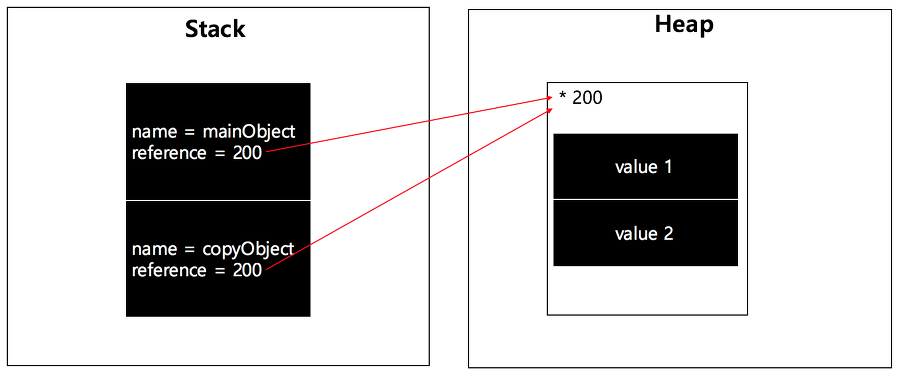
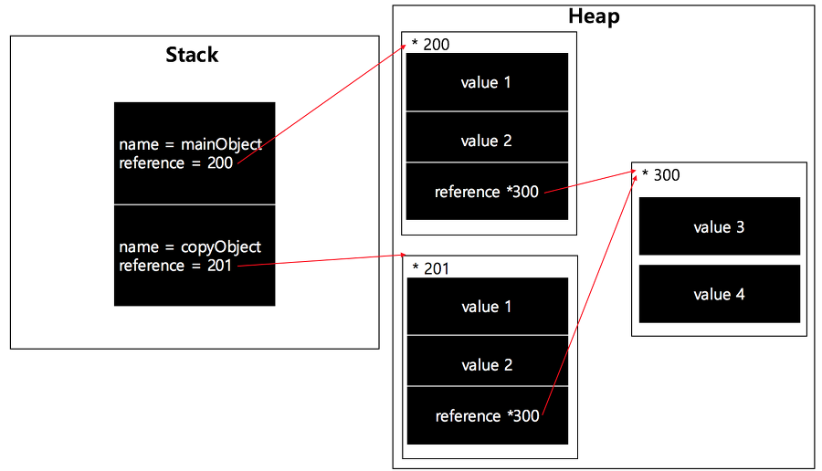
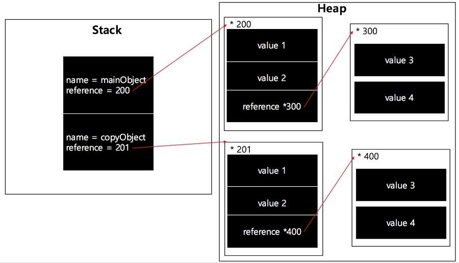

스터디에서 얘기가 나왔던 질문들과 제가 스터디원들의 글을 보면서 새로 알게 된 내용들을 정리하고자 합니다.

### 🙋🏻‍♀️ 얕은 복사 VS 깊은 복사

우선 세 개의 카테고리로 나눠서 설명을 드리겠습니다.

#### 단순 복사

가장 쉽게 생각 할 수 있는 것은 `할당 연산자 (=)`를 통한 복사입니다.

이것을 단순 복사라고 해보겠습니다.

```js
// 단순 복사 예시
const mainObject = {
  a: 1,
  b: 2,
};

// 할당 연산자를 사용하여 객체를 복사합니다.
const copyObject = mainObject;

// copyObject의 a라는 키(key)에 새로운 값으로 변경합니다.
copyObject.a = 4;

//mainObject 또한 프로퍼티 값이 변경된 것을 확인할 수 있다.
console.log(mainObject.a); // 4
console.log(copyObject.a); // 4
```

이렇게 값을 어느 한쪽에서만 수정하더라도 두 객체 모두 동일하게 변화하는 모습을 확인할 수 있습니다.

왜냐하면 할당 연산자는 <u>원본 객체의 주소</u>를 변수에 할당하기 때문입니다.

참조 값을 다른 변수로 복사하게 되면 그 값이 객체 자체가 아니라 heap에 저장된 객체를 가리키는 포인터이기 때문에 한쪽을 변경하면 다른 쪽에도 반영이 됩니다.

<br>



<br>
<br>

그림처럼 서로 다른 변수이지만 같은 객체를 바라보고 있습니다.

이러한 방식은 객체의 불변성을 깨뜨리고, 버그를 유발할 가능성이 높습니다.

만약 우리가 생각하는 복사가 원본 객체를 기준으로 새로 생성되는 새로운 객체를 의미한다면, 할당 연산자를 통한 객체 복사는 사실상 `복사` 보다는 `참조`에 가깝습니다.

원본과 아예 다른 객체를 생성하려면 `얕은 복사(Shallow Copy)` 혹은 `깊은 복사(Deep Copy)`를 해야 합니다.

#### 얕은 복사(Shallow Copy)

> 한 depth만 복사를 하게 됩니다.

새로운 객체에 원본 객체의 속성과 값을 그대로 생성하는 방식입니다.

❗️만약 프로퍼티 값이 객체 형태라면 **객체의 주소를 복사**합니다.



구현 방법

- spread 프로퍼티 이용
- Object.assign()

```js
//스프레드 프로퍼티를 이용한 얕은 복사입니다.
const mainObject = { a: 1, b: 2 };
const copyObject = { ...mainObject };

console.log(copyObject); // {a: 1, b: 2}

//만약 할당 연산자를 통한 단순 복사를 진행하면 true가 나옵니다.
//원본과는 다른 객체입니다.
console.log(mainObject === copyObject); // false

//객체 병합
const merged = { x: 1, y: 2, ...{ a: 3, b: 4 } };
console.log(merged); //{x: 1, y: 2, a: 3, b: 4}
```

```js
// Object.assign()을 이용한 얕은 복사
let mainObject = {
  a: 1,
  b: 2,
  c: {
    c1: 1,
    c2: 2,
  },
};

let copyObject = Object.assign({}, mainObject);

copyObject.a = 10;

copyObject.c.c1 = 5;

console.log(mainObject.a); // 1
console.log(mainObject.c.c1); // 5
```

#### 깊은 복사 (Deep Copy)

> 원본 객체를 완전히 복사하게 됩니다.

얕은 복사에서 주소를 복사한 것 또한 주소를 복사하지 않고, 새로운 메모리 공간을 확보해서 생성하게 됩니다.

새로운 메모리 공간을 확보해서 생성했기 때문에 완전히 다른 것을 의미합니다.



구현 방법

- 재귀호출로 복사
- JSON
- lodash

```js
//JSON 방식 사용

const mainObject = {
  a: 1,
  b: 2,
  c: function () {
    return 1;
  },
};
let copyObject = JSON.parse(JSON.stringify(mainObject));

//❗️stringify 메소드는 기본적으로 function 의 경우 undefined 로 처리한다.
console.log(copyObject); //{a: 1, b: 2}
```

### 🙋🏻‍♀️ 순수 함수 VS 비순수 함수

### 🙋🏻‍♀️ 일급 객체

> 함수가 일급 객체라는 것은 값으로 사용할 수 있다는 뜻입니다.

다음 조건을 만족하는 객체를 `일급 객체`라고 합니다.

- 무명의 리터럴로 생성할수 있어야 합니다. 즉 런타임에 생성이 가능해야합니다.
- 변수나 자료구조(객체,배열)에 저장할 수 있어야 합니다.
- 함수의 매개변수에 전달 할 수 있어야 합니다.
- 함수의 반환 값으로 사용할 수 있어야 합니다.

```js
// 1. 함수는 무명의 리터럴로 생성할 수 있다.
// 2. 함수는 변수에 저장할 수 있다.
// 런타임(할당 단계)에 함수 리터럴이 평가되어 함수 객체가 생성되고 변수에 할당된다.
const increase = function (num) {
  return ++num;
};

const decrease = function (num) {
  return --num;
};

// 2. 함수는 객체에 저장할 수 있다.
const auxs = { increase, decrease };

// 3. 함수의 매개변수에게 전달할 수 있다.
// 4. 함수의 반환값으로 사용할 수 있다.
function makeCounter(aux) {
  let num = 0;

  return function () {
    num = aux(num);
    return num;
  };
}

// 3. 함수는 매개변수에게 함수를 전달할 수 있다.
const increaser = makeCounter(auxs.increase);
console.log(increaser()); // 1
console.log(increaser()); // 2

// 3. 함수는 매개변수에게 함수를 전달할 수 있다.
const decreaser = makeCounter(auxs.decrease);
console.log(decreaser()); // -1
console.log(decreaser()); // -2
```

함수가 일급 객체라는 것은 <u>함수를 객체와 동일하게 사용할 수 있다는 의미입니다.</u>

객체는 값이므로 함수는 **값**과 동일하게 취급 할 수 있습니다.

따라서 함수는 값을 사용할 수 있는 곳(변수 할당문, 객체의 프로퍼티 값, 배열의 요소, 함수 호출의 인수, 함수 반환문)이라면 어디서든지

리터럴로 정의할 수 있으며 런타임에 함수 객체로 평가됩니다.

### 🙋🏻‍♀️ 쓰로틀과 디바운스

### 🙋🏻‍♀️ Template Literal과 styled-components

```js
const Title = styled.h1`
  font-size: 1.5em;
  text-align: center;
`;
```

혹시 이런 코드를 보신 적이 있으신가요?

styled-components를 사용해보신 분들이라면 많이 익숙할 것입니다.

styled-components는 컴포넌트에 css를 import해서 적용하는 것이 아닌 스타일된 컴포넌트를 만들어 사용이 가능한 라이브러리입니다.

이러한 방법은 `템플릿 리터럴(Template Literal)` 그리고 `테그드 템플릿(Tagged Template Literal)`과 연관이 되어있습니다.

복습을 간단히 해보자면 ES6부터 템플릿 리터럴이라고 하는 새로운 문자열 표기법이 도입되었습니다.

템플릿 리터럴은 백틱을 사용하여 멀티라인 문자열, 표현식 삽입, 태그드 템플릿 등 편리한 문자열 처리가 가능합니다.

그중에서도 **태그드 템플릿 리터럴**은 템플릿 리터럴을 이용하여 <u>함수의 인자를 파싱하여 넘겨주는 것입니다.</u>

```js
//예제 코드
const meal = "dinner";
const taste = "good";

function getSnackTaste(string, eat, flavor) {
  let snack = "cookie";
  let feel = "bad";

  if (eat === "breakfast") {
    snack = "milk";
  }
  if (flavor === "bad") {
    feel = "good";
  }
  return string[0] + snack + string[1] + feel + "~~";
}

getSnackTaste`Today, ${meal} is ${taste}`; // Today, cookie is bad~~
```

```js
var person = "Mike";
var age = 28;

function myTag(strings, personExp, ageExp) {
  var str0 = strings[0]; // "that "
  var str1 = strings[1]; // " is a "

  // 사실 이 예제의 string에서 표현식이 두 개 삽입되었으므로
  // ${age} 뒤에는 ''인 string이 존재하여
  // 기술적으로 strings 배열의 크기는 3이 됩니다.
  // 하지만 빈 string이므로 무시하겠습니다.
  // var str2 = strings[2];

  var ageStr;
  if (ageExp > 99) {
    ageStr = "centenarian";
  } else {
    ageStr = "youngster";
  }

  // 심지어 이 함수내에서도 template literal을 반환할 수 있습니다.
  return str0 + personExp + str1 + ageStr;
}

var output = myTag`that ${person} is a ${age}`;

console.log(output);
// that Mike is a youngster
```

자세한 내용은 [여기](https://developer.mozilla.org/ko/docs/Web/JavaScript/Reference/Template_literals)를 참고하세요.
