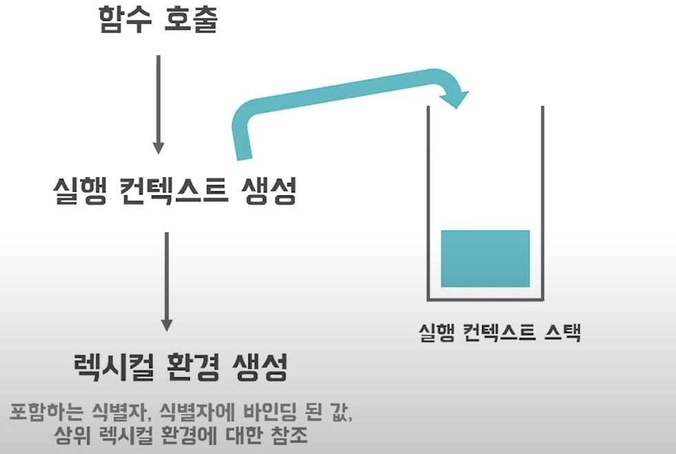
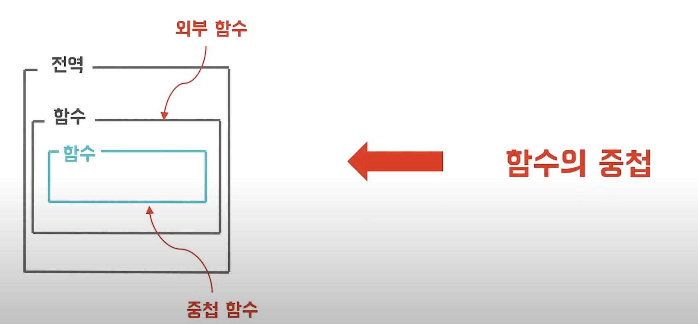
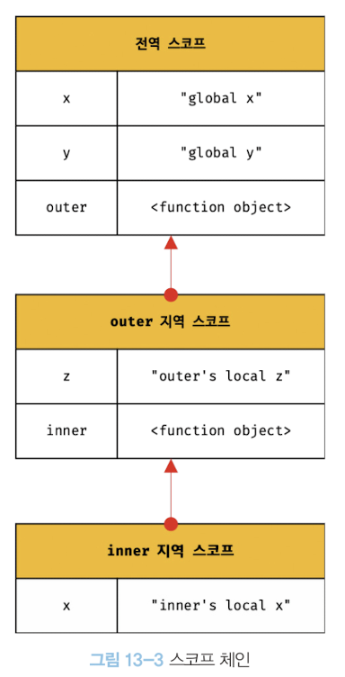

## 📌13장 학습목표

- 스코프가 무엇인지 설명할 수 있다.
- 스코프의 종류에 대해서 설명할 수 있다.
- 자바스크립트 엔진이 변수를 어떻게 참조하는지 스코프체인과 관련해서 설명할 수 있다.
- 함수 레벨 스코프와 블록 레벨 스코프를 설명할 수 있다.
- 렉시컬 스코프에 대해서 설명할 수 있다.

## 스코프 (Scope)

> 식별자가 유효한 범위를 말합니다. (variable access)

여기서 말하는 식별자는 <u>변수 이름, 함수 이름, 클래스 이름 등</u> 모든 식별자를 포함합니다.

중요한 점은 자신이❗️**선언된 위치**에 의해 다른 코드가 식별자 자신을 참조할 수 있는 유효 범위가 결정된다는 점입니다.

정리하자면 스코프는 식별자가 유효한 범위를 말하고, 그 범위는 자신이 선언된 위치에 의해 결정된다고 정리하면 되겠네요.

이번에는 스코프의 범위가 다르기 때문에 `let`, `const` 키워드 보다는 `var` 키워드를 예시 코드에 사용하겠습니다.

```js
var a = 10;

function foo() {
  var a = 20;
  console.log(a); //20
}

foo();

console.log(a); //10
```

위 예시에서 자바스크립트 엔진은 두 개의 변수 `a`중에서 어떤 변수를 참조할지 결정해야 합니다. 이를 **식별자 결정(identifier resolution)** 이라고 합니다.

그렇다면 어떤 변수를 참조할 지 결정하는 기준은 무엇일까요? 바로 그 기준이 `스코프`입니다.

그런 의미에서 스코프는 자바스크립트 엔진이 식별자를 검색(결정)할 때 사용하는 규칙(기준)이라고 볼 수 있겠네요.

이처럼 자바스크립트 엔진은 코드가 어디에서 실행되고 주변에 어떤 코드가 있는지를 고려합니다. 다시 말해서 `코드의 문맥(context)`을 고려한다는 뜻이죠.

책에서는 이와 관련해서 `렉시컬 환경`과 `실행 컨텍스트`라는 용어를 사용하고 있으니, 용어만 짚고 넘어가겠습니다.

✅ **실행 컨텍스트 (execution context):** 실행할 코드들의 환경정보(변수, 함수선언, 스코프, this 등)들을 모아놓은 내부적인 자료 구조입니다. 객체 형태로 관리됩니다.

✅ **렉시컬 환경 (lexical environment):** 스코프를 구분하여 식별자를 등록하고 관리하는 저장소 역할을 합니다. 실행 컨텍스트를 구성하는 컴포넌트입니다. 간단히 말하면 코드가 어디서 실행되고 주변에 어떤 코드가 있는지 대체적인 정보를 담고 있는 환경이라고 보시면 됩니다.

함수가 호출이되면 자바스크립트 내에서 다음과 같은 흐름이 진행이 됩니다.

<br>

<br>
<br>

1. 먼저 호출된 함수의 `실행 컨텍스트를 생성`하고 이를 `실행 컨텍스트 스택(코드의 실행 순서를 관리)`에 push 합니다.

<br>

2. 그 후에 함수는 본인의 `렉시컬 환경`을 생성 합니다.

<br>

3. 코드의 실행이 끝나면 실행 컨텍스트 스택에서 해당 컨텍스트를 pop 합니다.

<br>

❓만약 스코프라는 개념이 없다면 어떻게 될까요❓

같은 이름을 갖는 변수는 충돌을 일으키기에 저희는 프로그램 전체에서 하나 밖에 못쓰겠죠. (🫠 굉장히 피곤해지겠네요.)

다행히도 우리는 스코프라는 개념이 있기에, 다른 스코프에는 같은 이름의 식별자를 사용할 수 있습니다.

이처럼 스코프는 `네임스페이스(개체를 구분할 수 있는 범위)`이기도 하죠.

<br>

## 스코프의 종류

> 프로그래밍 코드는 전역(Global)과 지역(Local)으로 구분할 수 있습니다.

✅**전역(Global):** `코드의 가장 바깥 영역`을 말합니다.

전역은 전역 스코프를 만듭니다. 전역에 변수를 선언하면 전역 변수가 됩니다.

✅**지역(Local):** `함수 몸체 내부`를 말합니다.

지역은 지역 스코프를 만듭니다. 지역에 변수를 선언하면 지역변수가 됩니다.

<br>

## 스코프 체인 (Scope Chain)

> 스코프가 계층적으로 연결된 것을 말합니다.

함수는 전역에서 정의가 될 수도 있지만, 어떠한 함수 몸체 내부에서 정의될 수도 있습니다.



✅**함수의 중첩:** 함수 몸체 내부에 함수가 정의된 것을 말합니다.

✅**중첩 함수(nested function):** 함수 몸체 내부에서 정의한 함수를 말합니다.

✅**외부 함수(outer function):** 중첩함수를 포함하는 함수를 말합니다.

이렇게 함수가 중첩된다면 각각 함수의 스코프들도 중첩이 되겠죠?

그러면 스코프는 함수의 중첩에 의해 `계층적 구조`를 갖게될 것입니다.

이때 외부 함수의 지역 스코프를 중첩 함수의 **상위 스코프**라고 합니다.

```js
var x = "나는 전역 x입니다.";

function outer() {
  var y = "나는 outer함수의 지역 y입니다.";
  console.log(x); // 1번
  console.log(y); // 2번

  function inner() {
    var x = "나는 inner 함수의 지역 x야";

    console.log(x); // 3번
    console.log(y); // 4번
  }

  inner();
}

outer();

console.log(x); // 5번
console.log(y); // 6번
```

<br>



<br>
<br>

자바스크립트 엔진은 변수를 참조할때 이 `스코프 체인`을 이용합니다.

스코프체인을 통해 **변수를 참조하는 코드의 스코프에서 시작하여 상위 스코프 방향으로 이동하며 선언된 변수를 검색(결정)** 합니다.

이와 같은 과정을 통해 상위 스코프에서 선언한 변수를 하위 스코프에서도 참조할 수 있게 됩니다.

<br>

## 함수 레벨 스코프 (Function Level Scope)

> 함수의 코드 블록만을 지역 스코프로 인정한다는 뜻입니다.

```js
var i = 10;

//var 키워드로 선언한 변수 i는 for문에서 전역 변수로 취급합니다.
//왜냐하면 var 키워드로 선언한 변수는 함수 코드 블록만을 지역 스코프로 인정하기 때문입니다.
for (var i = 0; i < 4; i++) {
  console.log(i); //0 1 2 3
}

//의도치 않게 i의 값이 변경되었습니다.
console.log(i); //4
```

✅**함수 레벨 스코프 (Function Level Scope):** 함수의 코드 블록(몸체)만을 지역 스코프로 인정합니다.

✅**블록 레벨 스코프 (Block Level Scope):** 모든 코드 블록(if,for,while,try/catch, 함수 코드 블록 등)을 지역 스코프로 인정합니다.

`var` 키워드는 함수 레벨 스코프이고, ES6에 도입된 `let` , `const` 키워드는 블록 레벨 스코프를 지원합니다.

<br>

## 렉시컬 스코프 (Lexical Scope)

> 함수를 어디에 정의했는지에 따라서 함수의 상위 스코프를 결정하는 방식입니다.

```js
var a = 10;

function foo() {
  var a = 20;
  bar();
}

function bar() {
  console.log(a);
}

foo(); //10
bar(); //10
```

함수의 상위 스코프를 결정하는 방식에는 두 가지 방식이 있습니다.

✅**동적 스코프(dynamic scope):** 함수 호출을 어디에서 했는지에 따라서 상위 스코프를 결정하는 방식입니다.

✅**정적 스코프(static scope) / 렉시컬 스코프(lexical scope):** 함수 정의를 어디에서 했는지에 따라 상위 스코프를 결정하는 방식입니다.

자바스크립트 엔진은 `렉시컬 스코프(lexical scope)`를 따르기 때문에 **함수를 어디에서 정의했는지에 따라서 상위 스코프를 결정**합니다.

다시 말해서 함수가 호출된 위치는 상위 스코프의 결정에 어떤 영향도 미치지 않는다는 뜻이죠.

이처럼 함수의 상위 스코프는 함수 정의가 실행될 때 정적으로 결정됩니다.

**함수 정의(함수 선언문 or 함수 표현식)가 실행되어 생성된 함수 객체는 이렇게 결정된 상위 스코프를 기억하게 됩니다.**

왜냐하면 함수가 호출될 때 마다 함수의 상위 스코프를 참조할 필요가 있기 때문이죠.

예를 들어 위 예시에서 bar 함수 객체는 자신이 정의된 스코프, 즉 전역 스코프를 기억하고 있는 것이 되겠지요.
