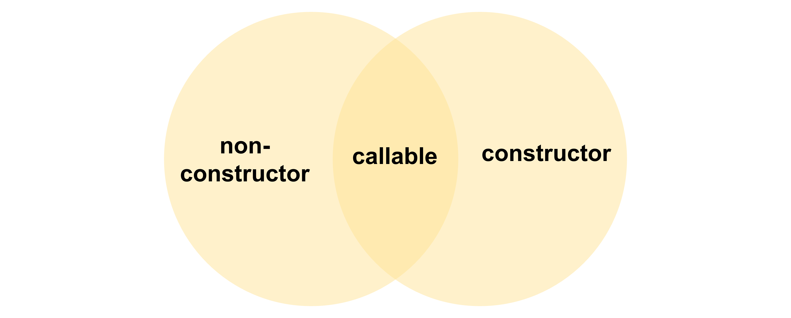

앞에서 우리는 객체 리터럴에 의한 객체 생성 방식에 대해서 살펴보았습니다.

이외에도 객체를 생성하는 방법에는 아래와 같았습니다.

-   Object 생성자 함수
-   생성자 함수
-   Object.create 메서드
-   클래스 (ES6)

위의 내용처럼 이제는 **Object 생성자 함수** 와 **생성자 함수**를 통해 객체를 생성하는 방식에 대해 알아보겠습니다.

과연 생성자 함수란 무엇일까요?🤔

그리고 객체 리터럴에 의해 객체를 생성하는 방법과 어떤 차이가 있을까요❓

## 01. Object 생성자 함수

> Object 생성자 함수를 호출하면 빈 객체를 생성하여 반환합니다.

우선 용어부터 가볍게 정의하고 가겠습니다.

✅**생성자 함수:** 객체(인스턴스)를 생성하는 함수를 의미합니다.

✅**인스턴스(instance):** 생성자 함수에 의해 생성된 객체입니다.

✅**new 연산자:** 이 연산자와 함께 함수를 호출하면 해당 함수는 생성자 함수로 동작합니다.

Object 생성자 함수에 의해 객체를 생성하는 방식은 다음과 같습니다.

```js
// new 연산자와 함꼐 Object 생성자 함수를 호출하면 빈 객체를 생성하여 반환합니다.
const wizard = new Object();

// 빈 객체 생성 이후 프로퍼티 or 메서드를 추가하여 객체를 완성합니다.
wizard.name = 'Navi';
wizard.attack = function () {
    console.log('Meow! i am ' + this.name);
};

console.log(cat); // {name: 'Navi', cry: ƒ}
cat.cry(); // Meow! i am Navi
```

그러나 굳이 Object 생성자 함수를 써야할 이유는 잘 모르겠네요.🤔

왜냐하면 객체 리터럴로 훨씬 편하게 만들 수 있는데 말이죠.

<br>

## 02. 생성자 함수

그렇다면 간편한 `객체 리터럴`을 놔두고, `생성자 함수`를 굳이 써야하는 이유가 뭘까요?

왜냐하면 객체 리터럴에 의한 객체 생성 방식에는 ❗️단점이 존재하기 때문입니다.

```js
const wizard1 = {
    attack: 2,
    specialAttack() {
        return 2 * this.attack;
    },
};

console.log(wizard1.specialAttack()); // 4

const wizard2 = {
    attack: 5,
    specialAttack() {
        return 2 * this.attack;
    },
};

console.log(wizard2.specialAttack()); // 10
```

위처럼 프로퍼티는 객체마다 프로퍼티 값이 다를 수 있지만 메서드는 동일한 경우가 많습니다.

따라서 동일한 프로퍼티를 갖는 객체를 여러 개 생성해야 하는 경우 **매번 같은 프로퍼티를 기술해야 하기에 비효율적**입니다.

반면 생성자 함수에 의해서 객체를 생성하면 <u>프로퍼티 구조가 동일한 객체를 여러개 간편하게 생성</u>할 수 있습니다.

이것은 마치 인스턴스를 생성하기 위한 템플릿(클래스)처럼 생성자 함수를 사용하는 방법입니다.

```js
// 생성자 함수
function Wizard(attack) {
    // 생성자 함수 내부의 this는 생성자 함수가 생성할 인스턴스를 가리킵니다.
    this.attack = attack;
    this.specialAttack = function () {
        return this.attack * 2;
    };
}

// 인스턴스를 생성합니다.
const wizard1 = new Wizard(2); // 공격력이 2인 Wizard 객체를 생성합니다.
const wizard2 = new Wizard(5); // 공격력이 5인 Wizard 객체를 생성합니다.

console.log(wizard1.specialAttack()); // 4
console.log(wizard2.specialAttack()); // 10
```

참고로 new 연산자와 함께 생성자 함수를 호출하지 않으면 `일반 함수`로 동작하게 됩니다.

⚠️ 잠깐❗️ 낯선 `this`가 나왔기 때문에 간단하게 정리하고 갑시다.

> **this**는 객체 자신의 프로퍼티나 메서드를 참조하기 위한 **자기 참조 변수(self-referencing variable)** 입니다.

this가 가리키는 값은 `함수 호출 방식`에 따라 동적으로 결정됩니다.

✅*일반 함수로서 호출:* this에는 **전역 객체**가 바인딩됩니다.

✅*메서드로서 호출:* **메서드를 호출한 객체(마침표 앞 객체)** 가 바인딩됩니다.

✅*생성자 함수로서 호출:* **생성자 함수가 미래에 생성할 인스턴스**가 바인딩됩니다.

```js
// 함수는 다양한 방식으로 호출될 수 있습니다.
function foo() {
    console.log(this);
}

// 일반적인 함수로서 호출합니다.
foo(); // window

const obj = { foo };

// 메서드로서 호출합니다.
obj.foo(); // obj

// 생성자 함수로서 호출합니다.
const inst = new foo(); // inst
```

<br>

## 03. 생성자 함수의 인스턴스 생성 과정

> 자바스크립트 엔진은 암묵적인 처리를 통해 인스턴스를 생성하고 반환합니다.

생성자 함수 몸체 내부에서 수행해야 하는 역할은 다음과 같은 것이라고 예상됩니다.

-   1. 인스턴스를 생성합니다.
-   2. 생성된 인스턴스를 초기화합니다.
-   3. 인스턴스를 반환합니다.

하지만 인스턴스를 생성하고 반환하는 코드는 어디에도 보이지 않네요!

그 이유는 자바스크립트 엔진은 암묵적으로 인스턴스를 생성하고 초기화한 후 반환하기 때문입니다.

순서를 같이 함께 살펴봅시다.

#### 1. 인스턴스 생성과 this 바인딩

> 암묵적으로 빈 객체를 생성하고 그 인스턴스를 this에 바인딩 시킵니다.

생성자 함수 내부의 `this`가 생성자 함수가 생성할 인스턴스를 가리키는 이유가 이것입니다.

이 처리는 함수의 몸체 코드가 실행되는 `런타임 이전`에 실행됩니다.

```
❗️바인딩: 식별자와 값을 연결하는 과정을 의미합니다.

예를 들어 변수 선언은 변수이름과 확보된 메모리 공간의 주소를 바인딩하는 것입니다.

this 바인딩은 this와 this가 가리킬 객체를 바인딩하는 것입니다.

참고로 this는 키워드로 분류되지만 식별자 역할을 한답니다.
```

```js
function Wizard(attack) {
    // 암묵적으로 인스턴스가 생성되고 this에 바인딩 됩니다.
    console.log(this); // Wizard {}
    this.attack = attack;
    this.specialAttack = function () {
        return this.attack * 2;
    };
}

const wizard1 = new Wizard(2);
```

#### 2. 인스턴스 초기화

> 인스턴스에 프로퍼티 추가 및 초기 값을 할당합니다.

이 단계에서는 생성자 함수에 기술되어 있는 코드가 한줄씩 실행되어 this에 바인딩되어 있는 인스턴스를 초기화합니다.

앞에서 보았듯이 이 처리는 저희 개발자가 직접 해주어야합니다.

```js
function Wizard(attack) {
    // 1. 암묵적으로 인스턴스가 생성되고 this에 바인딩 됩니다.

    // 2. this에 바인딩 되어있는 인스턴스를 초기화 합니다.
    this.attack = attack;
    this.specialAttack = function () {
        return this.attack * 2;
    };
}
const wizard1 = new Wizard(2);
```

#### 3. 인스턴스 반환

> 완성된 인스턴스가 바인딩된 this가 암묵적으로 반환됩니다.

```js
function Wizard(attack) {
    // 1. 암묵적으로 인스턴스가 생성되고 this에 바인딩 됩니다.

    // 2. this에 바인딩 되어있는 인스턴스를 초기화 합니다.
    this.attack = attack;
    this.specialAttack = function () {
        return this.attack * 2;
    };

    // 3. 완성된 인스턴스가 바인딩된 this를 암묵적으로 반환합니다.
}

// 인스턴스를 생성합니다.
// Wizard 생성자 함수는 암묵적으로 this를 반환합니다.
const wizard1 = new Wizard(2);
console.log(wizard1); // Wizard {attack: 2, specialAttack: ƒ}
```

<br>

## 04. 내부 메서드 `[[Call]]` 과 `[[Construct]]`

함수와 객체의 차이를 기억하시나요?

바로 **🤙함수는 호출이 가능한 객체**라는 점입니다.

그래서 함수에는 일반 객체와는 달리, 함수 객체만을 위한 내부 메서드인 `[[Call]]` 과 `[[Construct]]`를 추가로 가지고 있습니다.

결론부터 말씀드리면.

함수가 **일반 함수**로서 호출되면 함수 객체의 내부 메서드 `[[Call]]`이 호출되고,

**생성자 함수**로서 호출되면 내부 메서드 `[[Construct]]`가 호출됩니다.

```js
function foo() {}

// 일반 함수로서 호출: [[Call]]이 호출됩니다.
foo();

// 생성자 함수로서 호출: [[Construct]]가 호출됩니다.
new foo();
```

여기서 내부 메서드 `[[Call]]`을 갖는 함수 객체를 **callable** 이라고 합니다.

내부 메서드 `[[Construct]]`를 갖는 함수 객체를 **constructor**라고 합니다.

또한 `[[Construct]]`를 갖지 않는 함수를 **non-constructor**라고 합니다.

관계는 아래와 같습니다.



기본적으로 모든 함수는 호출이 가능하므로 내부메서드 `[[Call]]`을 가지고 있습니다.

여기서 일반함수로서만 호출을 할 수 있는 객체이면 `non-constructor`이고,

일반 함수 또는 생성자 함수로서 호출할 수 있는 객체는 `constructor`가 되는 것이죠.

### constructor와 non-constructor의 구분

자바스크립트 엔진은 함수 정의를 평가하여 함수 객체를 생성할 때 <u>함수 정의 방식에 따라</u> 함수를 `constructor`와 `non-constructor`로 구분합니다.

-   **constructor:**
    -   함수 선어문
    -   함수 표현식
    -   클래스(클래스도 함수입니다.)

<br>

-   **non-constructor:**
    -   메서드(ES6 메서드 축약 표현)
    -   화살표 함수

그래서 `non-constructor` 함수 객체를 생성자 함수로서 호출하면 에러가 발생합니다.

```js
// 화살표 함수로 함수를 정의하였습니다.
sayHello = () => console.log('Hello');

// 생성된 함수 객체를 생성자 함수로서 호출하면 에러가 발생합니다.
new sayHello(); // 🚫 TypeError: sayHello is not a constructor
```
