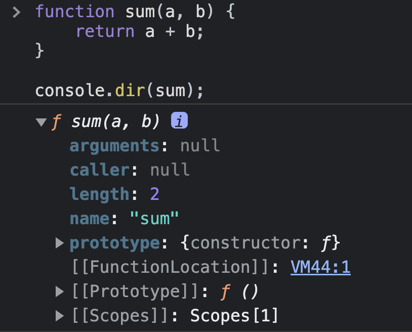
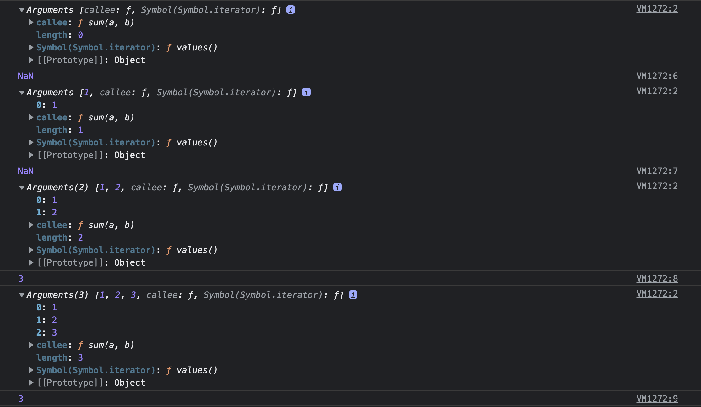

## 일급 객체

> 함수는 값으로 취급할 수 있습니다.

기억나시나요?

함수는 **객체이면서 동시에 값**으로 취급할 수 있었습니다.

그러나 일반 객체와는 차이가 있었습니다.

바로 🤙 `호출`이 가능한 객체라는 점이었죠!

그렇기에 함수 객체에는 일반 객체에는 없는 함수 고유의 프로퍼티를 가지고 있답니다.

<br>

## 함수 객체의 프로퍼티

함수 객체 고유의 프로퍼티는 아래와 같습니다.

-   arguments
-   caller
-   length
-   name
-   prototype

한 번 확인해볼까요?

```js
function sum(a, b) {
    return a + b;
}

console.dir(sum);
```



<br>
<br>

이번에는 `Object.getOwnPropertyDescriptors` 메서드로 확인해보겠습니다.

```js
function sum(a, b) {
    return a + b;
}

console.log(Object.getOwnPropertyDescriptors(sum));

/*
arguments: {value: null, writable: false, enumerable: false, configurable: false}
caller: {value: null, writable: false, enumerable: false, configurable: false}
length: {value: 2, writable: false, enumerable: false, configurable: true}
name: {value: 'sum', writable: false, enumerable: false, configurable: true}
prototype: {value: {…}, writable: true, enumerable: false, configurable: false}
*/
```

이들은 모두 일반 객체에는 없는 <u>함수 객체의 데이터 프로퍼티</u>입니다.

하나씩 살펴보죠.

#### arguments 프로퍼티

> 함수 호출시 전달된 인수들의 정보를 담고 있는 순회 가능한 유사 배열 객체입니다.

```js
function sum(a, b) {
    console.log(arguments);
    return a + b;
}

console.log(sum()); // NaN
console.log(sum(1)); // NaN
console.log(sum(1, 2)); // 3
console.log(sum(1, 2, 3)); // 3
```



<br>
<br>

argument 객체의 프로퍼티 키는 인수의 순서를, 프로퍼티 값은 인수를 나타냅니다.

참고로 `calle` 프로퍼티는 arguments 객체를 생성한 함수, 즉 함수 자신을 가리키고

arguments 객체의 `length` 프로퍼티는 인수의 개수를 가리킵니다.

그러면 `arguments 객체`는 언제 유용하게 쓰일까요?🤔

`arguments 객체`는 매개변수 개수를 확정할 수 없는 **가변 인자 함수**를 구현할 때 유용합니다.

```js
function multiply() {
    let res = 1;

    // arguments 객체는 length 프로퍼티가 있는 유사 배열 객체이므로 for문으로 순회가 가능합니다.
    for (let i = 0; i < arguments.length; i++) {
        res *= arguments[i];
    }
    return res;
}

console.log(multiply()); // 1
console.log(multiply(1, 2)); // 2
console.log(multiply(1, 2, 3)); // 6
```

참고로 ❗️`유사 배열 객체`는 배열이 아니라서 **배열 메서드를 사용할 경우 🚫에러가 발생**합니다.

그래서 배열 메서드를 사용하려면 `Function.prototype.call`, `Function.prototype.apply`를 사용하여 간접 호출하는 방식을 예전에 사용했습니다.

```js
function sum() {
    // arguemnts 객체를 배열로 변환합니다.
    const array = Array.prototype.slice.call(arguments);
    return array.reduce(function (pre, cur) {
        return pre + cur;
    }, 0);
}

console.log(sum(1, 2)); // 3
console.log(sum(1, 2, 3, 4, 5)); // 15
```

이를 조금 더 편하게 쓰고자 **Rest 파라미터**를 도입했습니다.

```js
function sum(...args) {
    return args.reduce((pre, cur) => pre + cur, 0);
}

console.log(sum(1, 2)); // 3
console.log(sum(1, 2, 3, 4, 5)); // 15
```

**✅ Rest 파라미터**

> `Rest 파라미터(나머지 매개변수)`는 매개변수 이름 앞에 세개의 점`(...)`을 붙여서 정의한 매개변수를 의미합니다.

`Rest 파라미터`는 함수에 전달된 **인수들의 목록을 배열로 전달받습니다.**

```js
function foo(...rest) {
    console.log(rest); // [1, 2, 3, 4, 5]
}

foo(1, 2, 3, 4, 5);
```

**✅ reduce 메서드**

> 배열의 각 요소를 순회하며 callback함수의 실행 값을 누적하여 하나의 결과값을 반환 합니다.

```js
let value = arr.reduce(
    function (accumulator, item, index, array) {
        // ...
    },
    [initial] // 옵션입니다.
);
```

```js
배열.reduce((누적값, 현잿값, 인덱스, 배열) => {
    return 결과;
}, 초깃값);
```

```js
let arr = [1, 2, 3, 4, 5];

let result = arr.reduce((sum, current) => sum + current, 0);

alert(result); // 15
```

비동기 프로그래밍을 할 때 굉장히 유용하다고 하네요!

자세한 설명은 [여기](https://ko.javascript.info/array-methods#ref-1028)를 참고하세요.

#### caller 프로퍼티

> 함수 자신을 호출한 함수를 가리킵니다.

#### length 프로퍼티

> 함수를 정의할 때 선언한 매개변수의 개수를 가리킵니다.

#### name 프로퍼티

-   ES6에서 표준이 되었으며 함수 이름을 나타냅니다. ES5와 ES6의 동작이 서로 다릅니다.
-   익명 함수 표현식의 경우 ES5는 빈 문자열을, ES6는 함수 객체를 가리키는 식별자를 값으로 갖습니다.

#### prototype 프로퍼티

> 생성자 함수가 생성할 인스턴스의 프로토타입 객체를 가리킵니다.

`prototype 프로퍼티`는 ✅`constructor`만이 소유하는 프로퍼티입니다.

따라서 일반 객체와 생성자 함수로 호출할 수 없는 ❌`non-constructor`에는 `prototype 프로퍼티`가 없습니다.

```js
// 함수 표현식으로 생성한 함수 객체는 prototype 프로퍼티를 소유합니다.
(foo = function () {}).hasOwnProperty('prototype'); // true
```

```js
// 일반 객체는 prototype 프로퍼티를 소유하지 않습니다.
({}.hasOwnProperty('prototype')); // false
```

```js
// 화살표로 생성한 함수 객체는 prototype 프로퍼티를 소유하지 않습니다.
(() => {}).hasOwnProperty('prototype'); //false
```

⚠️ **`__proto__` 접근자 프로퍼티**

> 접근자 프로퍼티이며, 함수 객체 고유의 프로퍼티는 아닙니다.

함수 객체는 `Object.prototype` 객체의 프로퍼티를 상속받습니다.

이것은 함수 객체 뿐만 아니라, 모든 객체가 상속받아 사용이 가능합니다.

모든 객체는 `[[Prototype]]`이라는 내부 슬롯을 갖죠.

여기서 `[[Prototype]]` 내부 슬롯은 상속을 구현하는 프로토타입 객체를 가리킵니다.

하지만 여러분도 잘 아시다시피 직접 접근은 🚫금지되어있습니다.

하지만 `__proto__` 프로퍼티를 통해서 간접적인 접근이 가능합니다.

`__proto__`프로퍼티는 `[[Prototype]]` 내부 슬롯이 가리키는 **프로토타입 객체에 접근하기 위해 사용하는 접근자 프로퍼티**입니다.

```js
const obj = { x: 1 };

// 객체 리터럴 방식으로 작성한 객체의 프로토타입 객체는 Object.prototype입니다.
console.log(obj.__proto__ === Object.prototype); // true

// 객체 리터럴 방식으로 생성한 객체는 프로토타입 객체인 Object.prototype의 프로퍼티를 상속받습니다.
// hasOwnProperty 메서드는 Object.prototype의 메서드입니다.
console.log(obj.hasOwnProperty('x')); // true
console.log(obj.hasOwnProperty('__proto__')); // false
```

**❗️hasOwnProperty 메서드**

인수로 전달받은 프로퍼티 키가 **객체 고유의 키**인 경우 ✅`true`를 반환합니다.

**상속받은** 프로토타입의 프로퍼티 키인 경우 ❌`false`를 반환합니다.
