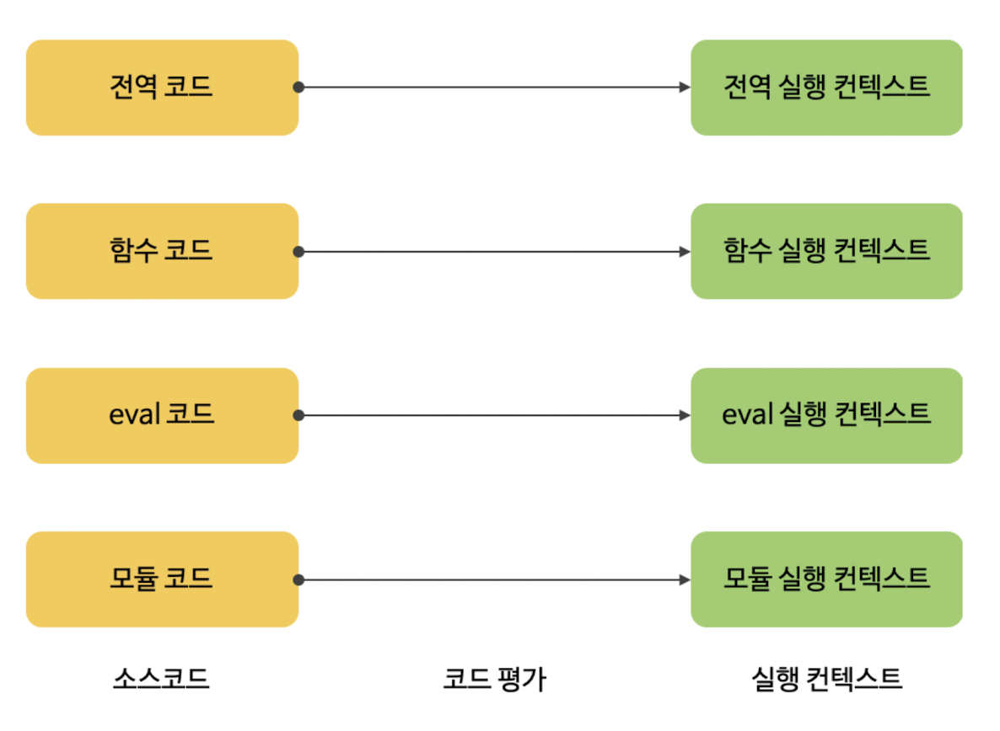
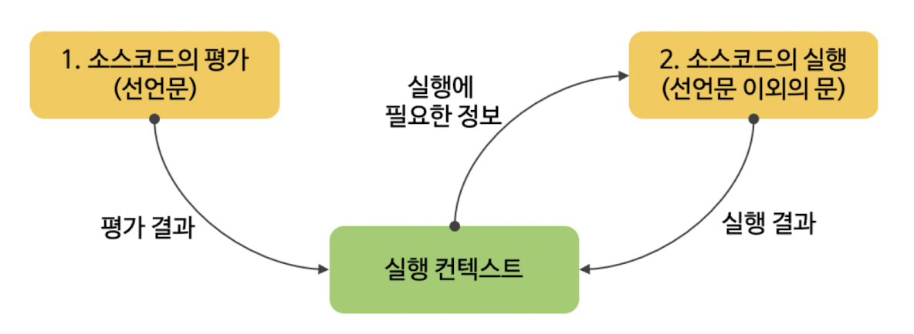
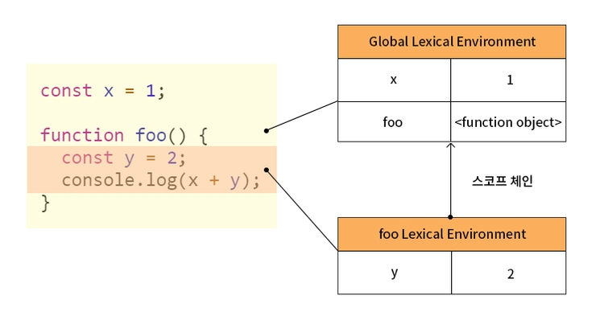
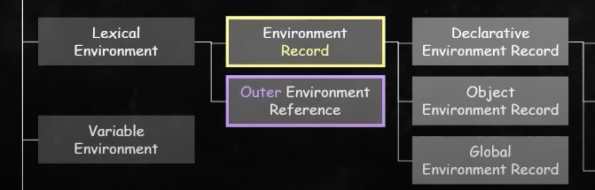
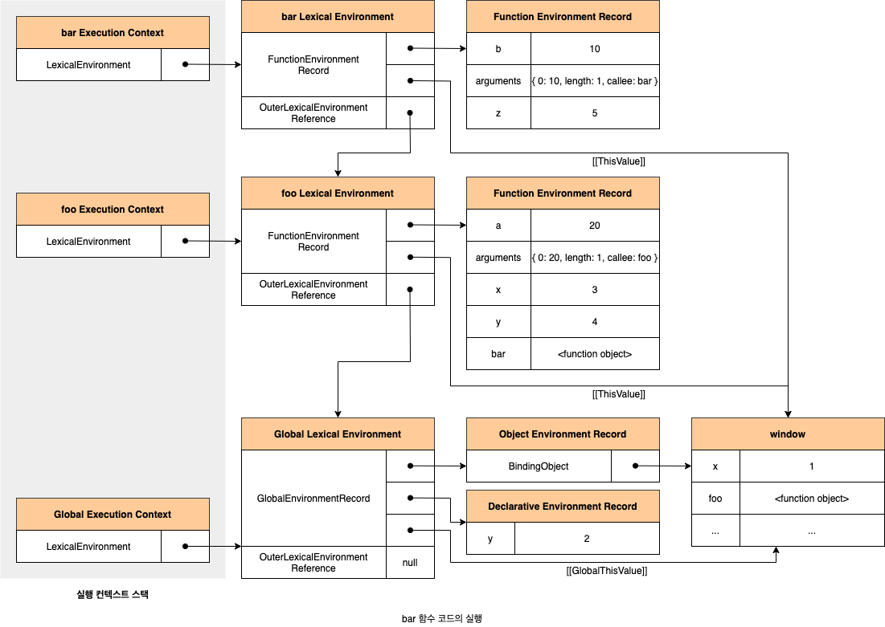
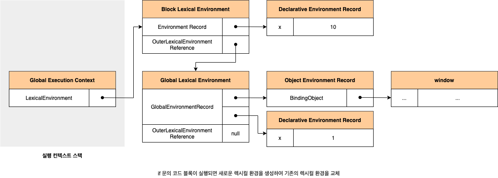

실행 컨텍스트는 엄청 중요해보이네요.
이를 잘 알아두면 아래의 동작 방식을 이해할 수 있답니다.

-   스코프를 기반으로 식별자 바인딩을 관리하는 방식
-   호이스팅이 발생하는 이유
-   클로저의 동작 방식
-   이벤트 핸들러와 비동기 처리의 동작 방식

이번에는 급한 마음을 내려놓고 천천히 읽어나가 봅시다.

## 소스코드의 타입

소스코드란 인간이 읽을 수 있는 단계의 프로그래밍을 말합니다.

다시 말해서 컴파일 되어 기계어로 번역되기 이전 과정으로, 저희가 프로그래밍 언어로 코드를 짠 것을 말합니다.

ECMAScript 사양에서 소스코드는 4가지 타입으로 구분됩니다.

| 소스코드의 타입             | 설명                                                                                                                            |
| --------------------------- | ------------------------------------------------------------------------------------------------------------------------------- |
| `전역 코드 (global code)`   | 📌 전역에 존재하는 소스코드를 말합니다.                                                                                         |
| `함수 코드 (function code)` | 📌 함수 **내부**에 존재하는 소스코드를 말합니다. <br> ❗️함수 내부에 중첩된 함수, 클래스 등의 내부 코드는 포함되지 않습니다. ❌ |
| `eval 코드 (eval code)`     | 📌 빌트인 전역 함수인 eval 함수에 인수로 전달되어 실행되는 소스코드를 말합니다.                                                 |
| `모듈 코드 (module code)`   | 📌 모듈 내부에 존재하는 소스코드를 말합니다.                                                                                    |

이러한 4가지 타입의 소스코드는 각기 다른 실행 컨텍스트를 생성합니다.

그렇다면 이렇게 소스코드를 분류하는 이유는 무엇일까요?

바로 소스코드 타입에 따라 <u>실행 컨텍스트를 생성하는 과정과 관리하는 내용이 다르기 때문입니다.</u>

가령, 전역코드 같은 경우 전역 변수 관리를 위한 전역 스코프를 생성해야할 것입니다. 그리고 전역에서 선언된 변수 or 함수를 전역객체와 연결도 시켜줘야 겠죠?

함수 코드도 지역 스코프를 생성하고 지역변수, 매개변수, arguments 객체를 관리해야 합니다. 또 지역 스코프를 전역 스코프에서 시작하는 스코프 체인의 일원으로 연결해야죠.

eval 코드, 모듈 코드도 각각 독립적인 스코프를 생성해야 할 것입니다.



<br>
<br>

이런식으로 소스코드의 타입 마다 각자의 실행 컨텍스트가 생성되며, 관리하는 내용도 모두 다릅니다.

<br>

## 소스코드의 평가와 실행

> JS 엔진은 소스코드를 '평가'와 '실행' 과정으로 나누어서 처리합니다.

### 1️⃣ 소스코드 평가 과정

1. 실행 컨텍스트를 생성합니다.
   <br>
2. 변수, 함수 선언문만 먼저 실행하여 식별자를 소코프(렉시컬 환경 레코드)에 등록합니다.

예를 들어 아래의 코드가 존재한다고 가정해 봅시다.

같이 한 번 과정을 따라가보죠.

```js
var x;
x = 1;
```

-   변수 선언문인 `var = x;` 를 먼저 실행합니다.
-   이때 생성된 변수 식별자 x는 실행 컨텍스트가 관리하는 스코프에 등록이 되고, undefined로 초기화 됩니다.

### 2️⃣ 소스코드 실행 과정 (런타임)

소스코드 평가 과정이 끝나면 선언문을 제외한 소스코드가 순차적으로 실행되기 시작합니다.

1. 소스코드 실행에 필요한 정보(변수 or 함수 참조)를 실행 컨텍스트가 관리하는 스코프에서 검색해서 취득합니다.
   <br>
2. 그리고 변수 값의 변경 등 소스코드의 실행 결과는 다시 실행 컨텍스트가 관리하는 스코프에 등록됩니다.

```js
var x; // 소스코드 평가 과정에서 이미 실행이 되었습니다.
x = 1;
```

-   변수 할당문 `x=1;`이 실행됩니다.
-   `x`라는 변수가 실행 컨텍스트가 관리하는 스코프에 등록이 되어있는지 확인합니다.
-   선언된 변수라면 값을 할당하고, 할당 결과를 실행 컨텍스트에 등록하여 관리합니다.

이 모든 과정을 일반적인 그림으로 표현하면 아래와 같습니다.



<br>

## 실행 컨텍스트의 역할

> 스코프(식별자를 등록하고 관리) & 코드의 실행 순서를 관리합니다.

아래의 예제를 따라가면서 한 번 어떤 것들이 실행 컨텍스트에서 관리를 하는지 ✅체크해보세요.

1. 전역 코드 평가
2. 전역 코드 실행
3. 함수 코드 평가
4. 함수 코드 실행

```js
const x = 1;
const y = 2;

function foo(a) {
    const x = 10;
    const y = 20;

    console.log(a + x + y);
}

foo(100);

console.log(x + y);
```

이처럼 코드가 실행되려면 **스코프, 식별자, 코드 실행 순서** 등의 관리가 필요합니다.

조금 더 구체적으로 말씀 드리겠습니다.

-   선언에 의해 생성된 모든 식별자 스코프를 구분하여 등록하고 상태 변화를 지속적으로 관리할 수 있어야 합니다.
-   스코프 체인을 통해 상위 스코프로 이동하면서 식별자를 검색 할 수 있어야 합니다.
-   코드의 실행 순서를 변경하거나 다시 되돌아 갈 수 있어야 합니다.

이 모든 것들을 관리하는 영역이 바로 실행 컨텍스트 입니다.

식별자와 스코프는 실행 컨텍스트의 **렉시컬 환경**으로 관리합니다.

코드의 실행 순서는 **실행 컨텍스트의 스택**으로 관리합니다.

<br>

## 실행 컨텍스트 스택 (call stack)

> 코드의 실행 순서를 관리합니다.

JS엔진은 먼저 전역 코드를 평가하여 전역 실행 컨텍스트를 생성합니다.

그리고 함수가 호출되면 함수 코드를 평가하여 함수 실행 컨텍스트를 생성합니다.

이 때 생성된 실행 컨텍스트는 `스택(stack)` 자료 구조로 관리됩니다.

```js
const x = 1;

function outer() {
    const y = 2;
    function inner() {
        const z = 3;
        console.log(x + y + z);
    }
    inner();
}

outer();
```


<br>
<br>

실행 컨텍스트 스택의 최상위에 존재하는 실행 컨텍스트는 언제나 **현재 실행 중인 코드의 실행 컨텍스트** 입니다.

이렇게 최상위에 존재하는 실행 컨텍스트를 `running execution context(실행 중인 실행 컨텍스트)` 라고 부릅니다.

<br>

## 렉시컬 환경

> 스코프와 식별자를 관리합니다.

렉시컬 환경은 식별자와 식별자에 바인딩 된 값, 그리고 상위 스코프에 대한 참조를 기록하는 자료구조 입니다.

렉시컬 환경은 실행 컨텍스트를 구성하는 컴포넌트입니다.



<br>
<br>

렉시컬 환경은 키와 값을 갖는 객체 형태의 스코프를 생성하여 식별자를 키로 등록하고 식별자에 바인딩된 값을 관리합니다.

렉시컬 환경은 두 개의 컴포넌트로 구성이 됩니다.



<br>
<br>

-   ✅ **환경 레코드 :** 스코프에 포함된 식별자를 등록하고 등록된 식별자에 바인딩 된 값을 관리하는 저장소입니다.

    <br>

-   ✅ **외부 렉시컬 환경에 대한 참조** 상위 스코프를 가리키게 됩니다. 여기서 상위 스코프는 외부 렉시컬 환경을 말합니다.

<br>

## 실행 컨텍스트의 생성과 식별자 검색 과정

```js
var x = 1;
const y = 2;

function foo(a) {
    var x = 3;
    const y = 4;

    function bar(b) {
        const z = 5;
        console.log(a + b + x + y + z);
    }
    bar(10);
}
foo(20);
```

🙆🏻‍♀️ 저는 다음 스텝을 모두 그림을 통해서 설명할 수 있다면 이 챕터는 어느정도 해결되었다고 생각합니다. (절대 귀찮은거 아님 😗)

1️⃣ 전역 객체 생성

전역 객체는 **전역 코드가 평가되기 이전**에 생성됩니다.

전역 객체에는 다음과 같은 것들을 포함합니다.

-   빌트인 전역 프로퍼티, 빌트인 전역 함수
-   표준 빌트인 객체
-   클라이언트 사이드 Web API (DOM, BOM, Canvas, XMLHttpRequest, fetch, SVG, Web Storage 등)
-   호스트 객체

전역 객체도 `Object.prototype`을 상속받습니다. 즉, 전역 객체도 프로토타입 체인의 일원입니다.

```js
window.toString(); // '[object Window]'

window.__proto__.__proto__.__proto__.__proto__ === Object.prototype; // true
```

2️⃣ 전역 코드 평가

3️⃣ 전역 코드 실행

4️⃣ foo 함수 코드 평가

5️⃣ foo 함수 코드 실행

6️⃣ bar 함수 코드 평가

7️⃣ bar 함수 코드 실행

8️⃣ bar 함수 코드 실행 종료

9️⃣ foo 함수 코드 실행 종료

🔟 전역 코드 실행 종료

<br>



<br>
<br>

## 실행 컨텍스트와 블록 레벨 스코프

```js
let x = 1;

if (true) {
    let x = 10;
    console.log(x); // 10
}

console.log(x); // 1
```

if 문의 코드 블록이 실행되면 if 문의 코드 블록을 위한 블록 레벨 스코프를 생성해야 합니다.

이를 위해 **선언적 환경 레코드를 갖는 렉시컬 환경을 새롭게 생성하여 기존의 전역 렉시컬 환경을 교체합니다.**

이때 새롭게 생성된 if 문의 코드 블록을 위한 렉시컬 환경의 외부 렉시컬 환경에 대한 참조는 if 문이 실행되기 이전의 전역 렉시컬 환경을 가리킵니다.

이것은 if 문 뿐 아니라 모든 블록 레벨 스코프를 생성하는 모든 블록문에 적용됩니다.

<br>


