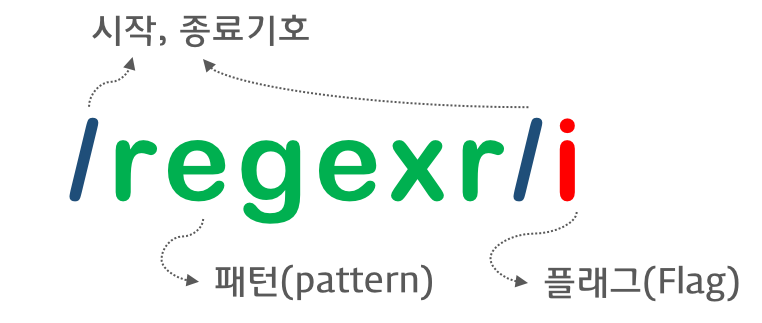

## 정규 표현식

> 일정한 패턴을 가진 문자열의 집합을 표현하기 위해 사용하는 형식 언어입니다.

사실 정규 표현식은 자바스크립트의 고유의 문법은 아니며, 대부분의 프로그래밍 언어와 코드 에디터에 내장되어있습니다.

정규 표현식은 ❗️문자열을 대상으로 **패턴 매칭 기능**을 제공합니다.

패턴 매칭 기능이란 특정 패턴과 일치하는 문자열을 검색하거나 추출 or 치환할 수 있는 기능을 말합니다.

```js
// 사용자로부터 입력받은 휴대폰 번호입니다.
const tel = '010-1234-567팔';

//정규 표현식 리터럴로 휴대폰 전화번호 패턴을 정의합니다.
const regExp = /^\d{3}-\d{4}-\d{4}$/;

// tel이 휴대폰 전화번호 패턴에 매칭하는지 테스트합니다.
regExp.test(tel); // false
```

정규표현식을 사용하면 반복문과 조건문 없이 패턴을 정의하고 테스트하는 것으로 간단히 체크할 수 있다는 장점이 있습니다.

반면, 여러가지 기호를 혼합하여 사용하기 때문에 가독성이 좋지 않다는 문제가 있습니다.

## 정규 표현식의 생성

정규 표현식 객체를 생성하기 위해서는 다음과 같은 방법 2가지가 있습니다.

-   정규 표현식 리터럴
-   RegExp 생성자 함수 사용

우선 정규 표현식 리터럴부터 소개하겠습니다.



이처럼 정규 표현식 리터럴은 패턴과 플래그로 구성됩니다.

```js
const target = 'I am ironman';

// 패턴: ironman
// 플래그: i => 대소문자를 구별하지 않고 검색합니다.
const regexp = /ironman/i;

// test 메서드는 target 문자열에 대해 정규표현식 regexp의 패턴을 검색하여 매칭 결과를
// 불리언 값으로 반환합니다.
regexp.test(target); // true
```

말씀드린대로 RegExp 생성자 함수를 사용하여 RegExp 객체를 생성할 수도 있습니다.

```js
const target = 'I am ironman';

const regexp = new RegExp(/ironman/i);

regexp.test(target); // true
```

## 플래그

> 패턴과 함께 정규 표현식을 구성하는 플래그는 정규 표현식의 검색 방식을 설정하기 위해 사용합니다.

중요한 3개의 플래그는 다음과 같습니다.

-   i (ignore case): 대소문자를 구별하지 않고 패턴을 검색합니다.
-   g (global): 대상 문자열 내에서 패턴과 일치하는 모든 문자열을 전역 검색합니다.
-   m (multi line): 문자열의 행이 바뀌더라도 패턴 검색을 계속합니다.

플래그는 옵션이므로 선택적으로 사용할 수 있습니다.

또한 순서와 상관없이 하나 이상의 플래그를 동시에 설정할 수 있습니다.

어떠한 플래그를 사용하지 않은 경우 대소문자를 구별해서 패턴을 검색합니다.

그리고 문자열에 패턴 검색 매칭 대상이 1개 이상 존재해도 첫 번째 매칭한 대상만 검색하고 종료합니다.

<br>

## 패턴

> 정규 표현식의 패턴은 문자열의 일정한 규칙을 표현하기 위해 사용합니다.
